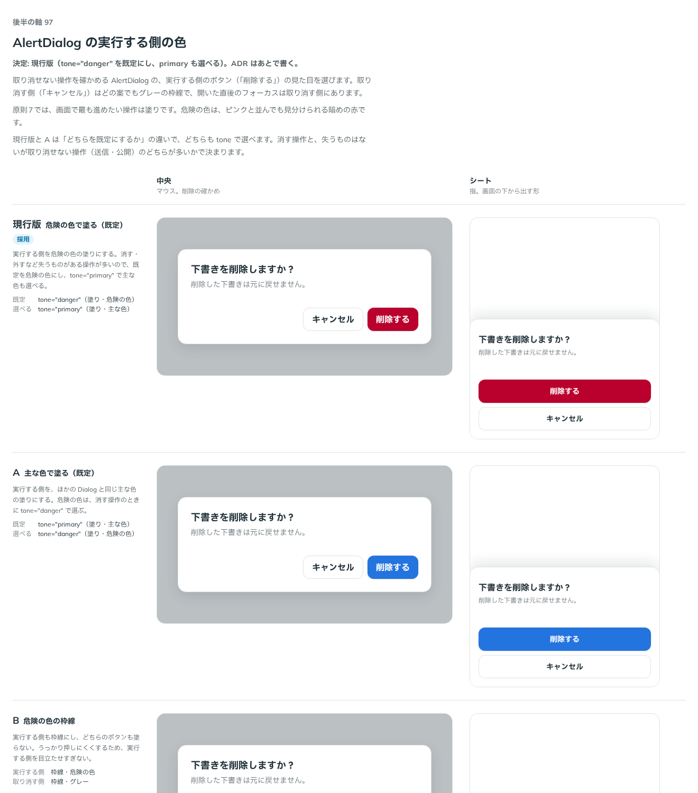

# 0123. AlertDialog の実行する側の色

- ステータス: Accepted
- 日付: 2026-09-19
- ラウンド: 後半 軸97

## 背景

取り消せない操作の前に、続けるかを確かめる面（AlertDialog）を作ります。[ADR-0102](./0102-overlay-components.md) では「部品として持たず、`dismissible`・`closeOnEscape`・`closeButton` の組み合わせで作る」としていましたが、組み合わせを間違えないことと、読み上げの役割（`alertdialog`）を確実に切り替えるために、部品として作ることにしました。この ADR では、閉じ方（後ろの画面・Esc・× のどれでも閉じない、下の 2 つのボタンだけで閉じる）は決定済みの前提とし、実行する側のボタン（「削除する」など）の色を決めます。取り消す側（「キャンセル」）はどの案もグレーの枠線で、開いた直後のフォーカスは取り消す側に置きます。

## 候補

| 案     | 内容                                                                  |
| ------ | --------------------------------------------------------------------- |
| 現行版 | 実行する側を危険の色で塗る（既定）。`tone="primary"` で主な色も選べる |
| A      | 実行する側を主な色で塗る（既定）。`tone="danger"` で危険の色も選べる  |
| B      | 実行する側も枠線にし、どちらのボタンも塗らない                        |

## 決定

**現行版を採用します。** 実行する側のボタンは `tone="danger"`（塗り・危険の色）を既定にし、`tone="primary"`（塗り・主な色）も選べます。消す・外すなど失うものがある操作が多いため、既定を危険の色にしました。ボタンは部品が下に 2 つ描く固定の形（`actionLabel`・`cancelLabel`・`onAction`）で、3 つ以上のボタンが要る確かめは AlertDialog の対象外とし、使う側が別の形（ダイアログではない形）で作ります。

## 理由

ユーザーの返事の原文です。

> 97: 現行版でお願いします

> 3: 3つ以上はないと思います。その場合はダイアログではない形で

- **既定は危険の色**: 原則6 の「危険は、ピンクと並んでも見分けられるよう…」のとおり、消す・外すなど失うものがある操作の既定に合う色は危険の色でした。原則7（画面で最も進めたい操作は塗り）のとおり、実行する側は塗りにします
- **主な色も選べる**: 送信・公開のように、失うものはないが取り消せない操作もあるため、`tone="primary"` で主な色も選べるようにしました
- **ボタンは 2 つ固定**: 「3つ以上はないと思います」との返事のとおり、AlertDialog は実行・取り消しの 2 つのボタンだけを描く形のままにしました。3 つ以上の選択肢が要る確かめは、AlertDialog ではなく Dialog を自分で組む形にします

## 却下した案と理由

- **A（主な色を既定にする）**: 選ばれませんでした。「現行版でお願いします」との返事のとおりです
- **B（実行する側も枠線にする）**: 選ばれませんでした。塗りのボタンのほうが、画面で最も進めたい操作という原則7 の考え方に合います

## 影響

- `src/components/alert-dialog/AlertDialog.tsx`: `title`・`description`・`children`・`actionLabel`・`cancelLabel`（既定「キャンセル」）・`onAction`・`tone`（`danger`・`primary`、既定 `danger`）・`trigger`・`open`・`defaultOpen`・`onOpenChange`・`presentation`・`actionsLayout`・`container`・`className` の props を持つ部品にしました。`onAction` が Promise を返すと、終わるまで実行する側のボタンを送信中にし、失敗（reject）したときは閉じずに残します
- Dialog を包み、`dismissible={false}`・`closeOnEscape={false}`・`closeButton={false}` を固定で渡します。開いた直後のフォーカスは取り消す側のボタンに `autoFocus` で置き、うっかり Enter で実行しないようにしています
- 読み上げの役割を `alertdialog` にするため、`src/internal/overlay/overlay-role-context.ts`（`OverlayRoleContext`）と `src/internal/overlay/popup-role.tsx`（`PopupRole`）を新しく置きました。`PopupRole` は、画面の下から出すシートの面が role を props で受け取らないため、面の中身に置いた見えない要素からいちばん近い `role="dialog"` を探して書き換えるハックです。Dialog 側で `overlay-role-context.ts` を読み、面の役割を配ります
- `src/index.ts` に `AlertDialog`・`AlertDialogProps`・`AlertDialogTone` を足しました
- backlog に足す未決事項: `PopupRole` の DOM 書き換えは本筋ではなく、Base UI の `SheetPopup` に role を渡せるようにするのが本来の直し方です

## 原則への反映

反映なし。色の選び方は原則6・7 の範囲内です。

## 比較画像

比較のストーリーは、決めた時点のコミット `2f37f7f` にあります（`git checkout 2f37f7f && pnpm storybook`）。

