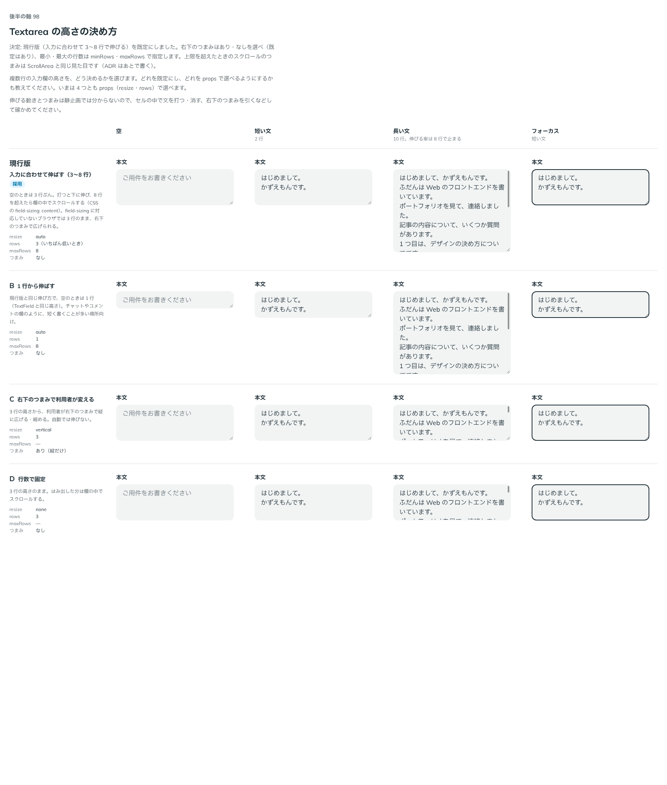
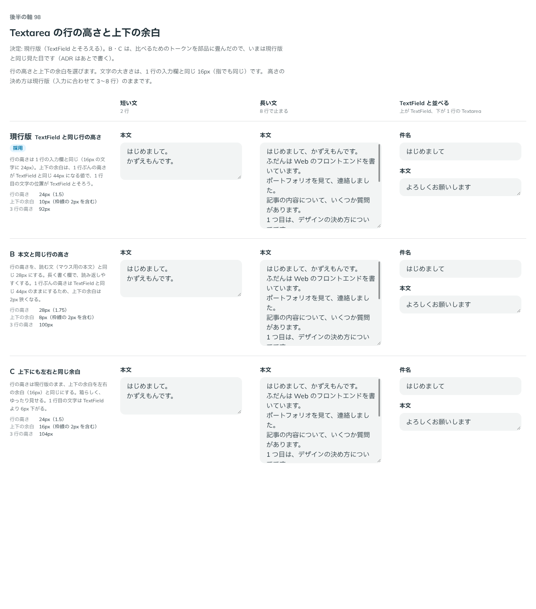

# 0124. 複数行の入力欄（Textarea）の高さ・余白と、文字数

- ステータス: Accepted
- 日付: 2026-09-19
- ラウンド: 後半 軸98

## 背景

複数行のテキスト入力（Textarea）を作ります。見た目・状態・ラベルとキャプションの並びは TextField と同じです（原則8）。決めるのは、入力に合わせて高さをどう伸ばすか、行の高さと上下の余白を TextField とそろえるか、文字数の見せ方の 3 つです。

## 候補（高さ）

| 案     | 内容                                                                       |
| ------ | -------------------------------------------------------------------------- |
| 現行版 | 入力に合わせて 3〜8 行で伸びる。右下のつまみなし                           |
| B      | 1 行から伸びる（空のときは TextField と同じ高さ）。右下のつまみなし        |
| C      | 3 行の高さから、右下のつまみで利用者が縦に広げる・縮める。自動では伸びない |
| D      | 3 行の高さで固定。はみ出した分は欄の中でスクロールする                     |

## 候補（行の高さと上下の余白）

| 案     | 内容                                                                                                                  |
| ------ | --------------------------------------------------------------------------------------------------------------------- |
| 現行版 | 行の高さは 1 行の入力欄と同じ 24px。上下の余白は、1 行ぶんの高さが TextField と同じ 44px になる値（10px）             |
| B      | 行の高さを読む文（マウス用の本文）と同じ 28px にする。1 行ぶんの高さは TextField と同じ 44px のまま（上下の余白 8px） |
| C      | 行の高さは現行版のまま、上下の余白を左右の余白と同じ 16px にする                                                      |

## 決定

**高さは現行版（入力に合わせて 3〜8 行で伸びる）を既定にします。** 右下のつまみ（`resizable`）はあり・なしを選べ、既定はあります。最小・最大の行数は `minRows`（既定 3）・`maxRows`（既定 8）で指定します。上限を超えたときは欄の中でスクロールし、そのつまみは ScrollArea（[ADR-0119](./0119-scroll-area.md)）と同じ見た目にします。右下のつまみで利用者が一度高さを変えたあとは、その高さを優先し、入力に合わせて伸びる動きと `maxRows` の上限は止めます。

**行の高さと上下の余白は現行版（TextField とそろえる）を採用します。** 行の高さは 1 行の入力欄と同じ 24px、上下の余白は 1 行ぶんの高さが TextField と同じ 44px になる値です。

**文字数は、既定では出さず、`showCount` で出せるようにします。** 柔らかい上限（`maxCount`）を新しく作り、超えても入力は止めません（貼り付けたあとで削れるようにするためです）。`maxCount` を超えているあいだは、`showCount` の指定にかかわらず文字数を必ず出し、数字を赤にします。欄の枠線と塗りもエラーの見た目にする（`overCountInvalid`、既定 `true`）か、数字だけを赤くする（`false`）かを選べます。超えたことと、上限内に戻ったことは、どちらも読み上げで知らせます。送信を止めるかどうかは使う側が決め、超えているときに `error` を渡します。打てなくする固定の上限は、ブラウザの `maxLength` のままです。

## 理由

ユーザーの返事の原文です。

> 98高さ: 現行版デフォルト、つまみありなし選択可デフォルトあり、最小最大行数指定可能、スクロールバーは ScrollArea と同じで。

> 98余白: TextField とそろえる。

> 4: デフォルト非表示、表示も選択可、上限を超えたら強制表示、超えたら数字は赤字で

> 枠はエラーになって欲しいですが、オフにもできるようにしたいです。

> おそらくバリデーションなどをユーザーが準備する可能性が高いので、使う側が error を渡すのがよさそうです。

> 3 もお願いします

- **高さは現行版＋選べる props に**: 返事のとおり、伸びる高さを既定にしつつ、B・C・D で比べた「1 行から」「つまみだけ」「固定」を、`minRows`・`maxRows`・`resizable` の props に置き換えて選べるようにしました。行数を props にしたので、比べていたときの `rows`・`resize` の切り替えは、決めたあとの部品にはありません
- **余白は現行版のまま**: 「TextField とそろえる」との返事のとおり、B・C は採らず、比べるためのトークン（`--textarea-leading`・`--textarea-padding-y`）は部品に畳んで消しました。比較のストーリーの B・C の行は、いまは現行版と同じ見た目です
- **文字数の既定は非表示**: 「デフォルト非表示、表示も選択可」との返事のとおり、`showCount` を新設しました。「上限を超えたら強制表示、超えたら数字は赤字で」のとおり、`maxCount` を超えているあいだは `showCount` の値にかかわらず出し、数字を赤にします
- **枠のエラーは選べる**: 「枠はエラーになって欲しいですが、オフにもできるようにしたい」との返事のとおり、`overCountInvalid`（既定 `true`）で欄の枠線と塗りをエラーの見た目にするかを選べるようにしました。見た目のためだけの `invalid` 状態（エラーの行をともなわない）を `Field` に足しました
- **送信を止めるのは使う側**: 「バリデーションなどをユーザーが準備する可能性が高いので、使う側が error を渡すのがよさそう」との返事のとおり、Textarea 自体は送信を止めず、超えているときに使う側が `error` を渡す前提にしました
- **戻ったことも知らせる**: 「3 もお願いします」（超えた・戻ったのどちらも読み上げで知らせる、の返事）のとおり、`maxCount` を超えたときだけでなく、上限内に戻ったときも読み上げの箱（`aria-live="polite"`）で知らせます

## 却下した案と理由

- **B（1 行から伸びる）・C（つまみだけで変える）・D（行数で固定）**: 既定としては選ばれませんでした。どれも `minRows`・`maxRows`・`resizable` の組み合わせで作れます
- **行の高さ・余白の B（本文と同じ行の高さ）・C（上下も左右と同じ余白）**: 選ばれませんでした。「TextField とそろえる」との返事のとおりです

## 影響

- `src/components/textarea/Textarea.tsx`: `label`・`caption`・`captionPlacement`・`error`・`warning`・`success`・`info`・`minRows`（既定 3）・`maxRows`（既定 8）・`resizable`（既定 `true`）・`maxCount`・`overCountInvalid`（既定 `true`）・`showCount`（既定 `false`）の props を持つ部品にしました
- textarea は `field-sizing: content` で中身の高さに伸ばし（対応していないブラウザは `src/components/textarea/use-auto-height.ts`）、外側を Base UI の ScrollArea で包んで `minRows`〜`maxRows` の高さにします。つまみの見た目は `src/internal/scroll-area-styles.ts`（ScrollArea から移した tv）を共有します
- `src/internal/field/Field.tsx`: 見た目だけの `invalid`（行のない、欄だけのエラー状態）を足しました
- `src/index.ts` に `Textarea`・`TextareaProps`・`TextareaResize` を足しました
- backlog に足す未決事項: `loading`・`prefix`・`suffix` はまだありません。上限に近づいたことを予告する見た目は作っていません（超えたときだけ知らせます）。文字数は `String.length` で数えるので、絵文字などは実際に見える文字数と違うことがあります。右下のつまみで一度高さを変えたあと、入力に合わせて伸びる動きへ戻す手段がありません。iOS で右下のつまみがどう見える・操作できるかは実機で確認していません。高さの計算（`--textarea-min-height` など）は欄の要素で密度のトークンを読むので、開いたあとに祖先の密度が変わっても再計算されるかは確認していません

## 原則への反映

原則4 の文を書き換えました。「エラーは丸の「!」と赤、警告は三角とオリーブ色です。色だけでなく形でも見分けます。警告は送信を止めないので、欄の見た目は変えません」の直後に、「文字数のように、数そのものが超えたことを示しているときは、エラーの行を出さずに欄だけをエラーの見た目にする形も選べます。行を出すかどうかは使う側が決めます」を足しました。

## 比較画像

比較のストーリーは、決めた時点のコミット `2f37f7f` にあります（`git checkout 2f37f7f && pnpm storybook`）。

