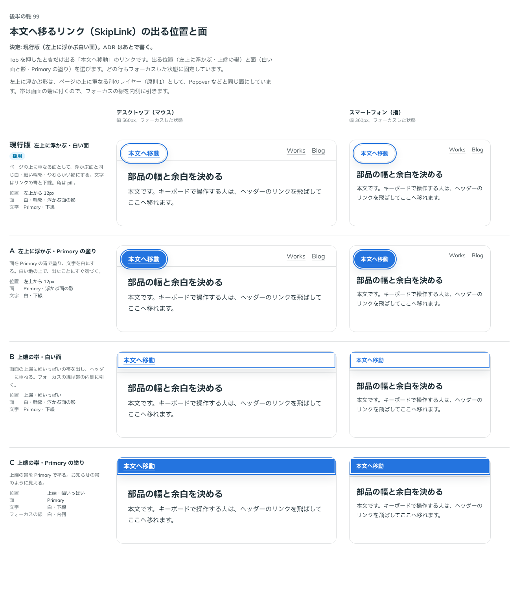

# 0125. 本文へ移るリンク（SkipLink）の出る位置と面

- ステータス: Accepted
- 日付: 2026-09-19
- ラウンド: 後半 軸99

## 背景

Tab を押したときだけ現れる「本文へ移動」のリンク（SkipLink）を作ります。ページの最初（ヘッダーより前）に置き、本文の要素に同じ id を付けて使います。ふだんは読み上げにだけ届き、キーボードでフォーカスしたときだけ画面に重ねて出ます。出る位置（左上に浮かぶ・上端の帯）と、面（白い面と影・Primary の塗り）を決めます。

## 候補

| 案     | 内容                                                                    |
| ------ | ----------------------------------------------------------------------- |
| 現行版 | 左上に浮かぶ。白い面・細い輪郭・浮かぶ面の影。文字は Primary の青と下線 |
| A      | 左上に浮かぶ。Primary の塗り。文字は白                                  |
| B      | 上端に幅いっぱいの帯。白い面。フォーカスの線は内側                      |
| C      | 上端に幅いっぱいの帯。Primary の塗り。文字は白                          |

## 決定

**現行版を採用します。** 左上に浮かぶ形で、面はページの上に重なる別のレイヤーとして、浮かぶ面と同じ白・細い輪郭・やわらかい影にします（原則1）。文字はリンクの Primary の青と淡い下線で、hover で下線だけが濃くなります（原則3）。角は pill です（原則5）。リンクの文言は「本文へ移動」です。

## 理由

ユーザーの返事の原文です。

> 99: 現行版

> 9: OK

- **現行版を選んだ理由**: 「現行版」との返事のとおりです。SkipLink はページの上に重なる別のレイヤーなので、原則1 の「重なるレイヤー」の見た目（白・細い輪郭・やわらかい影）にそろえ、浮かぶ面（Popover など）と同じ扱いにしました
- **文言**: 「9: OK」（「本文へ移動」の文言の確認）のとおり、既定の文言を「本文へ移動」にしました

## 却下した案と理由

- **A（左上に浮かぶ・Primary の塗り）**: 選ばれませんでした。白い地の上では、Primary の塗りにしなくても現行版で十分目立ちます
- **B（上端の帯・白い面）・C（上端の帯・Primary の塗り）**: 選ばれませんでした。上端いっぱいの帯は、ヘッダーに重なって見えづらくなる懸念がありました

## 影響

- `src/components/skip-link/SkipLink.tsx`: `href`（既定 `#main`）・`children`（既定「本文へ移動」）・`render` の props を持つ部品にしました
- ふだんは `sr-only`（VisuallyHidden と同じ隠し方）にし、`focus:` で位置・面・文字を上書きして画面に重ねます。`:not(:focus)` の形にしていないのは、`storybook-addon-pseudo-states` が `:not()` の中を書き換えてしまい、フォーカスしても隠れたままになるためです（[`.storybook/visual-testing.md`](../../.storybook/visual-testing.md) に追記しました）
- 位置・角・面の色は `--skip-link-*`（`design/tokens.css`）に出しました
- `src/index.ts` に `SkipLink`・`SkipLinkProps` を足しました

## 原則への反映

原則1 の文を書き換えました。「別のレイヤーは、ページの上に重なっています。選択肢、ボトムシート、画面の横から出すパネル、メニュー、ダイアログ、押して開く吹き出し、マウスを載せて出る補足です。」を、「別のレイヤーは、ページの上に重なっています。選択肢、ボトムシート、画面の横から出すパネル、メニュー、ダイアログ、押して開く吹き出し、マウスを載せて出る補足、キーボードで操作したときだけ現れる本文へ移るリンクです。」に書き換えました。

## 比較画像

比較のストーリーは、決めた時点のコミット `2f37f7f` にあります（`git checkout 2f37f7f && pnpm storybook`）。

