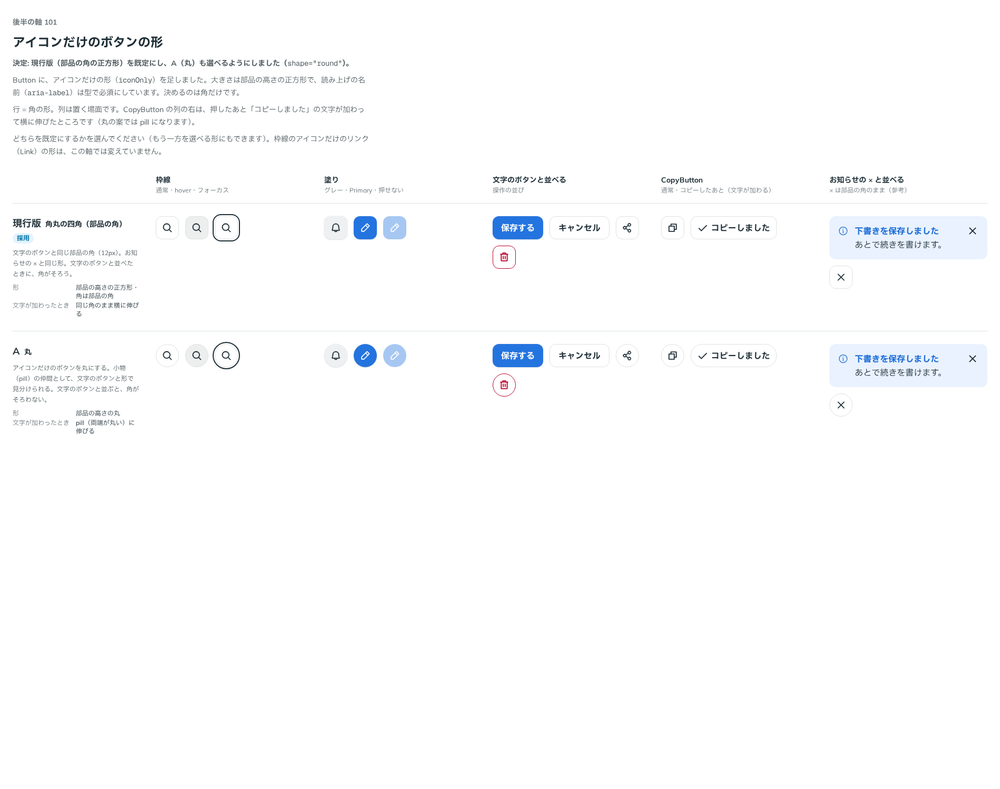

# 0127. アイコンだけのボタンの形

- ステータス: Accepted
- 日付: 2026-09-19
- ラウンド: 後半 軸101

## 背景

Button に、アイコンだけのボタンの形（`iconOnly`）を足します（[ADR-0114](./0114-icon.md) の backlog にあった未着手項目です）。大きさは部品の高さの正方形で、押せる範囲は見た目の範囲のままです（原則7・11）。決めるのは角の形だけです。

## 候補

| 案     | 内容                                                            |
| ------ | --------------------------------------------------------------- |
| 現行版 | 角丸の四角。文字のボタンと同じ部品の角（お知らせの × と同じ形） |
| A      | 丸。小物（pill）の仲間                                          |

## 決定

**現行版（部品の角の正方形）を既定にし、A（丸）も `shape="round"` で選べるようにします。** 文字が加わったとき（CopyButton の「コピーしました」など）は、現行版は同じ角のまま横に伸び、A は pill（両端が丸い）に伸びます。

## 理由

ユーザーの返事の原文です。

> 101: 現行版デフォルト、丸も選択可

- **既定は部品の角**: 返事のとおり、文字のボタンと同じ角を既定にしました。文字のボタンと並べたときに角がそろいます
- **丸も選べる**: 返事のとおり、小物（pill）の仲間として見分けたい場面のために、`shape="round"` を選べるようにしました

## 却下した案と理由

この軸には、却下した見た目はありません。現行版・A のどちらも `shape` の値として選べます。

## 影響

- `src/components/button/Button.tsx`: `iconOnly`（既定 `false`）・`shape`（`square`・`round`、既定 `square`。`iconOnly` のときだけ選べます）の props を足しました。比べていたときのトークン（`--button-icon-only-radius`）は、決めたので部品に畳んで消しました
- `src/index.ts` に `ButtonShape` を足しました
- CopyButton（[ADR-0128](./0128-copy-button.md)）にも `shape` を通しています
- backlog に足す未決事項: 枠線のアイコンだけのリンク（Link）の形は、この軸では変えていません。`shape` と合わせるかは決めていません

## 原則への反映

原則5 の文を書き換えました。「ボタン、入力欄、お知らせは同じ角です。お知らせは部品なので、カードの角にはしません」の直後に、「アイコンだけのボタンは部品の角が既定です。小物のように丸も選べます」を足しました。

## 比較画像

比較のストーリーは、決めた時点のコミット `2f37f7f` にあります（`git checkout 2f37f7f && pnpm storybook`）。

