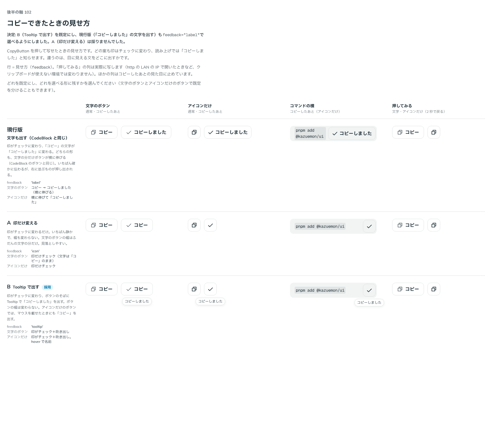

# 0128. CopyButton で写せたことをどう見せるか

- ステータス: Accepted
- 日付: 2026-09-19
- ラウンド: 後半 軸102

## 背景

文字列をクリップボードに写すボタン（CopyButton）を作ります。見た目は Button で、コピーできたことの見せ方は CodeBlock のコピーのボタン（[ADR-0092](./0092-code-block-frame.md)）に倣い、印がチェックに変わって読み上げでも知らせます。決めるのは、目に見える「コピーしました」の文をどこに出すかです。

## 候補

| 案     | 内容                                                                                                           |
| ------ | -------------------------------------------------------------------------------------------------------------- |
| 現行版 | 文字も出す（CodeBlock と同じ）。「コピー」が「コピーしました」に変わり、文字の分だけボタンが横に伸びる         |
| A      | 印だけ変える。文字は「コピー」のまま、幅は変わらない                                                           |
| B      | Tooltip で出す。印はチェックに変わり、ボタンのそばに吹き出しで「コピーしました」を出す。ボタンの幅は変わらない |

## 決定

**B（Tooltip で出す）を既定にし、現行版（文字も出す）も `feedback="label"` で選べるようにします。A（印だけ変える）は採りません。** どちらの案も、印はチェックに変わり、読み上げでは「コピーしました」を知らせます。アイコンだけのボタンの Tooltip では、マウスを載せたとき・キーボードでフォーカスしたときにも名前（「コピー」）を出します。CopyButton の見た目の既定は、グレーの枠線（`appearance="outline"`）です。

## 理由

ユーザーの返事の原文です。

> 102: Bデフォルト、現行版も選択可

> 11: OK

- **既定は Tooltip**: 返事のとおり B を既定にしました。ボタンの幅が変わらないので、右に並ぶものを押し出しません
- **現行版も選べる**: 返事のとおり、確かに伝わる形として `feedback="label"` を残しました
- **A は不採用**: 「Bデフォルト、現行版も選択可」に A は含まれておらず、印だけの変化はいちばん見落としやすい案でした。部品の props からは外し、比較のストーリーでは Button と共有の印を使って再現しています
- **既定の見た目**: 「11: OK」（CopyButton の既定の見た目の確認）のとおり、グレーの枠線を既定にしました

## 却下した案と理由

- **A（印だけ変える）**: 選ばれませんでした。いちばん静かで見落としやすく、`feedback` の値としても残していません

## 影響

- `src/components/copy-button/CopyButton.tsx`: `text`・`label`（既定「コピー」）・`copiedLabel`（既定「コピーしました」）・`iconOnly`（既定 `false`）・`shape`（[ADR-0127](./0127-icon-only-button-shape.md)）・`feedback`（`tooltip`・`label`、既定 `tooltip`）・`appearance`（既定 `outline`）・`onCopied`・`onCopyError` の props を持つ部品にしました
- 印と読み上げの箱（`CopiedStatus`・`CopyGlyph`）は `src/internal/copy/copy-parts.tsx` に、コピーの処理（`use-copy.ts`）は CodeBlock から `src/internal/copy/` へ移し、CodeBlock と共有しました
- 押すと写せたあいだ（2 秒）だけ、コピーしたあとの見た目になります。写せなかったとき（権限がない・安全でない接続）は見た目を変えず、`onCopyError` で使う側が知らせる前提です
- `src/index.ts` に `CopyButton`・`CopyButtonProps`・`CopyButtonFeedback` を足しました
- backlog に足す未決事項: 写せなかったときの見た目は作っていません。Tooltip を長押しで出したあと、指を離さずに動かしたときの見え方は、[ADR-0102](./0102-overlay-components.md) の backlog と同じく実機で確かめていません

## 原則への反映

反映なし。既定の見た目（グレーの枠線）は原則7 の範囲内で、コピーの見せ方に新しい色や形は持ち込んでいません。

## 比較画像

比較のストーリーは、決めた時点のコミット `2f37f7f` にあります（`git checkout 2f37f7f && pnpm storybook`）。

