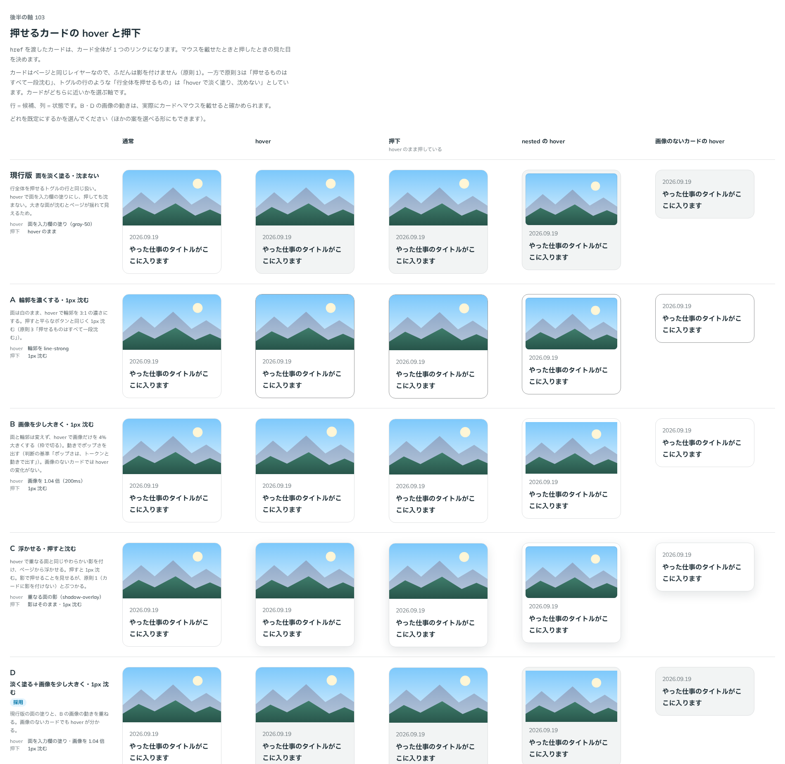

# 0129. 押せるカードの hover と押下

- ステータス: Superseded by 0169
- 日付: 2026-09-19
- ラウンド: 後半 軸103

## 背景

Card を作ります。画像と文をまとめて見せる面で、`Card`（外枠）・`CardImage`（画像）・`CardBody`（文の部分）の 3 つに分かれています。型は 2 つ（default・nested）で、default は画像をカードの端まで届かせ、nested は画像をカードの内側に収めます（[ADR-0014](./0014-nested-card-inset.md)）。角は [ADR-0016](./0016-card-radius.md)、画像の比率は [ADR-0017](./0017-card-media-aspect.md) のまま変えていません。

`href` を渡すと、カード全体が 1 つのリンクになります。`render` に Next.js の `Link` などを渡すと、その要素にカードの見た目を重ねられます（`render={<NextLink href="/works/1" />}`）。決めるのは、押せるカードの hover と押下の見た目です。ページと同じレイヤーのカードに、押せることをどう手応えとして足すかが軸です（原則1・原則3）。

## 候補

| 案     | 内容                                                                |
| ------ | ------------------------------------------------------------------- |
| 現行版 | hover で面を入力欄の塗り（`--color-field`）にする。押しても沈まない |
| A      | hover で輪郭を濃く（line-strong）する。1px 沈む                     |
| B      | hover で画像だけ 1.04 倍にする。1px 沈む                            |
| C      | hover で重なる面の影（shadow-overlay）を付ける。1px 沈む            |
| D      | 現行版の塗り＋B の画像。1px 沈む                                    |

状態は、通常・hover・押下・入れ子（nested）の hover・画像のないカードの hover の 5 列で比べました。

## 決定

**D＋A を採用します。** hover で面を入力欄の塗り（`--color-field`）にし、輪郭を line-strong の濃さにし、画像を 1.04 倍にします。押すと、平らな要素と同じ深さ（`--flat-press-depth`）で沈みます。影は付けません。

`href` は `NextLink` などを渡せるよう、`render` で受け取ります（既存の作りのままです）。

## 理由

ユーザーの返事の原文です。

> 103: クリックできるなら D + Aの外枠が濃くなる かなと思いました。href は NextLink なども入れられるようにしたいです。

- **D＋A を選んだ理由**: ユーザーは、比べた 5 案のうち D（面の塗り＋画像の拡大）に、A の輪郭を濃くする変化を重ねる形を選びました。輪郭の変化は画像の有無によらず出るので、画像のないカードでも hover が塗りと輪郭の 2 つで分かります。基準の言葉では、画像の動きが「人懐っこい」、影を足さないことが「軽い」に近い決定です
- **沈める**: 現行版は沈まない案でしたが、押せるものは一段沈むという決まり（原則3）に、カードだけ例外を作らない形にしました
- **影は付けない**: カードはページと同じレイヤーにある面なので、浮いて見える影は付けません（原則1）

## 却下した案と理由

- **現行版（沈まない）**: 選ばれませんでした。押せるものはすべて一段沈むという決まりから外れます
- **B 単独（画像だけ大きくする）**: 選ばれませんでした。画像のないカードでは hover の変化が画像にしか出ないため、手応えが分かりません
- **C（重なる面の影）**: 選ばれませんでした。カードはページと同じレイヤーの面で、影を付けると浮いて見えます。原則1 の「ページと同じレイヤーにあるものには、影を付けない」とぶつかります

## 影響

- `src/components/card/Card.tsx`: `href`・`target`・`rel`・`render` の props を足しました。`href` か、`render` に渡した要素が `href` を持つときにカード全体が押せる面になります。hover の面は `--card-fill`（`theme.css` で登録した変数。[ADR-0112](./0112-fill-transition-by-registered-property.md) と同じ作り）に置き、`background-color` ではなく変数を動かします
- `design/tokens.css` に `--card-hover-media-scale`（1.04）などのカードのトークンを足しました
- `src/index.ts` に `Card`・`CardProps`・`CardAppearance`・`CardBody`・`CardBodyProps`・`CardImage`・`CardImageProps` を足しました
- ストーリーに「Next.js の Link」の見本を足しました
- backlog に足す未決事項: Card の中にほかのリンクやボタンを置く形（題だけをリンクにして、カード全体を押せるように広げる）は用意していません

## 原則への反映

原則3 の文を書き換えました（カード全体を押せるもの…）。「カード全体を押せるものは、hover で面を淡く塗り、輪郭を濃くし、画像を少しだけ大きくします。押すと、平らなボタンと同じだけ沈みます。カードは一枚ずつ離れて並ぶので、沈めてもページは揺れて見えません。画像の動きで、整然とした見た目のまま楽しさを足します」を足しました。

## 比較画像

比較のストーリーは、決めた時点でコミットする前に消しました。トークンへ畳み込む前の状態から撮った画像が記録です。この画像には D に採用の印が付いていますが、実際に採用したのは D の塗り・沈みに A の輪郭（hover で line-strong にする変化）を重ねた形で、画像 1 行だけでは採用した見た目を再現しません。

