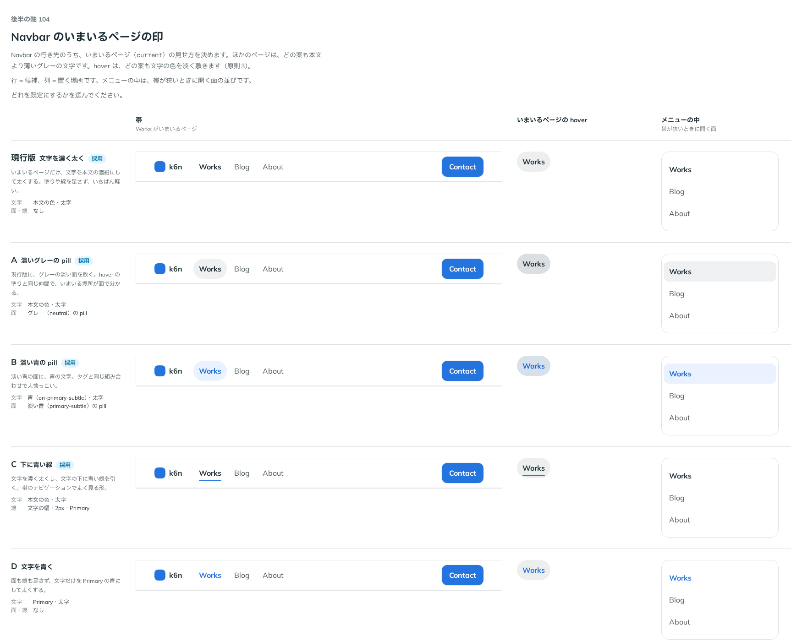

# 0130. Navbar のいまいるページの印

- ステータス: Accepted
- 日付: 2026-09-19
- ラウンド: 後半 軸104

## 背景

Navbar を作ります。ロゴ（`brand`）・行き先（`NavbarLink`）・操作（`actions`）を 1 行に並べる、ページの上の帯です。中身の幅と左右の余白は Container と同じにそろえます。帯の幅が 48rem（Tailwind の `md` と同じ幅）より狭いときは、行き先をメニューのボタンに畳み、押すと Drawer に縦に並べて出します。畳むかどうかは画面ではなく帯そのものの幅で決め（コンテナクエリ）、メニューの出し方は浮かぶ UI と同じ判定（原則11）で、指で操作していて画面が狭いときは下から出すシート、それ以外は横から出すパネルにします。帯の高さ（`--navbar-height`）は入力方式で変えません（原則11）。

行き先のリンクは平らな pill（原則5）で、hover は文字の色を淡く敷き、押すと沈みます（原則3・[ADR-0027](./0027-flat-press.md)）。決めるのは、いまいるページ（`aria-current="page"`）をどう見せるかです。

## 候補

| 案     | 内容                                      |
| ------ | ----------------------------------------- |
| 現行版 | 文字を本文の色にして太くする              |
| A      | グレー（neutral）の pill を敷く           |
| B      | 淡い青（primary-subtle）の pill・青い文字 |
| C      | 文字の下に 2px の Primary の線を引く      |
| D      | 文字だけ Primary の青にする               |

## 決定

**現行版（text）を既定にし、A（neutral）・B（primary）・C（underline）も `currentIndicator` で選べるようにします。** D は採用しません。

- `text`（既定）: 文字を本文の色で太くする
- `neutral`: グレーの pill を敷く
- `primary`: 淡い青の pill を敷き、文字を青くする
- `underline`: 文字の下に Primary の線を引く

どの印でも、文字を本文の色で太くする変化は共通です。メニューの中の行では、`underline` は `text` と同じ見た目にします。行の下に線を引くと区切り線に見えてしまうためです。

## 理由

ユーザーの返事の原文です。

> 104: 現行がデフォルトで、A,B,C の選択ができるといいなと思いました

- **現行版（text）を既定にした理由**: 返事のとおりです。文字を太くするだけの変化がいちばん軽く、帯の見た目を崩しません
- **A・B・C も選べるようにした理由**: 返事のとおりです。`currentIndicator` の `neutral`（A）・`primary`（B）・`underline`（C）で選べます

## 却下した案と理由

- **D（文字だけ Primary の青にする）**: 選ばれませんでした。返事で選ばれたのは現行版・A・B・C の 4 つで、D は挙がりませんでした。文字の色だけを変える変化は、太字にする現行版と役割が重なります

## 影響

- `src/components/navbar/Navbar.tsx`: `currentIndicator`（`text`・`neutral`・`primary`・`underline`、既定 `text`）の prop を足しました。塗りは `--flat-bg`（`theme.css` で登録した変数。[ADR-0112](./0112-fill-transition-by-registered-property.md) と同じ作り）に置きます
- `design/tokens.css` に `--navbar-current-bar`（`underline` の線の太さ）などのトークンを足しました
- `src/index.ts` に `Navbar`・`NavbarProps`・`NavbarCurrentIndicator`・`NavbarLink`・`NavbarLinkProps` を足しました
- backlog に足す未決事項: Navbar の行き先を、下に開くメニュー（NavigationMenu）にする形は決めていません。Navbar のメニューを開いたとき、`actions`（Contact などのボタン）をメニューの中にも出すかも決めていません

## 原則への反映

原則11 の文を書き換えました（帯の行き先を畳むのは帯の幅で決め、メニューの出し方は浮かぶ UI と同じ判定）。「ページの上の帯は、行き先を並べきれない幅になると、行き先をメニューのボタンに畳みます。畳むかどうかは、画面ではなく帯そのものの幅で決めます。帯を画面の一部に置いても、置いた幅に合わせるためです。畳んだメニューの出し方は、浮かぶ UI と同じ判定で決めます」を足しました。

## 比較画像

比較のストーリーは、決めた時点でコミットする前に消しました。トークンへ畳み込む前の状態から撮った画像が記録です。

