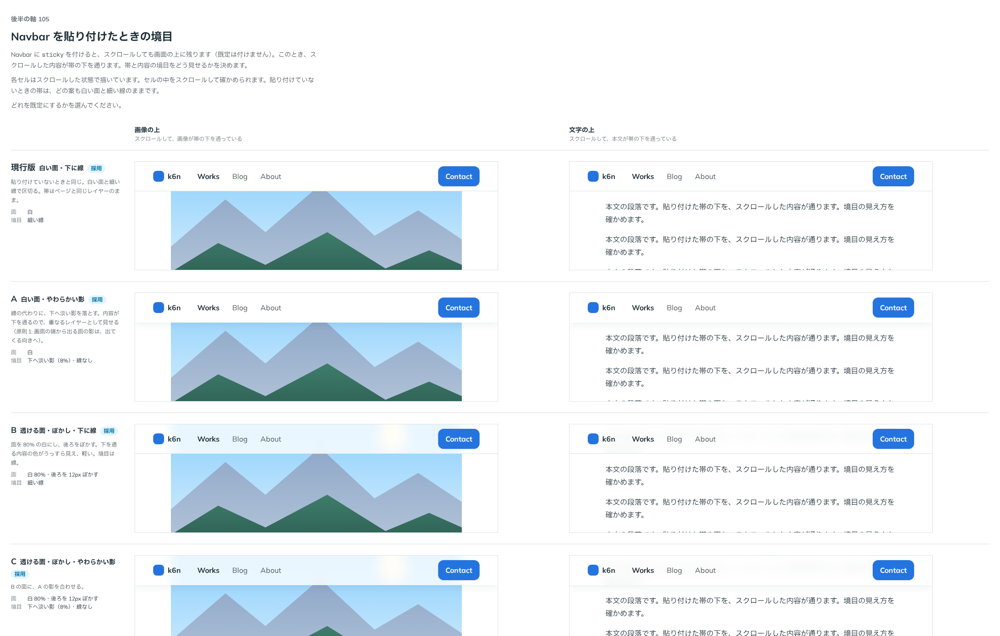

# 0131. Navbar を貼り付けたときの境目

- ステータス: Accepted
- 日付: 2026-09-19
- ラウンド: 後半 軸105

## 背景

Navbar はページと同じレイヤーの帯で、細い線で本文と区切ります（原則1）。画面の上に貼り付ける（`sticky`）と、スクロールした内容が帯の下を通るようになります。そのときは帯が重なりのレイヤーに近づくので、境目の見せ方（線のままか、重なりとして影を落とすか）と、面の見せ方（白いままか、透かして後ろをぼかすか）を決めます。

## 候補

境目（`stickyEdge`）と面（`stickyBackdrop`）を掛け合わせた 2×2 で比べました。

| 案     | 境目（stickyEdge）                   | 面（stickyBackdrop）                      |
| ------ | ------------------------------------ | ----------------------------------------- |
| 現行版 | line（細い線）                       | solid（白い面）                           |
| A      | shadow（線の代わりに下へ淡い影・8%） | solid（白い面）                           |
| B      | line（細い線）                       | blur（面を 80% にして後ろを 12px ぼかす） |
| C      | shadow（下へ淡い影）                 | blur（面を 80% にして後ろを 12px ぼかす） |

`sticky` そのものを既定で貼り付けるかどうかも合わせて決めました。

## 決定

**`sticky` の既定は `false`（貼り付かない）にします。** `sticky` を `true` にしたときの境目・面は、`stickyEdge`（`line` 既定・`shadow`）と `stickyBackdrop`（`solid` 既定・`blur`）の 2 つの props で独立に選べるようにします。現行版・A・B・C のどの組み合わせも選べます。

## 理由

ユーザーの返事の原文です。

> 105: 現行がデフォルトで、他全部選択できるようにしたいです。

- **`sticky` の既定を貼り付かないにした理由**: 最初の問いへの返事のとおりです（「Navbar 固定: 『既定は貼り付かない』」）。貼り付けるかどうかはページの作りに依存するため、使う側が選ぶ前提にしました
- **境目・面をどちらも既定 line・solid にした理由**: 返事のとおりです。貼り付けていないときの見た目（細い線・白い面）とそろえるのがいちばん自然でした
- **4 案とも選べるようにした理由**: 返事のとおりです。境目と面は独立した軸で、組み合わせを絞る理由がなかったため、`stickyEdge`・`stickyBackdrop` の 2 つの props にしました

## 却下した案と理由

この軸には、却下した見た目はありません。`stickyEdge`・`stickyBackdrop` はどちらの値も選べます。

## 影響

- `src/components/navbar/Navbar.tsx`: `sticky`（既定 `false`）・`stickyEdge`（`line`・`shadow`、既定 `line`）・`stickyBackdrop`（`solid`・`blur`、既定 `solid`）の props を足しました
- `design/tokens.css` に `--navbar-sticky-shadow`（下へ落とす淡い影）・`--navbar-backdrop-bg`（透ける面の色、80%）・`--navbar-backdrop-blur`（後ろのぼかし、12px）のトークンを足しました
- `src/index.ts` に `NavbarStickyEdge`・`NavbarStickyBackdrop` を足しました

## 原則への反映

原則1 の文を書き換えました（画面の上に貼り付けた帯は、内容が下を通るので、重なりとして影で区切ることも選べる）。「ページの上の帯も、ページと同じレイヤーです。細い線で本文と区切ります。画面の上に貼り付けると、スクロールした内容が帯の下を通ります。そのときは重なりとして、下へ淡い影を落とす形や、面を透かして後ろをぼかす形も選べます」を足しました。

## 比較画像

比較のストーリーは、決めた時点でコミットする前に消しました。トークンへ畳み込む前の状態から撮った画像が記録です。

