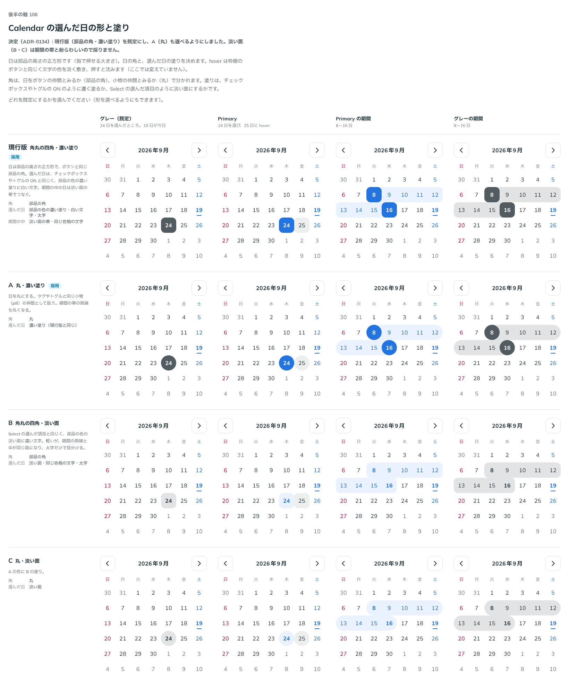

# 0134. Calendar の選んだ日の形と塗り

- ステータス: Accepted
- 日付: 2026-09-19
- ラウンド: 後半 軸106

## 背景

Calendar の日は部品の高さの正方形です（[ADR-0133](./0133-calendar-foundation.md)）。選んだ日をどう見せるかを決めます。角を部品の角にするか丸にするか（原則 5）、塗りを濃くするか淡くするか（原則 6）の 2 軸です。

## 候補

| 案     | 内容                                                                                                                     |
| ------ | ------------------------------------------------------------------------------------------------------------------------ |
| 現行版 | 部品の角・濃い塗り。チェックボックスやトグルの ON と同じ、部品の色の濃い塗りに白い文字。期間の中の日は淡い面の帯でつなぐ |
| A      | 丸・濃い塗り。日を小物（pill）の仲間として扱う。期間の帯の両端も丸くなる                                                 |
| B      | 部品の角・淡い面。Select の選んだ項目と同じ、部品の色の淡い面に濃い文字                                                  |
| C      | 丸・淡い面。A の形に B の塗り                                                                                            |

状態は、グレー（既定）・Primary（hover 込み）・Primary の期間・グレーの期間の 4 列で比べました。

## 決定

**現行版（部品の角・濃い塗り）を既定にし、A（丸）も選べるようにしました。** B・C（淡い面）は採りません。

## 理由

ユーザーの返事の原文です。

> 106: 現行版がデフォルトで、丸も選べる、がいいですね。薄い色は範囲と紛らわしいので、一旦ナシで。

- **現行版を既定にした理由**: 部品の角・濃い塗りは、チェックボックスやトグルの ON と同じ表し方で、ほかの選んだ状態とそろいます
- **A も選べるようにした理由**: 丸は日を小物の仲間として見せる案で、部品の角と並んで採用されました
- **B・C を採らない理由**: 淡い面にすると、期間の中の日をつなぐ帯（同じ淡い面）と選んだ日そのものの区別がつきにくくなります。「薄い色は範囲と紛らわしい」という返事のとおりです

## 却下した案と理由

- **B（部品の角・淡い面）**: 選ばれませんでした。範囲の帯と同じ淡さになり、選んだ日なのか範囲の途中なのか紛らわしくなります
- **C（丸・淡い面）**: 選ばれませんでした。理由は B と同じです

## 影響

- `src/components/calendar/Calendar.tsx`: `shape`（`square` | `round`）props を足しました。既定は `square` です
- `design/tokens.css`: 比較用に置いていた `--calendar-day-radius`・`--calendar-selected-strong` を、`shape` の値ごとの固定した角丸（濃い塗りは常に採用のため、淡い面の切り替えは削除）に畳み込みました
- backlog に足す未決事項はありません

## 原則への反映

原則 5 の文を書き換えました。カレンダーの日は既定で部品の角ですが、丸も選べる、という一文を足しました。

## 比較画像

比較のストーリーは決めた時点のコミット 7688bba にあります。`git checkout 7688bba && pnpm storybook` で開けます。

