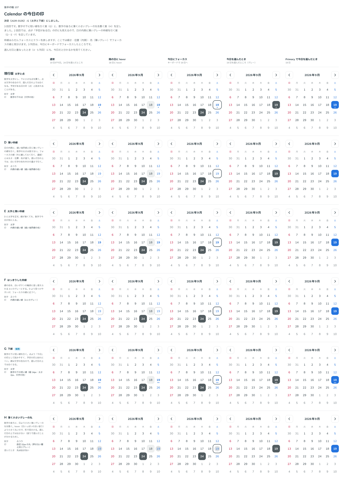

# 0135. Calendar の今日の印

- ステータス: Accepted
- 日付: 2026-09-19
- ラウンド: 後半 軸107

## 背景

今日の日をどう見せるかを決めます。今日は「状態」ではなく、いつ見ても分かる目印です。選んだ日（[ADR-0134](./0134-calendar-selected-day.md)）や、キーボードのフォーカス（[ADR-0136](./0136-calendar-keyboard-focus.md)）と重なっても見分けが付く必要があります。3 回ラウンドを重ねて決めました。

## 候補

| 案     | 内容                                                                                           |
| ------ | ---------------------------------------------------------------------------------------------- |
| 現行版 | 太字と点。数字を太字にし、下に小さな点（文字の色）を置く                                       |
| A      | 太字だけ（1 回目のみ）                                                                         |
| B      | 点だけ（1 回目のみ）                                                                           |
| C      | 淡い塗り（1 回目のみ）                                                                         |
| D      | 薄い枠線。日の内側に、細い境界線と同じ薄いグレーの線を引く。数字の太さは変えない               |
| E      | 太字と薄い枠線。D に太字を足す                                                                 |
| F      | はっきりした枠線。線の色を、白いボタンの輪郭に差し替えられる 3:1 のグレーにする                |
| G      | 下線。数字の下に短い線（幅 14px・太さ 2px、文字の色）を引く                                    |
| H      | 薄く小さいグレーの丸。数字の後ろに、日より小さい薄いグレーの丸を敷く。選んだ日の上では出さない |

状態は、通常・隣の日に hover・今日にフォーカス・今日を選んだとき・Primary で今日を選んだときの 5 列で比べました。

## 決定

**G（太字と下線）を採用します。** 下線は文字の色なので、選んだ日の上では白くなります。

## 理由

ユーザーの返事の原文です。

> 107: 現行版もいいですが、予定がある日という見た目にもなるので、グレーの薄い枠線とかも見てみたいです

> 107（3 回目の依頼）: 日付の下に線が引かれる、も見たいです。あとは薄く小さいグレーの丸も見たいですね

> 107（決定）: G の太字下線がいいですね！

- **1 回目**: A（太字だけ）・B（点だけ）・C（淡い塗り）を並べましたが、いずれも選ばれず、現行版（太字と点）に対して「予定がある日という見た目にもなる」という指摘が出ました
- **2 回目**: 点を今日の印として使うと、予定のある日の印と紛らわしいという指摘から、日の内側に細い枠線を引く D・E・F を足しました
- **3 回目**: さらに「日付の下に線」「薄く小さいグレーの丸」の 2 案を求められ、G・H を足しました。最終的に G（太字と下線）が選ばれました。下線は点より「今日」の印として読みやすく、予定の印とも紛れにくい形です

## 却下した案と理由

- **現行版（太字と点）**: 選ばれませんでした。点が「予定がある日」の印に見えるという指摘のためです
- **A（太字だけ）・B（点だけ）・C（淡い塗り）**: 1 回目で選ばれませんでした。返事は「点は予定がある日にも見える、グレーの薄い枠線も見たい」で、次のラウンドで枠線の案（D・E・F）を出す方向になりました
- **D・E・F（内側の薄い枠線）**: 2 回目で足しましたが、3 回目で下線と丸の案を求められ、選ばれませんでした
- **H（薄く小さいグレーの丸）**: 3 回目で G と並べましたが、選ばれませんでした

## 影響

- `src/components/calendar/Calendar.tsx`: 今日の印を、太字（`font-weight: 700`）と、数字の下の短い下線（幅 14px・高さ 2px・文字の色）の固定の見た目にしました。選んだ日と重なるときは下線も含めて白い文字の色になります
- `design/tokens.css`: 比較用に置いていた `--calendar-today-weight`・`--calendar-today-dot`・`--calendar-today-mark-width`・`--calendar-today-mark-height`・`--calendar-today-fill`・`--calendar-today-ring`・`--color-calendar-today-ring`・`--calendar-today-circle`・`--calendar-today-circle-size` は、決まった見た目に畳み込んで削除しました
- backlog に足す未決事項はありません

## 原則への反映

原則 6 の文を書き換えました。今日の日は太字と短い下線で表す、という一文を、カレンダーの色・印の段落にまとめて足しました（[ADR-0134](./0134-calendar-selected-day.md)・[ADR-0137](./0137-calendar-weekend-color.md)・[ADR-0140](./0140-calendar-holiday.md)・[ADR-0141](./0141-calendar-range-preview.md) と合わせて 1 段落にしています）。

## 比較画像

比較のストーリーは決めた時点のコミット 7688bba にあります。`git checkout 7688bba && pnpm storybook` で開けます。

