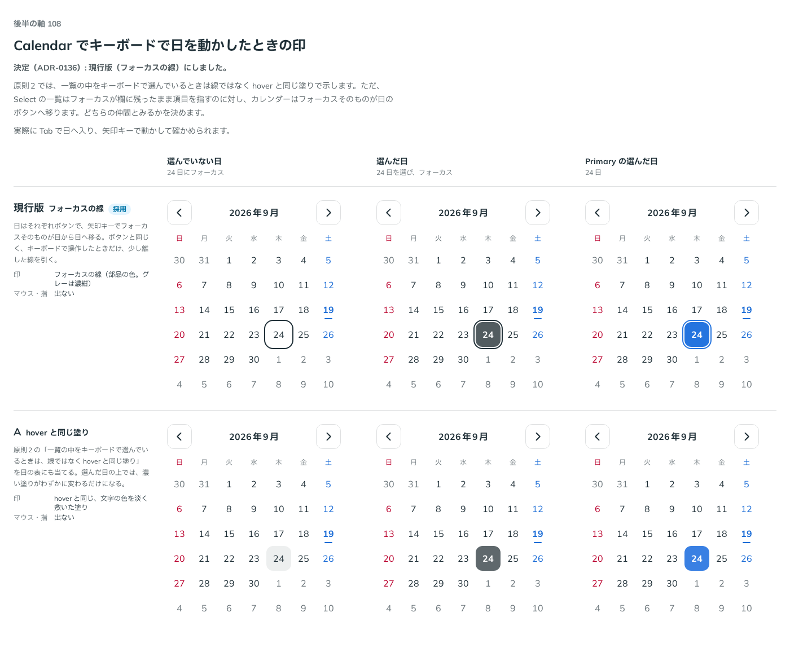

# 0136. Calendar でキーボードで日を動かしたときの印

- ステータス: Accepted
- 日付: 2026-09-19
- ラウンド: 後半 軸108

## 背景

原則 2 では、一覧の中をキーボードで選んでいるときは、線ではなく hover と同じ塗りで示す決まりがあります。Select の一覧はフォーカスが欄に残ったまま項目を指しますが、Calendar の日はそれぞれがボタンで、矢印キーでフォーカスそのものが日から日へ移ります。どちらの仲間として扱うかを決めます。

## 候補

| 案     | 内容                                                                                  |
| ------ | ------------------------------------------------------------------------------------- |
| 現行版 | フォーカスの線。ボタンと同じく、キーボードで操作したときだけ、少し離した線を引く      |
| A      | hover と同じ塗り。原則 2 の一覧の決まりをそのまま当て、文字の色を淡く敷いた塗りで示す |

状態は、選んでいない日・選んだ日・Primary の選んだ日の 3 列（いずれもフォーカス中）で比べました。

## 決定

**現行版（フォーカスの線）を採用します。**

## 理由

ユーザーの返事の原文です。

> 108: 現行版で OK です

- Calendar の日は Select の一覧の項目とは違い、フォーカスそのものが日のボタンへ移ります。ボタンの仲間として、キーボードで操作したときのフォーカスの線をそのまま引く形が選ばれました

## 却下した案と理由

- **A（hover と同じ塗り）**: 選ばれませんでした。フォーカスが欄に残ったまま項目を指す Select の一覧とは違い、Calendar の日はフォーカスそのものが移るボタンなので、ボタンと同じ表し方のほうが合っています

## 影響

- `src/components/calendar/Calendar.tsx`: フォーカスの線をそのまま使う実装のまま変更していません
- `design/tokens.css`: 比較用に置いていた `--calendar-focus-ring` を、フォーカスの線を出す値に固定して削除しました
- backlog に足す未決事項はありません

## 原則への反映

原則 2 の「一覧の中をキーボードで選んでいるときは、その項目を線ではなく hover と同じ塗りで示します」という一文を書き換えました。フォーカスが欄に残ったまま項目を指すときは塗りで示し、カレンダーの日のようにフォーカスそのものが項目ごとのボタンへ移るときは、ボタンと同じフォーカスの線を引く、という区別を明示しました。

## 比較画像

比較のストーリーは決めた時点のコミット 7688bba にあります。`git checkout 7688bba && pnpm storybook` で開けます。

