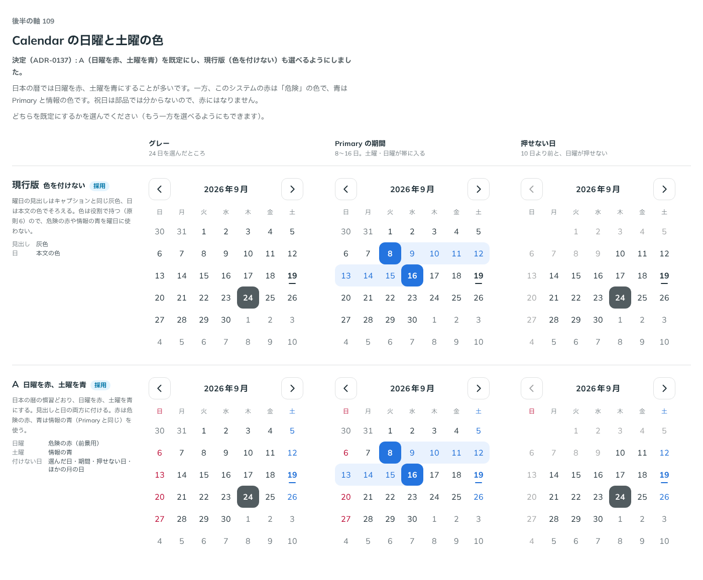

# 0137. Calendar の日曜・土曜の色

- ステータス: Accepted
- 日付: 2026-09-19
- ラウンド: 後半 軸109

## 背景

曜日の見出しと日の数字に、日曜・土曜の色を付けるかを決めます。原則 6 では「色は役割で持つ」ため、危険の赤や情報の青のような状態の色を、曜日という別の意味に使ってよいかが軸になります。一方で、日本の暦では日曜を赤、土曜を青にする慣習があります。

## 候補

| 案     | 内容                                                                                                                                                                         |
| ------ | ---------------------------------------------------------------------------------------------------------------------------------------------------------------------------- |
| 現行版 | 色を付けない。曜日の見出しはキャプションと同じ灰色、日は本文の色でそろえる                                                                                                   |
| A      | 日曜を赤、土曜を青にする。日本の暦の慣習どおり、見出しと日の両方に付ける。赤は危険の赤、青は情報の青（Primary と同じ）。選んだ日・期間・押せない日・ほかの月の日には付けない |

状態は、グレー・Primary の期間（土日が帯に入る）・押せない日の 3 列で比べました。

## 決定

**A（日曜を赤、土曜を青）を既定にし、現行版（色を付けない）も選べるようにしました。**

## 理由

ユーザーの返事の原文です。

> 109: A がデフォルトで、現行版も選べる、でお願いします。

- 日本の暦の慣習に合わせ、日曜を赤・土曜を青にする案が既定に選ばれました。危険の赤・情報の青という状態の色の役割とは別の意味で使うことになりますが、暦の慣習としての色付けは、状態の色を選ぶという原則 6 の考え方とは別枠として扱います
- 選んだ日・期間の帯・押せない日・ほかの月の日では、曜日の色より優先度の高い見た目（原則 1「押せなくなったものは押せない見た目を優先する」と同じ考え方）が勝つため、曜日の色は付けません
- 色を付けない現行版も、状態の色を厳密に役割だけで使いたい利用者のために選べるようにしました

## 却下した案と理由

却下した案はありません。両案とも採用しました（A を既定、現行版を選択可能に）。

## 影響

- `src/components/calendar/Calendar.tsx`: `weekendColor`（真偽値）props を足しました。既定は `true`（日曜赤・土曜青）で、`weekendColor={false}` で色を付けない見た目に切り替えられます
- `design/tokens.css`: `--color-calendar-sunday`・`--color-calendar-saturday`（前景用の赤・青）を役割トークンとして残しました。比較用の切り替えトークン `--calendar-weekend-color` は `weekendColor` props に畳み込みました
- backlog に足す未決事項はありません

## 原則への反映

原則 6 の文を書き換えました。カレンダーの日曜・祝日・土曜の色付け、今日の印、選んだ日・期間の色をまとめた段落を足しました（[ADR-0134](./0134-calendar-selected-day.md)・[ADR-0135](./0135-calendar-today.md)・[ADR-0140](./0140-calendar-holiday.md)・[ADR-0141](./0141-calendar-range-preview.md) と合わせて 1 段落にしています）。日本の暦の慣習に合わせて日曜・祝日を赤、土曜を青にできる、という一文を含みます。

## 比較画像

比較のストーリーは決めた時点のコミット 7688bba にあります。`git checkout 7688bba && pnpm storybook` で開けます。

