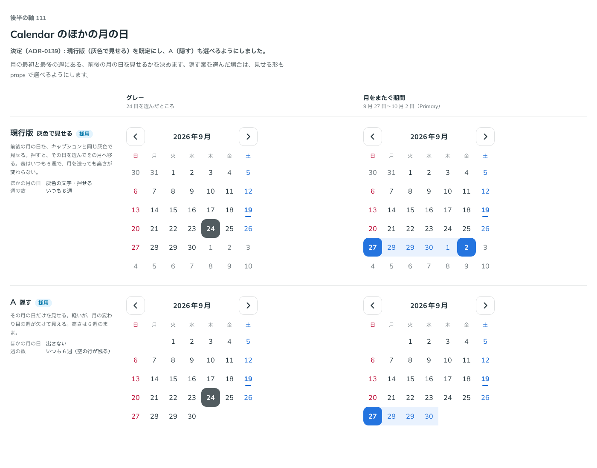

# 0139. Calendar のほかの月の日

- ステータス: Accepted
- 日付: 2026-09-19
- ラウンド: 後半 軸111

## 背景

月の最初と最後の週にある、前後の月の日を見せるかを決めます。表はいつも 6 週にそろえているので、隠しても高さは変わりません。

## 候補

| 案     | 内容                                                                                           |
| ------ | ---------------------------------------------------------------------------------------------- |
| 現行版 | 灰色で見せる。前後の月の日を、キャプションと同じ灰色で見せる。押すとその日を選んでその月へ移る |
| A      | 隠す。その月の日だけを見せる。高さは 6 週のまま（空の行が残る）                                |

状態は、グレー・月をまたぐ期間（Primary）の 2 列で比べました。

## 決定

**現行版（灰色で見せる）を既定にし、A（隠す）も選べるようにしました。**

## 理由

ユーザーの返事の原文です。

> 111: 現行デフォルト、隠すも選べるで。

- 灰色で見せる現行版は、月の変わり目の週がどこまで続くかが分かり、押せば前後の月へ移動できる案として既定に選ばれました
- 隠す A は、より軽い見た目を求める場面向けに選べる形として残しました

## 却下した案と理由

却下した案はありません。両案とも採用しました（現行版を既定、A を選択可能に）。

## 影響

- `src/components/calendar/Calendar.tsx`: `showOutsideDays`（真偽値）props を足しました。既定は `true`（灰色で見せる）で、`showOutsideDays={false}` で隠せます。表はどちらの値でもいつも 6 週です
- `design/tokens.css`: 比較用に置いていた `--calendar-outside-visible` は `showOutsideDays` props に畳み込んで削除しました
- backlog に足す未決事項はありません

## 原則への反映

反映なし（既存の原則の範囲内）。

## 比較画像

比較のストーリーは決めた時点のコミット 7688bba にあります。`git checkout 7688bba && pnpm storybook` で開けます。

