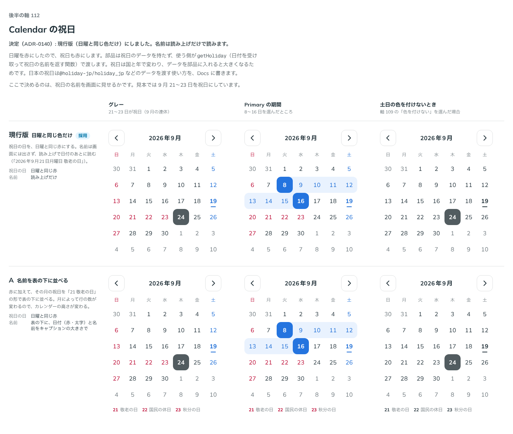

# 0140. Calendar の祝日

- ステータス: Accepted
- 日付: 2026-09-19
- ラウンド: 後半 軸112

## 背景

祝日をどう見せるかを決めます。祝日は国と年によって変わり、データを部品に持たせるとバンドルが大きくなるため、部品は祝日のデータを持ちません。使う側が、日付を受け取って祝日の名前を返す関数を渡す形にします。ここで決めるのは、色の付け方と、名前を画面に見せるかです。

## 候補

| 案     | 内容                                                                                                                                    |
| ------ | --------------------------------------------------------------------------------------------------------------------------------------- |
| 現行版 | 日曜と同じ色だけ。祝日の日を日曜と同じ赤にする。名前は画面には出さず、読み上げで日付のあとに読む                                        |
| A      | 名前を表の下に並べる。赤に加えて、その月の祝日を「21 敬老の日」の形で表の下に並べる。月によって行の数が変わり、カレンダーの高さも変わる |

状態は、グレー・Primary の期間・土日の色を付けないとき（[ADR-0137](./0137-calendar-weekend-color.md)）の 3 列で比べました。

## 決定

**現行版（日曜と同じ色だけ）を採用します。** 祝日の名前は画面には出さず、読み上げでだけ読みます。

## 理由

ユーザーの返事の原文です。

> 112: 日曜と同じ色でよさそうです。

- 日曜を赤にしたので（[ADR-0137](./0137-calendar-weekend-color.md)）、祝日も同じ赤にする案がそのまま選ばれました
- 名前を表の下に並べる A は、月によってカレンダーの高さが変わってしまうため採りません。名前は読み上げに含め、日付のあとに読み上げます（例:「2026年9月21日月曜日 敬老の日」）

## 却下した案と理由

- **A（名前を表の下に並べる）**: 選ばれませんでした。月によって祝日の行の数が変わり、カレンダーの高さが月ごとに変わってしまいます

## 影響

- `src/components/calendar/Calendar.tsx`: `getHoliday`（`(date: PlainDate) => string | undefined`）props を足しました。名前を返した日は日曜と同じ色になり、読み上げでは日付のあとに祝日の名前が読まれます。部品自体は祝日のデータを持ちません
- Docs（Storybook）に、日本の祝日を渡す使い方の例として `@holiday-jp/holiday_jp` などのデータを紹介します
- `design/tokens.css`: 比較用に置いていた `--calendar-holiday-list` の切り替えは、名前を画面に出さない決定により削除しました
- backlog に足す未決事項はありません

## 原則への反映

原則 6 の文を書き換えました。カレンダーの色・印をまとめた段落に、祝日は日曜と同じ色にし、名前は読み上げでだけ伝える、という一文を含めました（[ADR-0134](./0134-calendar-selected-day.md)・[ADR-0135](./0135-calendar-today.md)・[ADR-0137](./0137-calendar-weekend-color.md)・[ADR-0141](./0141-calendar-range-preview.md) と合わせて 1 段落にしています）。

## 比較画像

比較のストーリーは決めた時点のコミット 7688bba にあります。`git checkout 7688bba && pnpm storybook` で開けます。

