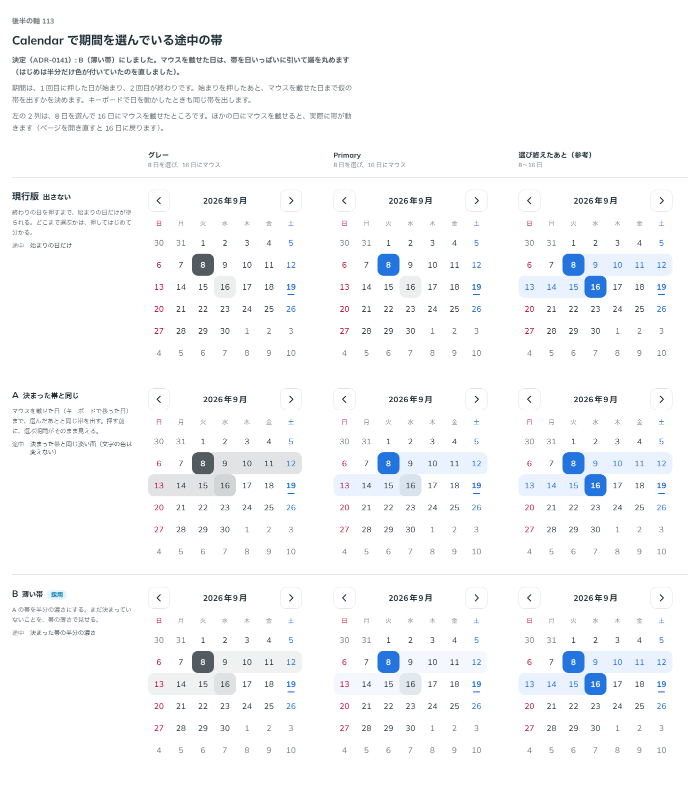

# 0141. Calendar で期間を選んでいる途中の帯

- ステータス: Accepted
- 日付: 2026-09-19
- ラウンド: 後半 軸113

## 背景

期間は、1 回目に押した日が始まり、2 回目が終わりです。始まりを押したあと、マウスを載せた日（キーボードで移った日）まで、仮の帯を出すかを決めます。

## 候補

| 案     | 内容                                                                         |
| ------ | ---------------------------------------------------------------------------- |
| 現行版 | 出さない。終わりの日を押すまで、始まりの日だけが塗られる                     |
| A      | 決まった帯と同じ。マウスを載せた日まで、選んだあとと同じ帯を出す             |
| B      | 薄い帯。A の帯を半分の濃さにする。まだ決まっていないことを、帯の薄さで見せる |

状態は、グレー（8 日を選び 16 日にマウス）・Primary（同様）・選び終えたあと（参考）の 3 列で比べました。

## 決定

**B（薄い帯）を採用します。** マウスを載せた日は、帯を日いっぱいに引いて端を丸めます。

## 理由

ユーザーの返事の原文です。

> 113: 開いた瞬間には、日付の四角の半分だけ色が変わることがあります。ものは B でよさそう

- B（薄い帯）は、期間がまだ決まっていないことを帯の薄さで見せられるので、決まった帯（[ADR-0134](./0134-calendar-selected-day.md)）と見分けが付きます
- 実装の初期版では、マウスを載せた日の帯が四角の半分だけ色付く不具合がありました。これを直し、マウスを載せた日は日いっぱいに帯を引き、端を日の角で丸める形にしました

## 却下した案と理由

- **現行版（出さない）**: 選ばれませんでした。終わりの日を押すまでどこまで選ぶか分からず、手応えに欠けます
- **A（決まった帯と同じ濃さ）**: 選ばれませんでした。まだ決まっていない期間と、決まった期間の帯が同じ濃さでは見分けが付きません

## 影響

- `src/components/calendar/Calendar.tsx`: 期間の始まりだけを選んだあと、マウスを載せた日・キーボードで移った日までの仮の帯を、決まった帯の半分の濃さで出す実装にしました。マウスを載せた日（塗っていない側）は帯を日いっぱいに引いて端を丸め、始まりの日（塗ってある側)は日の中央から帯を伸ばします
- `design/tokens.css`: 比較用に置いていた `--calendar-preview-opacity` は、0.5 に固定して削除しました
- backlog に足す未決事項はありません

## 原則への反映

原則 6 の文を書き換えました。カレンダーの色をまとめた段落に、選択中の期間は部品の色の淡い帯でつなぎ、まだ決まっていない期間はさらに薄い仮の帯で見せる、という一文を含めました（[ADR-0134](./0134-calendar-selected-day.md)・[ADR-0135](./0135-calendar-today.md)・[ADR-0137](./0137-calendar-weekend-color.md)・[ADR-0140](./0140-calendar-holiday.md) と合わせて 1 段落にしています）。

## 比較画像

比較のストーリーは決めた時点のコミット 7688bba にあります。`git checkout 7688bba && pnpm storybook` で開けます。

