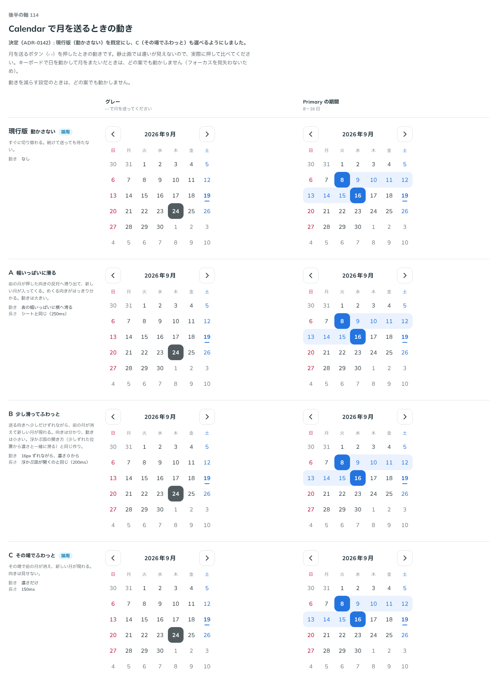

# 0142. Calendar で月を送るときの動き

- ステータス: Accepted
- 日付: 2026-09-19
- ラウンド: 後半 軸114

## 背景

月を送るボタン（‹ ›）を押したときの動きを決めます。新しい月は送る向きから入り、前の月は反対へ出る形を土台に、動きの大きさと長さの候補を比べました。静止画では違いが見えない軸なので、実際に押して確かめました。

## 候補

| 案     | 内容                                                                                                                  |
| ------ | --------------------------------------------------------------------------------------------------------------------- |
| 現行版 | 動かさない。すぐに切り替わる。続けて送っても待たない                                                                  |
| A      | 幅いっぱいに滑る。前の月が押した向きの反対へ滑り出て、新しい月が入ってくる。長さはシートと同じ（250ms）               |
| B      | 少し滑ってふわっと。送る向きへ少しだけずれながら、前の月が消えて新しい月が現れる。浮かぶ面の開き方と同じ作り（200ms） |
| C      | その場でふわっと。その場で前の月が消え、新しい月が現れる。向きは見せない（150ms）                                     |

状態は、グレー（月を送って確かめる）・Primary の期間の 2 列で比べました。

## 決定

**現行版（動かさない）を既定にし、C（その場でふわっと）も選べるようにしました。** A（幅いっぱいに滑る）・B（少し滑ってふわっと）は採りません。動きを減らす設定のときは、どの案でも動かしません。キーボードで日を動かして月をまたいだときも、フォーカスを見失わないよう動かしません。

## 理由

ユーザーの返事の原文です。

> 114: 現行がデフォルトで、C も選べるが良さそう

- 現行版（動かさない）は、続けて月を送っても待たされないので既定に選ばれました
- C（その場でふわっと、150ms）は、向きを見せずに軽く月が変わったことを伝えられる案として選べるようにしました
- A（幅いっぱいに滑る）・B（少し滑ってふわっと）は、より大きな動きの候補でしたが選ばれませんでした

## 却下した案と理由

- **A（幅いっぱいに滑る）**: 選ばれませんでした
- **B（少し滑ってふわっと）**: 選ばれませんでした

## 影響

- `src/components/calendar/Calendar.tsx`: `monthTransition`（`none` | `fade`）props を足しました。既定は `none`（動かさない）で、`monthTransition="fade"` でその場のフェード（150ms）に切り替えられます。動きを減らす設定では、どちらの値でも動かしません。キーボードでの月またぎでは、`monthTransition` の値によらず動かしません
- `design/tokens.css`: 比較用に置いていた `--calendar-motion-duration`・`--calendar-motion-distance`・`--calendar-motion-from-opacity` は、`monthTransition` の値ごとの見た目に畳み込みました。フェードの長さは `--calendar-month-fade-duration`（150ms）として残しています
- backlog に足す未決事項はありません

## 原則への反映

原則 3 の文を書き換えました。カレンダーの日を平らな押すものとして扱う一文（hover で淡く塗り、押すと沈む）に加え、月を送るときは既定では動かさず、静かなフェードも選べる、という一文を足しました。

## 比較画像

比較のストーリーは決めた時点のコミット 7688bba にあります。`git checkout 7688bba && pnpm storybook` で開けます。

