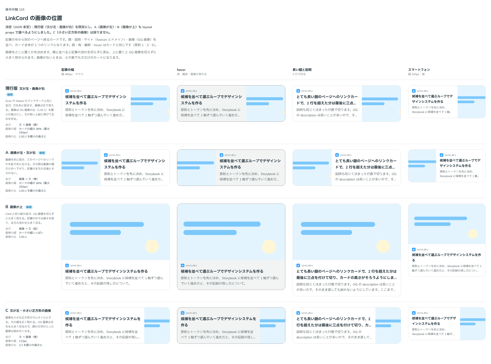

# 0143. LinkCard の画像の位置

- ステータス: Accepted
- 日付: 2026-09-19
- ラウンド: 後半 軸115

## 背景

LinkCard を作ります。記事の中から別のページへ移るカードで、題・説明・サイト（favicon とドメイン）・画像（OG 画像など）を並べ、カード全体が 1 つのリンクになります。面・角・輪郭・hover は Card と同じです（原則1・3・5）。Prose の中に置いても、中の `a`・`img` に当たる文字のリンク・画像の見た目が漏れないよう、詳細度を合わせて打ち消しています。

画像をどこに置くかを決めます。横に並べると記事の流れを切らずに済み、上に置くと OG 画像を切らずに大きく見せられます。

## 候補

| 案     | 内容                                                                               |
| ------ | ---------------------------------------------------------------------------------- |
| 現行版 | 文が左・画像が右。画像はカードの幅の 36%（最大 192px）、比は 1.91:1 を最小の高さに |
| A      | 画像が左・文が右。幅と比は現行版と同じ                                             |
| B      | 画像が上。Card と同じ縦の並び。画像はカードの幅いっぱい、比は 1.91:1               |
| C      | 文が左・小さい正方形の画像（112px、比 1:1）                                        |

状態は、記事の幅・hover・長い題と説明・スマートフォンの 4 列で比べました。

## 決定

**現行版（文が左・画像が右）を既定にし、A（画像が左）・B（画像が上）も layout props で選べるようにします。C（小さい正方形の画像）は採りません。** 画像がないときは、どの案も文だけの 1 列になります。

## 理由

ユーザーの返事の原文です。

> 112 現行版がデフォルトで、A と B は選べるようにしたいですね

- **現行版を既定にした理由**: Zenn や Notion のブックマークと同じ並びで、文を先に読ませられます
- **A・B も選べるようにした理由**: 返事のとおりです。並び順の好みは記事によって変わるため、layout の値で選べるようにしました
- **C を採らなかった理由**: 返事に挙がらず、選ばれませんでした。正方形に切ると、題の文字が入った OG 画像が読めなくなる欠点もあります

## 却下した案と理由

- **C（小さい正方形の画像）**: 選ばれませんでした。OG 画像は左右を大きく切るので、題の文字が入った画像は読めなくなります

## 影響

- `src/components/link-card/LinkCard.tsx`: `layout`（`end`・`start`・`top`、既定 `end`）の prop を足しました。画像がないときは、どの値でも文だけの 1 列になります
- `design/tokens.css`: `--link-card-media-width`・`--link-card-media-aspect` などの LinkCard のトークンを足しました。軸 115〜117 で比べるためだけに置いていた `--link-card-areas`・`--link-card-columns`・`--link-card-site-order`・`--link-card-favicon-display`・`--link-card-external-display`・`--link-card-title-heading`・`--link-card-title-lines`・`--link-card-description-lines` は、決まった値へ部品に畳んで消しました
- backlog に足す未決事項:
  - 画像が読み込みに失敗すると、Image の失敗の見た目（アイコンだけ）になります。文だけのカードとの見分けが付きにくいかは検討していません
  - 画像が右（既定）で文が長いレイアウトでは、画像が縦に伸びて大きく切れます。題の文字が入った OG 画像では、切れた分だけ読めなくなることがあります
  - 押せない LinkCard（disabled）と、`href` を持たない LinkCard は用意していません
  - Prose の中では `a` に `--color-own-focus` を primary で当てているため、LinkCard のフォーカスの線が青くなる可能性があります。確かめていません

## 原則への反映

反映なし（既存の原則の範囲内）。LinkCard の面・角・輪郭・hover は Card の決定（[ADR-0129](./0129-card-press.md)）のままで、画像の置き方は原則5「画像はカードの角です」の範囲で選べる並びを増やしただけです。

## 比較画像

比較のストーリーは決めた時点のコミット `8902982` にあります。`git checkout 8902982 && pnpm storybook` で開けます。

