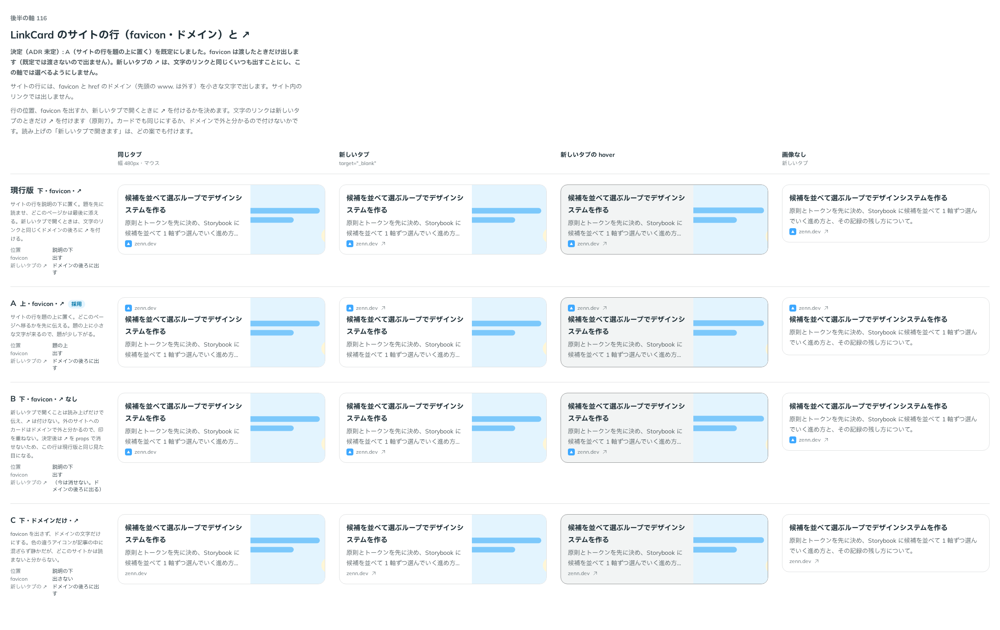

# 0144. LinkCard のサイトの行

- ステータス: Accepted
- 日付: 2026-09-19
- ラウンド: 後半 軸116

## 背景

LinkCard のサイトの行（favicon と href のドメイン。先頭の www. は外す）の位置と、favicon を出すか、新しいタブで開くときに文字のリンクと同じ ↗ を付けるかを決めます（[ADR-0143](./0143-link-card-layout.md) の続き）。サイト内のリンクでは、サイトの行を出しません。

## 候補

| 案     | 内容                                             |
| ------ | ------------------------------------------------ |
| 現行版 | サイトの行を説明の下・favicon を出す・↗ を付ける |
| A      | サイトの行を題の上・favicon を出す・↗ を付ける   |
| B      | 下・favicon を出す・↗ を付けない                 |
| C      | 下・favicon を出さない（ドメインの文字だけ）・↗  |

状態は、同じタブ・新しいタブ・新しいタブの hover・画像なしの 4 列で比べました。

## 決定

**A（サイトの行を題の上に置く）を既定にします。** favicon は渡したときだけ出します（既定では渡さないので出ません）。新しいタブで開くときの ↗ は、文字のリンクと同じくいつも出すことにし、この軸では選べるようにしません。

## 理由

ユーザーの返事の原文です。

> 113 上・favicon なしがデフォルト、上下・favicon は任意設定で。

- **A（上）を既定にした理由**: 返事のとおりです。どのページへ移るかを先に伝えられます
- **favicon を渡したときだけ出す理由**: 返事の「favicon なしがデフォルト」のとおりです。favicon の URL を渡す仕組みは props にあるので、渡せば出ます
- **↗ をいつも出す理由**: 文字のリンクは新しいタブのときだけ ↗ を付けます（原則7）。カードでもドメインの後ろに同じ印を付け、この軸では選べる形にしません

## 却下した案と理由

- **現行版（下・↗ あり）**: 既定には選ばれませんでした
- **B（↗ なし）**: 選ばれませんでした。決定後は ↗ を props で消せないため、この案は現行版と同じ見た目になります
- **C（favicon なし）**: 既定には選ばれませんでした。favicon は渡したときだけ出す形にしたので、渡さなければ C と同じ見た目になります

## 影響

- `src/components/link-card/LinkCard.tsx`: `sitePlacement`（`top`・`bottom`、既定 `top`）の prop を足しました。favicon は既存の `favicon` prop を渡したときだけ出します。新しいタブで開くときは、読み上げに「新しいタブで開きます」を足し、サイトの行の後ろに ↗ を常に付けます
- backlog に足す未決事項:
  - `site={false}` でサイトの行を出さないときは、新しいタブの ↗ の置き場がありません。読み上げの「新しいタブで開きます」だけで伝わります

## 原則への反映

反映なし（既存の原則の範囲内）。新しいタブのときに ↗ を付ける決まりは、原則7「文字のリンクは、新しいタブのときだけ文字の後ろに小さな矢印を付け」と同じ考えを LinkCard のサイトの行に当てはめただけです。

## 比較画像

比較のストーリーは決めた時点のコミット `8902982` にあります。`git checkout 8902982 && pnpm storybook` で開けます。

