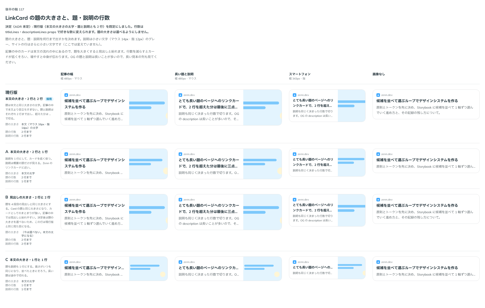

# 0145. LinkCard の題と説明の行数

- ステータス: Accepted
- 日付: 2026-09-19
- ラウンド: 後半 軸117

## 背景

LinkCard の題の大きさと、題・説明を何行まで出すかを決めます（[ADR-0143](./0143-link-card-layout.md)・[ADR-0144](./0144-link-card-site.md) の続き）。記事の中のカードは本文の流れの中にあるので、題を大きくすると見出しと紛れます。OG の題と説明は長いことが多いので、長い見本でも比べました。

## 候補

| 案     | 内容                                                |
| ------ | --------------------------------------------------- |
| 現行版 | 本文の大きさの太字。題・説明とも 2 行まで           |
| A      | 本文の大きさの太字。題 2 行・説明 1 行まで          |
| B      | 4 段目の見出しと同じ大きさの太字。題・説明とも 2 行 |
| C      | 本文の大きさの太字。題・説明とも 1 行まで           |

状態は、記事の幅・長い題と説明・スマートフォン・画像なしの 4 列で比べました。

## 決定

**現行版（本文の大きさの太字・題と説明とも 2 行）を既定にします。** 行数は `titleLines`・`descriptionLines` props で好きな数に変えられます。題の大きさは選べるようにしません。

## 理由

ユーザーの返事の原文です。

> 114 現行版がデフォルトで、行数を任意指定できると嬉しいですね

- **現行版を既定にした理由**: 返事のとおりです。題は本文と同じ大きさの太字で、記事の中で目立ちすぎません
- **行数を props で指定できるようにした理由**: 返事のとおりです。`titleLines`・`descriptionLines` で、記事に合わせて減らしたり増やしたりできます
- **題の大きさを選べるようにしなかった理由**: B（見出しの大きさ）は返事に挙がらず、選ばれませんでした。題を大きくすると記事の中の見出しと紛れるため、選べる形は持ちません

## 却下した案と理由

- **B（見出しの大きさ）**: 選ばれませんでした。Card の題と同じ大きさになりカードとしてのまとまりは強くなりますが、記事の中では見出しと紛れます

## 影響

- `src/components/link-card/LinkCard.tsx`: `titleLines`・`descriptionLines`（ともに既定 2）の prop を足しました。超えた分は三点（…）で切ります。題の大きさは本文の太字に固定しています
- backlog に足す未決事項:
  - 押せない LinkCard（disabled）と、`href` を持たない LinkCard は用意していません（[ADR-0143](./0143-link-card-layout.md) と同じ未決事項）

## 原則への反映

反映なし（既存の原則の範囲内）。題を本文と同じ大きさに留める判断は、原則9「記事の本文の部品は…見た目の選び分けを持ちません」と同じ、記事の流れを崩さない考えに沿っています。

## 比較画像

比較のストーリーは決めた時点のコミット `8902982` にあります。`git checkout 8902982 && pnpm storybook` で開けます。

