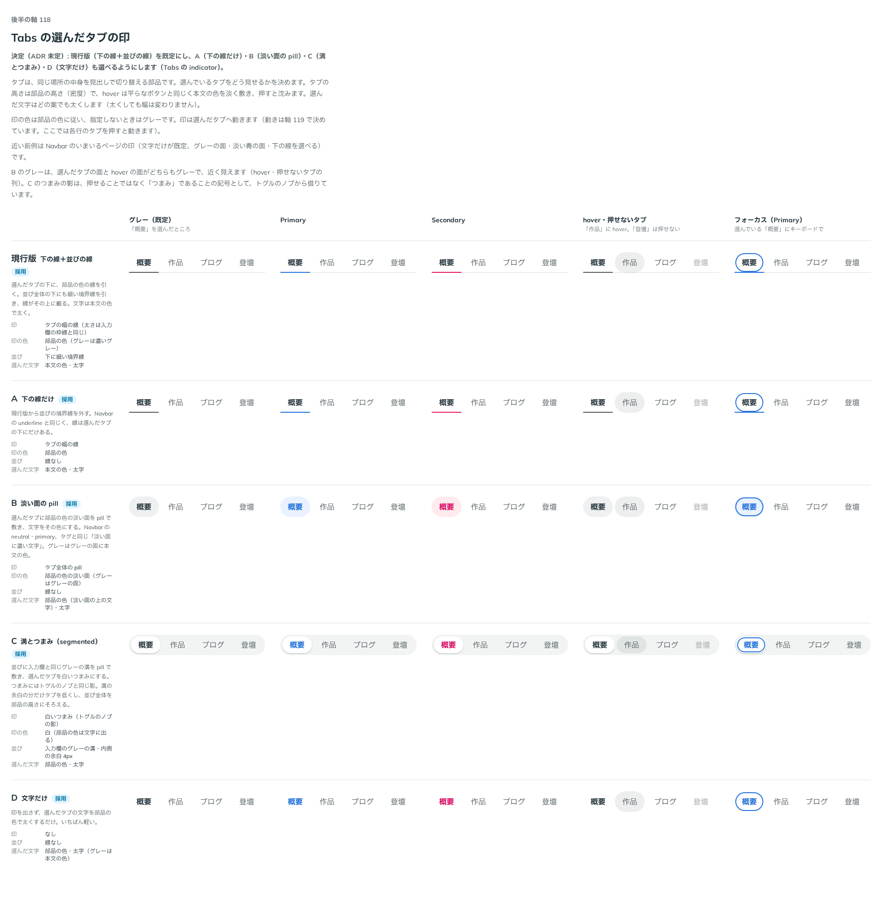

# 0146. Tabs の選んだタブの印

- ステータス: Accepted
- 日付: 2026-09-19
- ラウンド: 後半 軸118

## 背景

Tabs を作ります。同じ場所の中身を見出しで切り替える部品で、タブの高さは部品の高さ（密度）、hover は平らなボタンと同じく本文の色を淡く敷き、押すと沈みます（原則3・[ADR-0027](./0027-flat-press.md)）。選んだ文字はどの案でも太くします。決めるのは、選んでいるタブをどう見せるかです。近い前例は Navbar のいまいるページの印（[ADR-0130](./0130-navbar-current.md)）です。

## 候補

| 案     | 内容                                                                            |
| ------ | ------------------------------------------------------------------------------- |
| 現行版 | 選んだタブの下に部品の色の線。並び全体の下にも細い境界線                        |
| A      | 下の線だけ（並びの境界線なし）                                                  |
| B      | 選んだタブに部品の色の淡い面を pill で敷く（Navbar の neutral・primary と同じ） |
| C      | 並びに入力欄のグレーの溝を敷き、選んだタブを白いつまみにする（segmented）       |
| D      | 印を出さず、選んだタブの文字を部品の色で太くするだけ                            |

状態は、グレー（既定）・Primary・Secondary・hover と押せないタブ・フォーカス（Primary）の 5 列で比べました。

## 決定

**現行版（下の線＋並びの線）を既定にし、A（下の線だけ）・B（淡い面の pill）・C（溝とつまみ）・D（文字だけ）も `indicator` で選べるようにします。**

## 理由

ユーザーの返事の原文です。

> 115 現行版がデフォルトで、他全て選べるにしたいです

- **現行版を既定にした理由**: 返事のとおりです。線と並びの境界線の組み合わせが、いちばん見慣れた形です
- **A〜D も選べるようにした理由**: 返事のとおりです。すべての案が挙げられたため、`indicator` の値として残しました

## 却下した案と理由

なし。現行版・A・B・C・D のすべてを選べる形にしました。

## 影響

- `src/components/tabs/Tabs.tsx`: `indicator`（`line`・`underline`・`subtle`・`segmented`・`text`、既定 `line`）の prop を足しました。各案は `--tabs-indicator-*`・`--tabs-list-*`・`--tabs-tab-color` を決めきる内部の CSS 変数に畳んであります
- `design/tokens.css`: `--tabs-gap`・`--tabs-tab-radius`・`--tabs-indicator-bar` などの Tabs のトークンを足しました
- `src/index.ts` に `Tabs`・`TabList`・`Tab`・`TabPanel` と型を足しました
- backlog に足す未決事項:
  - 縦並び（vertical orientation）の Tabs は作っていません
  - 並びを幅いっぱいにする `fullWidth` は作っていません
  - はじめに選んでおいたタブが見えている範囲の外にあっても、その位置までスクロールしません
  - 押せないタブは、Base UI の既定のまま矢印キーで止まります。読み上げでは「利用不可」と分かりますが、そろえるかは決めていません
  - 別セッション（CodeGroup）から、Tabs に乗せ替えるときの要望が来ています: コードの題の帯に収まる高さと、コードの面の色（`--cb-fg`・`--cb-muted`・`--cb-line`）に差し替えられる色の入り口です

## 原則への反映

反映なし（既存の原則の範囲内）。タブの hover・押下は原則3の「枠線のボタンとリンクは、hover で文字の色を淡く敷きます」の範囲、選んだ印の色は原則6「選んでいることを示す印…も、部品の色に従います」の範囲です。印の形の選べる幅を増やしただけで、原則の文は変えていません。

## 比較画像

比較のストーリーは決めた時点のコミット `8902982` にあります。`git checkout 8902982 && pnpm storybook` で開けます。

