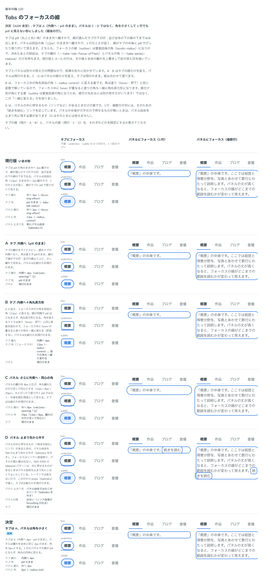

# 0148. Tabs のフォーカスの線

- ステータス: Accepted
- 日付: 2026-09-19
- ラウンド: 後半 軸120

## 背景

タブ（Tab）とタブの中身（TabPanel）にキーボードでフォーカスしたときの線を決めます。タブは pill（丸ごと丸い角）のまま外へ離すので、線が選んだタブの下の印・並び全体の下の線の下まではみ出します。パネルは部品の角（12px）のまま外へ離すので、1 行だと丈が低く、線がタブの中身に pill でぴったり張り付いて見えます。フォーカスの線（outline）は要素自身の角（border-radius）に沿うため、この 2 つは別々の見え方の問題です。

## 候補

タブの線（現行版と組み合わせ自由。パネルは比較のため現行のまま）:

| 案     | 内容                                                   |
| ------ | ------------------------------------------------------ |
| 現行版 | pill の角のまま外へ 2px 離す                           |
| A      | 内側へ 4px 離す。角は pill のまま                      |
| B      | A に加え、フォーカス中だけ角を部品の角（12px）に変える |

パネルの線（タブは比較のため現行のまま）:

| 案     | 内容                                                                    |
| ------ | ----------------------------------------------------------------------- |
| 現行版 | 部品の角（12px）のまま外へ 2px 離す                                     |
| C      | 離れを外へ 8px に広げ、角も離れた分だけ足して同心（20px）にする         |
| D      | パネルの中に押せるものがあるときは、パネル自体を Tab の止まり先から外す |

状態は、タブにフォーカス（下線・underline・subtle の 3 印）・パネルにフォーカス（1 行）・パネルにフォーカス（複数行）の 3 列で比べました。

## 決定

**タブは A（内側へ 4px・pill のまま）にします。パネルは、C・D ではなく、離れは全体と同じ 2px のまま角を 6px（`--radius-md`）に小さくする形にしました。** 1 行のパネルでも、線が pill に見えず角丸の四角に見えます。

## 理由

ユーザーの返事の原文です。

> Tabs とその内容にフォーカスしたときのフォーカスリングについて考えたいです。下線よりもはみ出しているので、違和感があります

> Tab の内容も pill の形のフォーカスリングになってしまいますね

> 117 は タブは A で、パネルフォーカス時は1行でも pill ではなくAB のように角丸の形になるようにしてほしいです。

- **タブを A にした理由**: 返事のとおりです。線を内側へ引くことで、下の印・並びの線より上に、少し離れて収まります
- **パネルを角丸の四角にした理由**: 返事の「1 行でも pill ではなく…角丸の形になるように」のとおりです。C（さらに外側へ）・D（止まり先から外す）ではなく、角を小さくする形で、1 行でも pill に見えないようにしました
- **B を採らなかった理由**: フォーカス中の角を部品の角に変える案でしたが、塗り（hover・押下）と同じ変数で角を解いているため、フォーカス中に hover が重なると塗りの角も一緒に変わってしまいます。決定では、この「一緒に変わる」複雑さを避けました

## 却下した案と理由

- **B（タブ: 内側へ＋角丸長方形）**: 選ばれませんでした。塗りの角と連動してしまう複雑さがあります
- **C（パネル: さらに外側へ・同心の角）**: 選ばれませんでした
- **D（パネル: 止まり先から外す）**: 選ばれませんでした。パネルの中身が文字だけで押せるものがないときは使えない案でもあります

## 影響

- `src/components/tabs/Tabs.tsx`: タブの離れは `--tabs-tab-focus-offset`（内側へ 4px）、パネルの角は `--tabs-panel-radius`（`--radius-md`、6px）で決めています。パネルの離れは全体のフォーカスの線と同じ 2px のままです
- backlog に足す未決事項:
  - タブの並び（TabList）は、フォーカスの線が枠で切れないよう外へ 4px 広げているので、並びの左右に余白がない場所では、その分だけ枠をはみ出すことがあります
  - 別セッション（CodeGroup）から、フォーカスの線の位置がこちら（内側 4px）とあちら（offset 0）で食い違っているという知らせが来ています。あちらがユーザーに確認する予定です

## 原則への反映

原則2の文を書き換えました。「線は部品から少し離して描く」を「線は部品の形からはみ出して見えない位置に描く」に改め、多くの部品は外側、下に印や区切りの線を持つタブは内側、と書き分けました。あわせて、線は囲んだものの角に沿い、文を囲む面（タブの中身）は 1 行でも pill に見えないよう角を小さくする、という一文を足しました。

## 比較画像

比較のストーリーは決めた時点のコミット `8902982` にあります。`git checkout 8902982 && pnpm storybook` で開けます。

