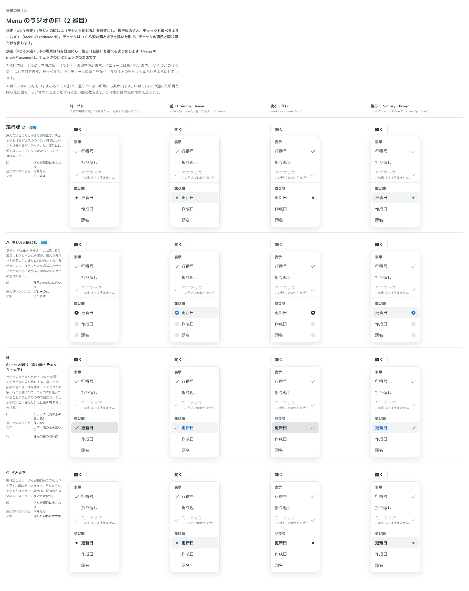

# 0149. Menu のチェックとラジオの印

- ステータス: Accepted
- 日付: 2026-09-19
- ラウンド: 後半 軸121（2 巡目）

## 背景

Menu を作ります。押して開く操作の一覧で、項目は入力欄の仲間です（原則3）。hover とキーボードの選択はどちらも入力欄の塗りで示し、危険な項目は赤を淡く敷きます。決めるのは、チェック（MenuCheckboxItem）とラジオ（MenuRadioItem）の印の場所と、ラジオの印の形です。

1 巡目では印の場所（前・後ろ）だけを決め、ラジオの印は次のラウンドで再検討することにしていました。

## 候補

印の場所（markPlacement）:

| 案   | 内容                                             |
| ---- | ------------------------------------------------ |
| 前   | 文字の前（印のある項目どうしの文字の左がそろう） |
| 後ろ | 右端（ふつうの項目と文字の左がそろう）           |

ラジオの印（radioMark、2 巡目）:

| 案     | 内容                                                                                           |
| ------ | ---------------------------------------------------------------------------------------------- |
| 現行版 | 選んだ項目にだけ小さな点。選んでいない項目には何もない                                         |
| A      | ラジオと同じ丸を小さくした形。どの項目にもグレーの丸を置き、選んだ丸だけ部品の色の塗りに白い点 |
| B      | Select の選んだ項目と同じ（淡い面・チェック・太字）                                            |
| C      | 現行版の点に、選んだ項目の文字の太字を足す                                                     |

状態は、前・グレー、前・Primary・hover、後ろ・グレー、後ろ・Primary・hover の 4 列で比べました。

## 決定

**印の場所は前を既定にし、後ろ（右端）も `markPlacement` で選べるようにします。** **ラジオの印は A（ラジオと同じ丸）を既定にし、現行版の点と、チェックも `radioMark` で選べるようにします。** チェックは B から淡い面と太字を除いた形で、チェックの項目と同じ印だけを出します（アクティブカラーの面は敷きません）。

## 理由

ユーザーの返事の原文です。

> 118 前がデフォルトで後ろも選べる、ラジオの場合、もうちょっといい表現が無いか検討したいです

> 118: A が分かりやすいのでデフォルトで、現行版またはチェックにもできる（アクティブカラーはなし）がいいですね。

- **印の場所を前を既定にした理由**: 返事のとおりです。後ろも `markPlacement="end"` で選べます
- **ラジオの印を A にした理由**: 返事のとおりです。選んでいない項目にもグレーの丸を置くことで、丸が並んで見え、ひとつだけを選ぶことがラジオと同じ形で読めます
- **B を面なしのチェックとして採った理由**: 返事の「アクティブカラーはなし」のとおりです。行に淡い面を敷く形は採らず、チェックの印だけを出します

## 却下した案と理由

- **B（Select と同じ、淡い面・太字つき）**: そのままの形では選ばれませんでした。面と太字を除き、チェックの印だけを出す形にしました

## 影響

- `src/components/menu/Menu.tsx`: `markPlacement`（`start`・`end`、既定 `start`）・`radioMark`（`radio`・`dot`・`check`、既定 `radio`）の prop を足しました
- `src/components/menu/MenuItem.tsx`: `RadioMark` で 3 つの印の形を描きます。`radio` は選んでいない項目にもグレーの丸を置き、選んだ丸だけ部品の色の塗りに白い点にします
- Select の backlog にあった「構造（浮かぶ選択肢かボトムシートか）を固定する Provider は、Menu など2つ目の浮かぶ UI を作るときに作る」という行は消しました。`ThemeProvider` の `presentation` がすでに Select・Menu・Dialog・Popover をまとめて決めているためです
- backlog に足す未決事項:
  - `MenuLinkItem` には `disabled` がありません
  - 印を前に置くと、印を持たない `MenuItem`・`MenuLinkItem` は印の場所を確保しないため、印のある項目と文字の左がそろいません
  - `MenuCheckboxItem`・`MenuRadioItem` は、選んだ行に面を敷きません（Select の選んだ項目は面を敷きます）

## 原則への反映

原則3の文を書き換えました。「一覧の項目（選択肢、メニュー）は入力欄の仲間で…」の一文に続けて、1 つだけを選ぶ項目は、選んでいない項目にも印の場所を丸く空けておき、選んだ丸だけをラジオと同じように塗って示す、という一文を足しました。

## 比較画像

比較のストーリーは決めた時点のコミット `8902982` にあります。`git checkout 8902982 && pnpm storybook` で開けます。

