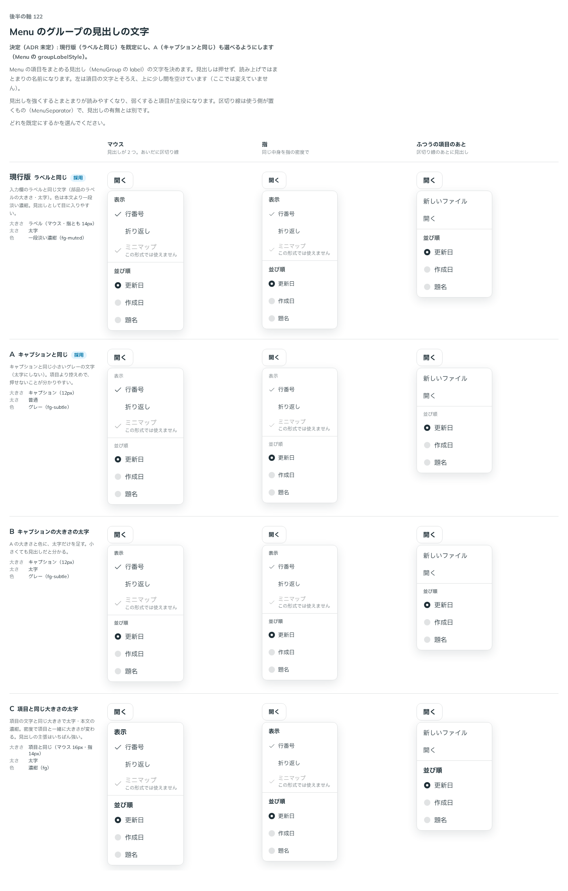

# 0150. Menu のグループの見出し

- ステータス: Accepted
- 日付: 2026-09-19
- ラウンド: 後半 軸122

## 背景

Menu の項目をまとめる見出し（MenuGroup の `label`）の文字を決めます。見出しは押せず、読み上げではまとまりの名前になります。左は項目の文字とそろえ、上に少し間を空けます。区切り線は使う側が置くもの（MenuSeparator）で、見出しの有無とは別です。

## 候補

| 案     | 内容                                                           |
| ------ | -------------------------------------------------------------- |
| 現行版 | 入力欄のラベルと同じ文字（ラベルの大きさ・太字・一段淡い濃紺） |
| A      | キャプションと同じ小さいグレーの文字（太字にしない）           |
| B      | A の大きさと色に、太字だけを足す                               |
| C      | 項目と同じ大きさの太字・本文の濃紺                             |

状態は、マウス・指・ふつうの項目のあとの 3 列で比べました。

## 決定

**現行版（ラベルと同じ）を既定にし、A（キャプションと同じ）も `groupLabelStyle` で選べるようにします。**

## 理由

ユーザーの返事の原文です。

> 119 現行版がデフォルト、A も選べるがいいかもですね

- **現行版を既定にした理由**: 返事のとおりです。ラベルと同じ太字で、見出しとして目に入りやすくなります
- **A も選べるようにした理由**: 返事のとおりです。項目を主役にしたいときは、控えめな `groupLabelStyle="caption"` を選べます
- **B・C を採らなかった理由**: 返事に挙がらず、選ばれませんでした

## 却下した案と理由

- **B（キャプションの大きさの太字）**: 選ばれませんでした
- **C（項目と同じ大きさの太字）**: 選ばれませんでした。見出しの主張がいちばん強く、項目と紛れる懸念があります

## 影響

- `src/components/menu/Menu.tsx`: `groupLabelStyle`（`label`・`caption`、既定 `label`）の prop を足しました
- `src/components/menu/menu-styles.ts`: `menuGroupLabel` の tv に `style` バリアントを持たせました
- backlog に足す未決事項はありません

## 原則への反映

反映なし（既存の原則の範囲内）。ラベル・キャプションの文字の大きさと色は、原則4「部品は『ラベル / 本体 / キャプション』の 3 層」で決めた形をそのまま使っています。

## 比較画像

比較のストーリーは決めた時点のコミット `8902982` にあります。`git checkout 8902982 && pnpm storybook` で開けます。

