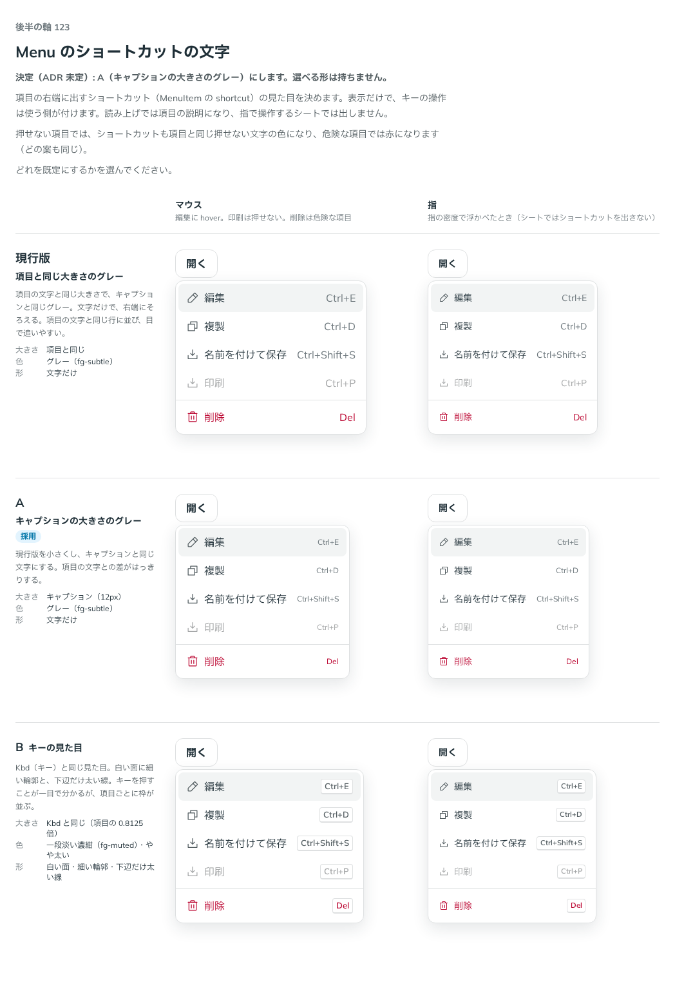

# 0151. Menu のショートカットの文字

- ステータス: Accepted
- 日付: 2026-09-19
- ラウンド: 後半 軸123

## 背景

項目の右端に出すショートカット（MenuItem の `shortcut`。例: 「Ctrl+E」）の見た目を決めます。表示だけで、キーの操作は使う側が付けます。読み上げでは項目の説明になり、指で操作するシートでは出しません。

## 候補

| 案     | 内容                                                      |
| ------ | --------------------------------------------------------- |
| 現行版 | 項目の文字と同じ大きさで、キャプションと同じグレー        |
| A      | キャプションの大きさのグレー                              |
| B      | Kbd（キー）と同じ見た目。白い面に細い輪郭、下辺だけ太い線 |

状態は、マウス（編集に hover、印刷は押せない、削除は危険な項目）・指の 2 列で比べました。

## 決定

**A（キャプションの大きさのグレー）にします。選べる形は持ちません。**

## 理由

ユーザーの返事の原文です。

> 120 A でよさそう

- **A にした理由**: 返事のとおりです。項目の文字より小さくすることで、ショートカットと項目の文字の差がはっきりします
- **B を採らなかった理由**: Kbd と同じ見た目にすると、項目ごとに枠が並び、一覧としてはにぎやかになります。返事にも挙がりませんでした

## 却下した案と理由

- **現行版（項目と同じ大きさ）**: 選ばれませんでした
- **B（キーの見た目）**: 選ばれませんでした

## 影響

- `src/components/menu/MenuItem.tsx`: ショートカットの文字はキャプションと同じ大きさ・グレーに固定しました。選べる prop は持ちません
- 押せない項目ではショートカットも項目と同じ押せない文字の色に、危険な項目では赤になります（どの案も同じ）
- backlog に足す未決事項はありません

## 原則への反映

反映なし（既存の原則の範囲内）。ショートカットの文字は、原則4の「キャプションと同じ形の行」の考えをそのまま当てはめています。

## 比較画像

比較のストーリーは決めた時点のコミット `8902982` にあります。`git checkout 8902982 && pnpm storybook` で開けます。

