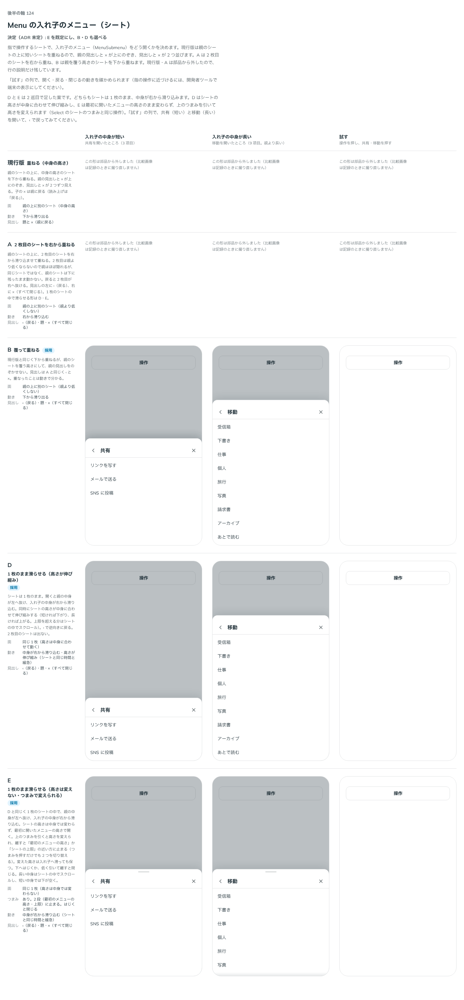

# 0152. Menu の入れ子をシートで開く形と、つまみ

- ステータス: Accepted
- 日付: 2026-09-19
- ラウンド: 後半 軸124（3 巡目）

## 背景

指で操作するシートで、入れ子のメニュー（MenuSubmenu）をどう開くかを決めます。浮かべる形では、入れ子は Base UI の既定どおり親の項目の横に出すので変えていません。1 巡目は、親のシートの上に短いシートを重ねる形（現行版）と、2 枚目のシートを右から重ねる形（A）を比べましたが、どちらも部品からは外れました。2・3 巡目で、シートを 1 枚のまま保つ形（D・E）を作りました。

あわせて、シートの上端のつまみ（[ADR-0110](./0110-sheet-handle-and-long-press-side.md)）を、入れ子がなくても、はじく・下へ引いて閉じられるとき（`closeOnSwipe`）に出すかを決めます。

## 候補

| 案     | 内容                                                                                                                         |
| ------ | ---------------------------------------------------------------------------------------------------------------------------- |
| 現行版 | 親のシートの上に、中身の高さのシートを下から重ねる。親の見出しと × が上にのぞく                                              |
| A      | 親のシートの上に、2 枚目のシートを右から重ねる。同じシートではなく、親のシートは下に残ったまま動かない                       |
| B      | 現行版と同じく下から重ねるが、親のシートを覆う高さにして親の見出しをのぞかせない（cover）                                    |
| D      | シートは 1 枚のまま。中身が右から滑り込み、シートの高さは中身に合わせて伸び縮みする（fit）                                   |
| E      | シートは 1 枚のまま。中身が右から滑り込み、高さは最初に開いたメニューの高さのまま変わらない。上のつまみで変えられる（fixed） |

どの形も、見出しの左に親へ戻る ‹ を、右にすべてを閉じる × を置きます。現行版・A は部品から外したので、比較のストーリーでは行の説明だけを残しました。状態は、入れ子の中身が短い・長い・試す（実際に操作できる列）の 3 列で比べました。

## 決定

**E（1 枚のまま滑らせる。高さは変えない・つまみで変えられる）を既定にし、B（覆って重ねる）・D（1 枚のまま滑らせる。高さが伸び縮み）も `submenuSheet` で選べるようにします。現行版（旧 stack）・A（旧 replace）は部品から外しました。**

つまみ（Select のシートと同じ、引く・はじく操作）は、次の 2 つのときに出します。

- `submenuSheet="fixed"`（既定）で、入れ子（MenuSubmenu）があるとき。高さを変えられます
- 入れ子がなくても、`closeOnSwipe` を true にしたとき。高さは変えず、はじく・下へ引いて閉じるだけです

入れ子がなく `closeOnSwipe` も false のときは、つまみを出しません（原則11・[ADR-0110](./0110-sheet-handle-and-long-press-side.md): つまみは引けることの印なので、引けないときは出しません）。

## 理由

ユーザーの返事の原文です。1 巡目は現行版・A のまま「シートの入れ子（submenuSheet: stack / replace / cover）。子の × は『戻る』に直した」段階で保留にしました。

> 121: 右から左に内容がスライドしてくる ＋ 内容に応じて高さが伸縮する（）はどうですか？2枚目が出てくるよりいいかなと。実装してみてもらえますか？

> 121 ですが、高さが最初に開いたメニューのまま変わらず、滑ってくる、という形も見てみたいです

> ちなみに A 案はちゃんと動いてますか？（同じシートになっていない気がする）

> 121 の E ですが、つまみありにして高さを自分で変えられるようにしたい気持ちがありますね

> 121 は EがデフォルトでB/Dを選べるようにしたいです

> 入れ子があるときだけ高さが変わる可能性があるので、入れ子が無い時はデフォルトなし、スワイプでも閉じれるようにする場合は、前の原則と同じようにつまみを表示する、とします。

- **D・E を作った理由**: 返事の「2 枚目が出てくるよりいいかな」のとおり、2 枚目の面を重ねず、1 枚のシートの中で中身だけを滑らせる形を求められました
- **A について**: 「同じシートになっていない気がする」という指摘のとおり、A は 2 枚目のシートを右から重ねる作りで、1 枚のシートの中で滑る D・E とは違う仕組みでした。比較のストーリーの説明をこの点が分かるように直しました
- **E を既定にした理由**: 返事のとおりです。高さが変わらないことで、入れ子へ進んでも画面が跳ねません
- **B・D を選べるようにした理由**: 返事のとおりです。親を覆う高さで重ねたい場合（B）、中身に合わせて高さを変えたい場合（D）向けに残しました
- **つまみの条件**: 返事の「入れ子があるときだけ高さが変わる可能性があるので…」のとおりです。変えられる可能性があるときだけ、引けることの印を出します

## 却下した案と理由

- **現行版（旧 stack。中身の高さで重ねる）**: 選ばれませんでした。親の見出しと × が上にのぞき、見出しと × が 2 つずつ見えてしまいます
- **A（旧 replace。2 枚目のシートを右から重ねる）**: 選ばれませんでした。同じシートに見えないという指摘のとおり、親のシートが下に残ったまま動かない作りでした

## 影響

- `src/components/menu/Menu.tsx`・`menu-context.ts`: `submenuSheet`（`fixed`・`fit`・`cover`、既定 `fixed`）・`closeOnSwipe`（既定 `false`）の prop を足しました。`fixed`・`fit` は入れ子を別の面にせず、同じシートの中のパネルとして描きます（`MenuSlide.tsx`・`use-menu-slide.ts`）。`cover` は Base UI の入れ子の Popup をそのまま使い、親と同じ高さ以上の面を重ねます
- `src/internal/sheet/use-sheet-drag.ts` を `src/internal/sheet` へ移し、Select のシートと Menu のシートで共有しました
- backlog に足す未決事項:
  - シートのスクロールバーが `ScrollArea` とそろっていません。ユーザーの返事は「スクロールバーは後から一気に修正でよさそう。一旦無視でおけです」で、まとめて直す予定です
  - 開閉と入れ子の動きは、実機（タッチ操作）で確かめていません
  - 比較のストーリー（`open`・`modal={false}` で複数の Menu を常に開いたまま並べるページ）では、各シートの高さを測る `ResizeObserver` が競合し、ページがまれに動くことがありました。実際の使い方では 1 つずつしか開かないため、部品自体の不具合ではないと考えていますが確かめていません

## 原則への反映

原則11の文を書き換えました。シートの中に、さらに一段深い一覧があるときは、別の面を重ねず同じシートの中で内容を横に滑らせて進み、面は深さによらず 1 つのままにする、という一文を足しました。

## 比較画像

比較のストーリーは決めた時点のコミット `8902982` にあります。`git checkout 8902982 && pnpm storybook` で開けます。現行版・A は、その時点ですでに部品から外れていたため、画像でも動く見本はなく、説明だけが残っています。

