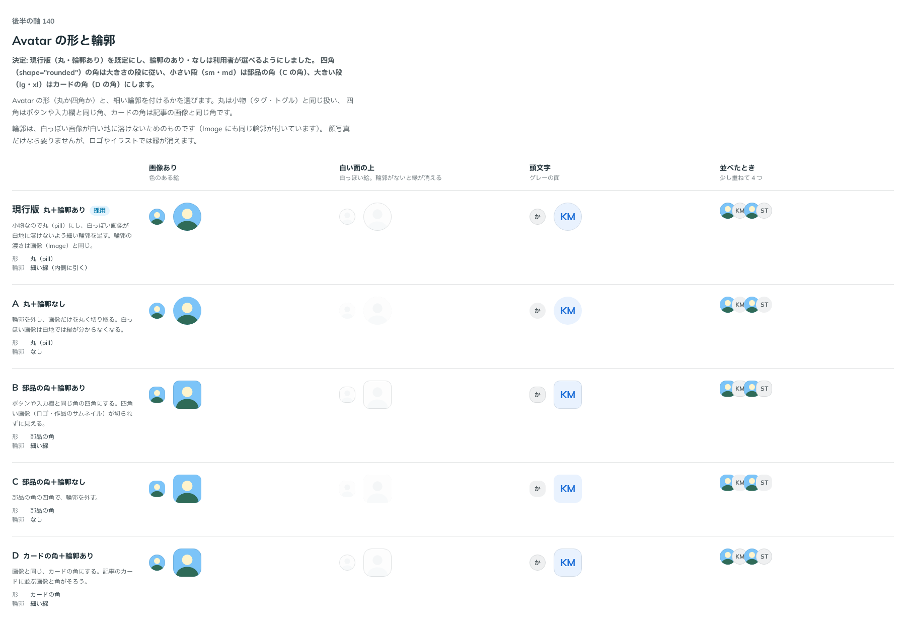

# 0154. Avatar の形と輪郭

- ステータス: Accepted
- 日付: 2026-09-19
- ラウンド: 後半 軸140〜150

## 背景

Avatar（人やものの顔）を作ります。押せないのでページと同じレイヤーに置き、影は付けません（原則1）。画像は 1:1 で切り取り、大きさは段（sm・md・lg・xl）で持ちます。押すものではないので、寸法は入力方式では変えません（原則11。Badge と同じ扱い）。

決めるのは、角の形と、細い輪郭を付けるかです。原則5 では「小物は pill、部品は部品の角、画像はカードの角」と分かれていて、Avatar はそのどれにも当てはまります。輪郭は、白っぽい画像が白い地に溶けないためのもので、Image にも同じ濃さの線が付いています（原則1）。

## 候補

| 案     | 内容                                       |
| ------ | ------------------------------------------ |
| 現行版 | 丸（pill）＋細い輪郭                       |
| A      | 丸（pill）・輪郭なし                       |
| B      | 部品の角（ボタン・入力欄と同じ）＋細い輪郭 |
| C      | 部品の角・輪郭なし                         |
| D      | カードの角（記事の画像と同じ）＋細い輪郭   |

状態は、画像あり・白い面の上に置いた白っぽい画像・頭文字・少し重ねて並べたときの 4 列で比べました。

## 決定

**現行版（丸＋輪郭あり）を既定にします。輪郭のあり・なしは `outline` で選べます。四角（`shape="rounded"`）の角は大きさの段に従い、小さい段（sm・md）は C と同じ部品の角、大きい段（lg・xl）は D と同じカードの角にします。**

あわせて、大きさの段は提案のまま（sm 24・md 32・lg 40・xl 56px、頭文字は段のおよそ 0.4 倍）としました。

## 理由

ユーザーの返事の原文です。

> 140: デフォルト丸・輪郭あり、輪郭ありなし選択可、角は大きいサイズの時D、小さいサイズの時C

> 140 は一旦これで。

大きさの段については、次のとおりです。

> 1: OK

- **丸を既定にした理由**: 返事のとおりです。人の顔は丸が見慣れた形で、小物（タグ・トグル）と同じ pill なので原則5 の中に収まります
- **輪郭を選べるようにした理由**: 返事のとおりです。顔写真だけなら要りませんが、ロゴや白っぽいイラストでは白地で縁が消えます（原則1）
- **四角の角を段に従わせた理由**: 返事のとおりです。24px の小さな四角にカードの角を当てると丸に近づき、56px の四角に部品の角を当てると角が小さく見えます。角を段に従わせると、どの段でも同じ「四角らしさ」になります。高さに比例させる規則（原則5 が採らない形）ではなく、段ごとに決め打った値です

## 却下した案と理由

なし。5 つの案は `shape` と `outline` の組み合わせ、または段ごとの角として、すべて残っています。

## 影響

- `src/components/avatar/Avatar.tsx`: `shape`（`circle`・`rounded`、既定 `circle`）と `outline`（既定 `true`）の props を足しました。四角の角は、大きさの段が `--avatar-radius-rounded` を段ごとの値に差し替え、`shape` がそれを読む形にしてあります
- `design/tokens.css`: `--avatar-size-sm`〜`-xl`・`--avatar-text-sm`〜`-xl`・`--avatar-radius-circle`・`--avatar-radius-rounded-sm`〜`-xl`・`--avatar-outline-width`・`--avatar-outline-color` を足しました。輪郭の濃さは Image の輪郭と同じです
- `src/components/avatar/Avatar.stories.tsx`: 大きさ × 形の一覧を置き、四角の角が段で変わることを見せています
- `src/index.ts` に `Avatar` と型を足しました
- backlog に足す未決事項:
  - アバターを重ねて並べる形（AvatarGroup。面の色の縁で切り分ける）は作っていません
  - 押せるアバター（メニューを開くボタンにする使い方）は作っていません
  - 状態の点（在席・不在）を重ねる形は決めていません

## 原則への反映

反映なし。原則 1〜12 の文は変えていない。原則の書き直しは別セッションが受け持つ。

## 比較画像

比較のストーリーは決めた時点のコミット `cdff792` にあります。`git checkout cdff792 && pnpm storybook` で開けます。

