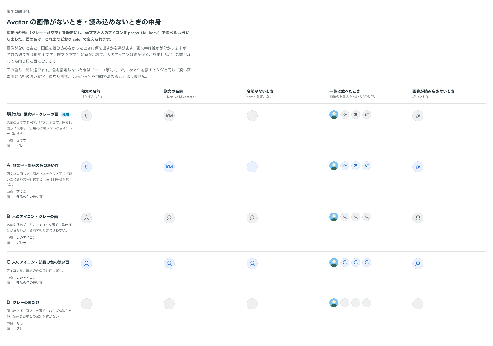

# 0155. Avatar の画像がないとき

- ステータス: Accepted
- 日付: 2026-09-19
- ラウンド: 後半 軸140〜150

## 背景

Avatar は画像を出す部品ですが、画像を持たない人もいますし、URL が切れていることもあります。そのときに何を出すかを決めます。形と輪郭は [ADR-0154](./0154-avatar-shape.md) で決めました。

色は原則6 のとおり、指定しないときはグレーです。淡い面に同じ色相の濃い文字（Tag と同じ組）も持てます。名前から色を自動で決める形は、色は利用者が選ぶという原則6 に反するので、はじめから候補にしていません。

## 候補

| 案     | 内容                           |
| ------ | ------------------------------ |
| 現行版 | 名前の頭文字・グレーの面       |
| A      | 名前の頭文字・部品の色の淡い面 |
| B      | 人のアイコン・グレーの面       |
| C      | 人のアイコン・部品の色の淡い面 |
| D      | 何も置かず、グレーの面だけ     |

状態は、和文の名前・欧文の名前・名前がないとき・一覧に並べたとき・画像が読み込めないときの 5 列で比べました。

## 決定

**現行版（グレーの面に頭文字）を既定にします。頭文字にするか人のアイコンにするかは `fallback` で選べ、面と文字の色はこれまでどおり `color` で変えられます。**

あわせて、次の 2 つを決めました。

- 頭文字は、和文は 1 文字、欧文は語頭 2 文字までです。欧文で 1 語だけの名前（`Kazuya`）は 1 文字（`K`）にします
- 頭文字や人のアイコンに切り替わったときも、名前を読み上げに残します

## 理由

ユーザーの返事の原文です。

> 141: デフォルトグレー・頭文字、名前にするか人アイコンにするかを指定可能、色はユーザーで変更可能

頭文字の作り方と読み上げについては、次のとおりです。

> 2: 1文字でOK

> 3: 推奨でOK

- **頭文字を既定にした理由**: 返事のとおりです。一覧に並んだときに、顔写真がない人でも誰かが分かります
- **人のアイコンも選べるようにした理由**: 返事のとおりです。名前を持たない相手（組織・まだ決まっていない担当）では、頭文字が作れません
- **色を利用者が変えられるようにした理由**: 返事のとおりです。指定しないときはグレーで、原則6 の「色を指定しないとき、色を持つ部品はすべてグレー」に沿います
- **欧文 1 語を 1 文字にした理由**: 返事のとおりです。`Ka` のように 2 文字を切り出すと、読み方の分からない綴りが並びます。語頭だけを拾う規則にそろえました
- **名前を読み上げに残した理由**: 返事のとおりです。頭文字やアイコンだけでは、読み上げで「か」としか聞こえず、一覧の中で誰のアバターか分かりません。頭文字・アイコン・`children` は飾りとして読み上げから外し、代わりに名前（`alt` か `name`）を見えない文字で置きます。画像が読み込めているときは、これまでどおり画像の代わりの文が名前になるので、二度は読まれません。`alt=""` のときは何も読ませません（周りの文字に名前があるときのための指定です）

## 却下した案と理由

- **D（面だけ）**: 専用の指定は作りませんでした。名前も `children` も渡さなければ面だけになるので、値を増やす必要がありませんでした。読み込み中の面と見分けが付かない形でもあります

A と C は、現行版・B に `color` を組み合わせた姿なので、独立の値にはしていません。

## 影響

- `src/components/avatar/Avatar.tsx`: `fallback`（`initials`・`icon`、既定 `initials`）の props を足し、人のアイコンを部品に取り込みました。`children` を渡すと、頭文字・アイコンより優先します。読み上げのために、中身を `aria-hidden` の包みに入れ、名前を `VisuallyHidden` で置いています
- `src/components/avatar/initials.ts`: 名前から頭文字を作る関数です。和文（漢字・かな）とハングルは 1 文字、欧文は語頭 2 文字まで、1 語のときは 1 文字です
- `src/components/avatar/avatar-icons.tsx`: 人のアイコン（Phosphor の User・Regular）です
- `design/tokens.css`: `--avatar-icon-scale`（アイコンの大きさの、段に対する割合）を足しました。面と文字の色は、役割の色（`--color-neutral`・`--color-primary-subtle` など）をそのまま使います
- `src/index.ts` に `Avatar` と型（`AvatarFallback` を含む）を足しました
- backlog に足す未決事項:
  - 読み込み中の面（Skeleton と同じ光）は出していません。画像が読み込めるまでは、頭文字かアイコンが出たままです
  - 名前から色を自動で決める形は作りません（原則6）。必要になったら、使う側が `color` を決めます

## 原則への反映

反映なし。原則 1〜12 の文は変えていない。原則の書き直しは別セッションが受け持つ。

## 比較画像

比較のストーリーは決めた時点のコミット `cdff792` にあります。`git checkout cdff792 && pnpm storybook` で開けます。

