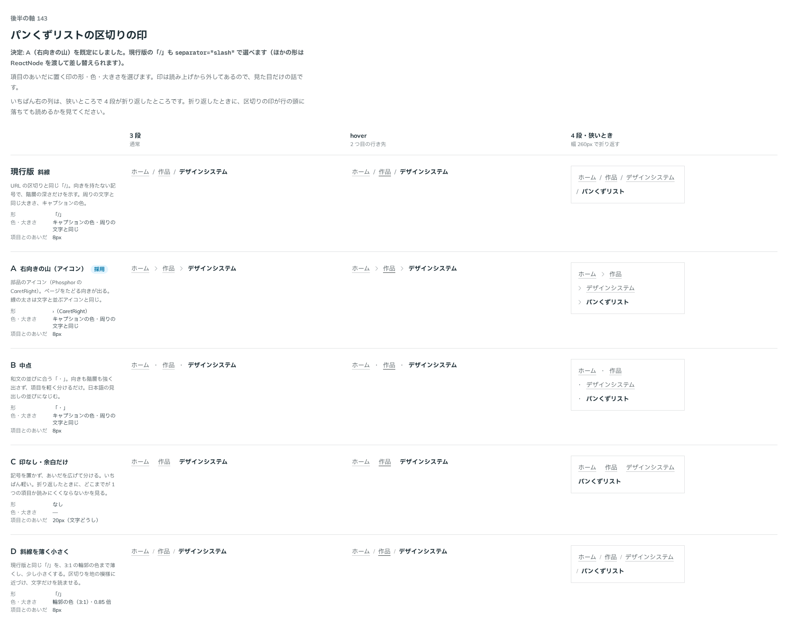

# 0156. パンくずリストの区切りの印

- ステータス: Accepted
- 日付: 2026-09-19
- ラウンド: 後半 軸140〜150

## 背景

パンくずリスト（いまいるページまでの道）を作ります。構造は `nav` の中の並びで、いちばん右がいまいるページです。ページと同じレイヤーの案内なので、影は付けません（原則1）。文字は読む文字の小さいほう（本文の上に置く注記）で、行き先は文字のリンクと同じく押せる範囲が文字の行だけです（原則7・11）。

決めるのは、項目のあいだに置く区切りの印です。印は読み上げから外してあるので、見た目だけの話になります。

## 候補

| 案     | 内容                                                              |
| ------ | ----------------------------------------------------------------- |
| 現行版 | 「/」（URL と同じ斜線）。キャプションの色、周りの文字と同じ大きさ |
| A      | 右向きの山（Phosphor の CaretRight）。たどる向きが出る            |
| B      | 「・」（中点）。和文の並びになじむ                                |
| C      | 印を置かず、あいだを広げて分ける                                  |
| D      | 「/」を輪郭の色（3:1）まで薄くし、0.85 倍に小さくする             |

状態は、3 段・2 つ目に hover・幅 260px で 4 段が折り返したときの 3 列で比べました。

## 決定

**A（右向きの山）を既定にします。現行版の「/」は `separator="slash"` で選べ、ほかの形は文字やアイコンをそのまま渡して差し替えられます。**

あわせて、次の 2 つを決めました。

- 区切りの印の色は、キャプションと同じ薄いグレーです（D のように輪郭の色まで薄くはしません）
- 入りきらないときは折り返します。横にスクロールする形や、途中を「…」に畳む形は採っていません

## 理由

ユーザーの返事の原文です。

> 143: デフォルトA、現行版も選択可

折り返しと区切りの色については、次のとおりです。

> 4: 折り返すでOK、backlog に中間...なども検討するのを追加してください

> 6: 推奨でOK

- **右向きの山を既定にした理由**: 返事のとおりです。上の階層から下の階層へたどる向きが印に出るので、並びの意味が読み取れます
- **「/」も選べるようにした理由**: 返事のとおりです。URL をそのまま見せる場面では、斜線のほうが合います
- **色をキャプションの色にした理由**: 返事のとおりです。印は項目を分けるための補助で、文字より一段薄くします。D のように 3:1 の輪郭の色まで薄くすると、狭いところで折り返したときに、行の頭に落ちた印が読み取れませんでした
- **折り返す形にした理由**: 返事のとおりです。切り詰めると、どの階層が隠れたのかが分かりません。まずは全部見せる形にし、畳み方は未決のままにします

## 却下した案と理由

- **B（中点）**: 階層の向きも切れ目も弱く、和文の見出しの並び（「作品・デザインシステム」）と見分けが付きませんでした
- **C（印なし）**: 折り返したときに、どこまでが 1 つの項目か読み取れませんでした
- **D（薄く小さい「/」）**: 上のとおり、折り返した行の頭で印が消えました

## 影響

- `src/components/breadcrumb/Breadcrumb.tsx`: `separator` の props を足しました。用意してある印は `caret`（既定）と `slash` で、ほかの形は ReactNode をそのまま渡します。印は `aria-hidden` で読み上げから外し、いちばん左の項目の前には置きません。並びは折り返す形（`flex-wrap`）です
- `design/tokens.css`: `--breadcrumb-gap`（項目と印のあいだ）・`--breadcrumb-row-gap`（折り返した行のあいだ）・`--breadcrumb-separator-size`・`--color-breadcrumb-separator` を足しました
- `src/index.ts` に `Breadcrumb`・`BreadcrumbItem` と型（`BreadcrumbSeparatorName` を含む）を足しました
- backlog に足す未決事項:
  - 長い道を畳む形（途中を「…」にまとめる、はじめと終わりだけ残す、押すと開く）は決めていません
  - 横にスクロールさせる形も決めていません
  - 構造化データ（JSON-LD・microdata）は出していません

## 原則への反映

反映なし。原則 1〜12 の文は変えていない。原則の書き直しは別セッションが受け持つ。

## 比較画像

比較のストーリーは決めた時点のコミット `cdff792` にあります。`git checkout cdff792 && pnpm storybook` で開けます。

