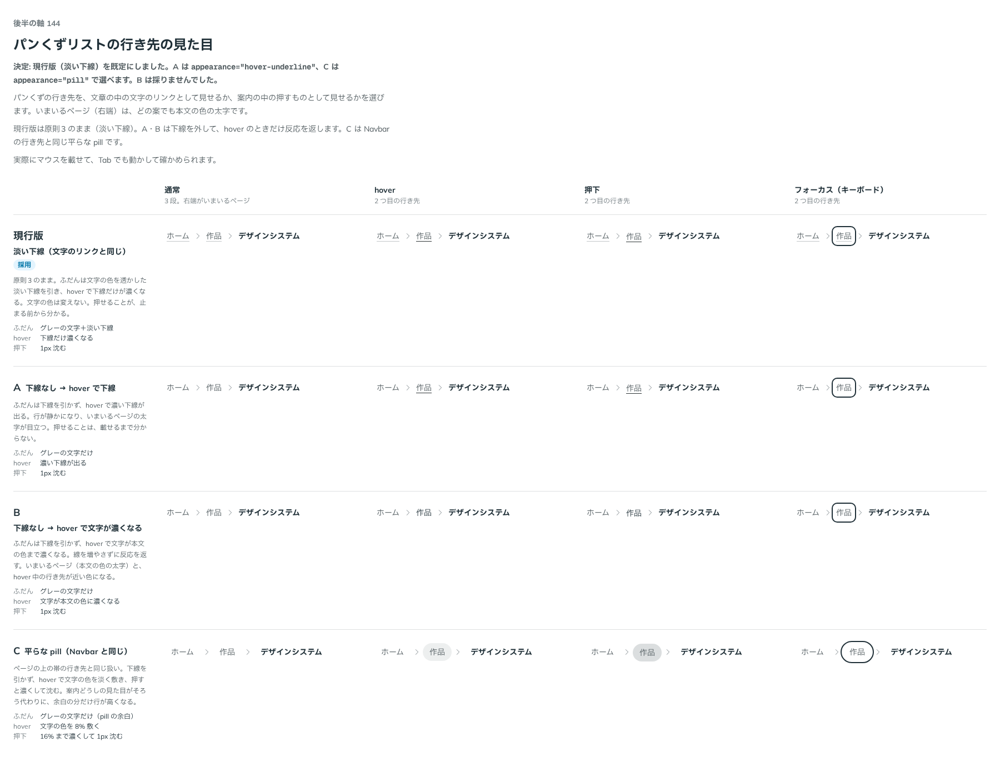

# 0157. パンくずリストの行き先の見た目

- ステータス: Accepted
- 日付: 2026-09-19
- ラウンド: 後半 軸140〜150

## 背景

パンくずリストの項目のうち、いちばん右はいまいるページで、リンクにしません（本文の色の太字です）。残りは行き先のリンクです。区切りの印は [ADR-0156](./0156-breadcrumb-separator.md) で決めました。

決めるのは、その行き先を、文章の中の文字のリンクとして見せるか、案内の中の押すものとして見せるかです。文字のリンクは、ふだん淡い下線で、hover で下線だけが濃くなります（原則3・[ADR-0030](./0030-text-link.md)）。ページの上の帯（Navbar）の行き先は、下線を引かず、平らな pill として hover で文字の色を淡く敷きます。パンくずは、どちらにも寄せられる場所にあります。

## 候補

| 案     | 内容                                                             |
| ------ | ---------------------------------------------------------------- |
| 現行版 | 淡い下線（文字のリンクと同じ）。hover で下線だけが濃くなる       |
| A      | ふだんは下線なし。hover で濃い下線が出る                         |
| B      | ふだんは下線なし。hover で文字が本文の色まで濃くなる             |
| C      | 平らな pill（Navbar の行き先と同じ）。hover で文字の色を淡く敷く |

状態は、通常・hover・押下・キーボードのフォーカスの 4 列で比べました。どの案でも、押すと 1px 沈みます（原則3）。

## 決定

**現行版（淡い下線）を既定にします。A は `appearance="hover-underline"`、C は `appearance="pill"` で選べます。B は採りません。**

あわせて、道が 1 段だけのときも、そのまま出すことにしました（隠しません）。

## 理由

ユーザーの返事の原文です。

> 144: デフォルト現行、A と C 選択可

1 段だけのときについては、次のとおりです。

> 5: 推奨でOK

- **淡い下線を既定にした理由**: 返事のとおりです。パンくずは本文の上に置く注記なので、文章の中の文字のリンクと同じ見え方にそろえます。押せることが、マウスを載せる前から分かります
- **A も選べるようにした理由**: 返事のとおりです。行を静かにしたいページでは、下線を外していまいるページの太字を目立たせられます
- **C も選べるようにした理由**: 返事のとおりです。ページの上の帯のすぐ下に置くときは、帯の行き先と同じ pill にそろえられます
- **1 段だけでも出す理由**: 返事のとおりです。段の数で出したり消したりすると、ページによって案内の位置が変わります。いまいる場所は、1 段でも読めるほうが分かりやすいです

## 却下した案と理由

- **B（hover で文字が濃くなる）**: hover 中の行き先が、いまいるページ（本文の色の太字）と近い色になり、どちらがいまいる場所か読み取りにくくなりました。原則3 の「枠線のボタンとリンクは、hover で文字の色を淡く敷きます」にも、文字の色そのものを動かす形は入っていません

## 影響

- `src/components/breadcrumb/Breadcrumb.tsx`: `appearance`（`underline`・`hover-underline`・`pill`、既定 `underline`）の props を足しました。3 つの見た目は `--breadcrumb-link-*`（下線の色・敷く塗り・角丸・余白）の差だけで作ってあり、いまいるページの文字も行き先と同じ余白で置いて、位置をそろえています。押下は平らな要素と同じ 1px の沈みで、キーボードのフォーカスはボタン・リンクと同じ離した線です
- `design/tokens.css`: `--breadcrumb-link-radius`・`-px`・`-py`・`-color`・`-hover-color`・`-underline`・`-underline-hover`・`-hover-bg`・`-press-bg` と、pill のときに差し替える `--breadcrumb-pill-*` を足しました
- `src/index.ts` に `Breadcrumb`・`BreadcrumbItem` と型（`BreadcrumbAppearance` を含む）を足しました
- backlog に足す未決事項:
  - いまいるページを、リンクにしたい使い方（同じページの先頭へ戻す）には応えていません
  - 行き先にアイコン（ホームの家の印）を置く形は決めていません

## 原則への反映

反映なし。原則 1〜12 の文は変えていない。原則の書き直しは別セッションが受け持つ。

## 比較画像

比較のストーリーは決めた時点のコミット `cdff792` にあります。`git checkout cdff792 && pnpm storybook` で開けます。

