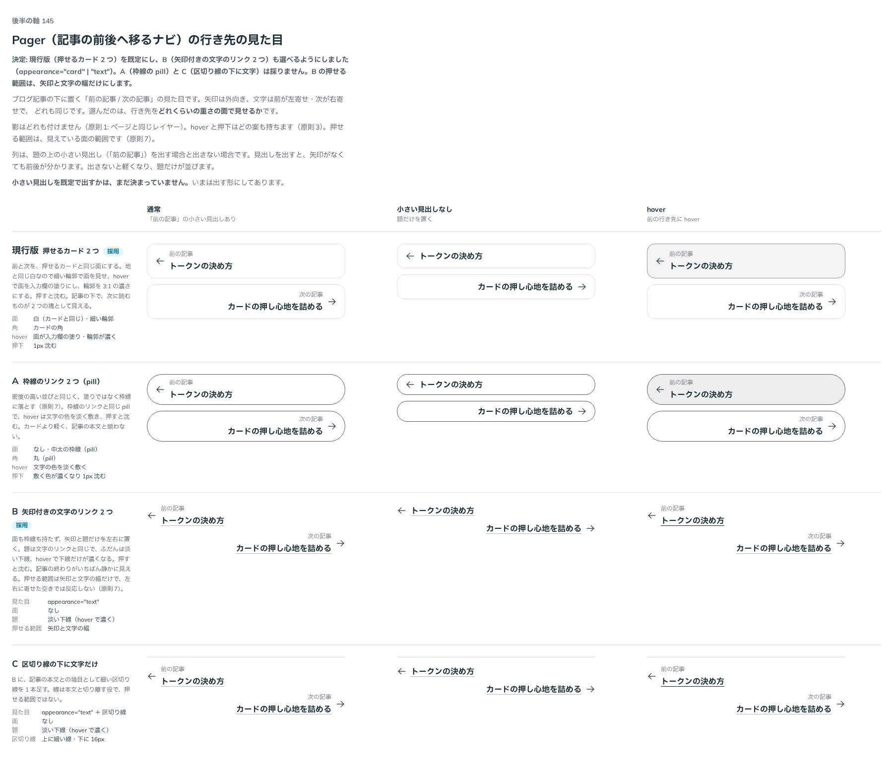

# 0158. Pager の行き先の見た目

- ステータス: Accepted
- 日付: 2026-09-19
- ラウンド: 後半 軸140〜150（軸145）

## 背景

Pager を作ります。ブログ記事の下に置く「前の記事 / 次の記事」のナビで、行き先は前と次の 2 つだけです。ページ番号を並べる Pagination は別の部品です。

`nav` の中に 2 つの行き先を横に並べ、置いた場所が狭いときは縦に積みます。画面の幅ではなく置いた場所の幅で決めるのは、Navbar が行き先を畳むときと同じ考え方です（原則11・[ADR-0130](./0130-navbar-current.md)）。矢印は外向き（前は左、次は右）、文字は前が左寄せ・次が右寄せで、ページの外へ出る向きをそのまま表します。影は付けません（原則1: ページと同じレイヤー）。

決めるのは、行き先をどれくらいの重さの面で見せるかです。あわせて、題の上の小さい見出し（「前の記事」）を既定で出すか、矢印にどの形を使うか、題の大きさ、縦に積む幅、読み上げの文言の既定も決めました。

## 候補

| 案     | 内容                                                                                             |
| ------ | ------------------------------------------------------------------------------------------------ |
| 現行版 | 押せるカード 2 つ。白い面・細い輪郭・カードの角。hover で面を入力欄の塗りに、輪郭を 3:1 の濃さに |
| A      | 枠線のリンク 2 つ（pill）。中太の枠線で、hover は文字の色を淡く敷く                              |
| B      | 矢印付きの文字のリンク 2 つ。面も枠線も持たず、題は淡い下線で hover に濃くなる                   |
| C      | B の上に細い区切り線を 1 本引き、その下に左右へ寄せた文字だけ                                    |

列は、題の上の小さい見出しを出す場合・出さない場合・前の行き先に hover した場合の 3 つで比べました。

## 決定

**現行版（押せるカード 2 つ）を既定にし、B（矢印付きの文字のリンク 2 つ）も `appearance` で選べるようにします。** A と C は採りません。

| 決めたこと        | 決定                                                                                                    |
| ----------------- | ------------------------------------------------------------------------------------------------------- |
| 見た目            | `appearance="card"`（既定）と `"text"` の 2 つ                                                          |
| card              | 押せるカードと同じ面。細い輪郭で面を見せ、hover で面を入力欄の塗りに、輪郭を 3:1 の濃さにし、押すと沈む |
| text              | 面も枠線も持たない。題は文字のリンクと同じ淡い下線で、hover に濃くなり、押すと沈む                      |
| text の押せる範囲 | 文字と矢印の領域だけ。左右に寄せたときの空きでは hover・押下・フォーカスが出ない                        |
| 矢印              | 外向きの Arrow（← →）が既定。行き先ごとに `icon` で任意のアイコンに差し替えられる（置き場所は変えない） |
| 小さい見出し      | 「前の記事」「次の記事」を既定で出す                                                                    |
| 題の大きさ        | 部品の文字（`--text-control`）の太字                                                                    |
| 縦に積む幅        | 置いた場所の幅が 28rem 未満。コンテナクエリの条件には CSS 変数を書けないので、コード側の定数            |
| 読み上げの文言    | `nav` の名前は「前後の記事」、小さい見出しは「前の記事」「次の記事」                                    |
| 片方だけのとき    | `keepSpace`（既定 `true`）で、もう片方の場所を空けて位置を保つ                                          |

## 理由

ユーザーの返事の原文です。

> 145: デフォルト現行、B も選択可、Bは文字部分＋矢印の領域だけ反応するにしたいです（左右の余白は反応しない）

未決だったところの答えです。

> 7: 出す
>
> 8: Arrow デフォルト、任意アイコン指定可
>
> 9: 推奨でOK
>
> 10: 推奨でOK
>
> 11: OK

- **現行版を既定にした理由**: 返事のとおりです。記事の下では次に読むものへ進んでほしいので、2 つの塊として見える重さを既定にしました。見た目は押せるカード（[ADR-0129](./0129-card-press.md)）と同じ作りで、面・輪郭・hover・沈み方をそろえています
- **B も選べるようにした理由**: 返事のとおりです。本文の終わりを静かに閉じたい記事では、面を持たない形を選べます
- **B の押せる範囲**: 「文字部分＋矢印の領域だけ反応する」という指定です。行き先そのものを席の幅いっぱいに広げず、中身の幅のまま外側へ寄せています（前は左、次は右）。押せる範囲は見た目の範囲と一致させ、見えない広がりは付けません（原則7）
- **矢印は Arrow**: 「Arrow デフォルト、任意アイコン指定可」という指定です。Caret（‹ ›）は Calendar の月送りや枠線のリンクが使う形で、前後の記事へ移る矢印としては向きだけの印になります。線の付いた Arrow のほうが「移る」ことが読めます。行き先ごとの `icon` で差し替えられるので、Caret に戻すこともできます
- **小さい見出しを出す**: 「出す」という答えです。矢印がなくても前後が分かり、読み上げでもリンクの名前に「前の記事」と題の両方が入ります
- **題の大きさ・縦に積む幅・文言**: 「推奨でOK」「OK」の答えです。題は部品の文字、縦に積む幅は 28rem、文言の既定は「前後の記事」「前の記事」「次の記事」のままにしました

## 却下した案と理由

- **A（枠線の pill）**: 選ばれませんでした。枠線に落とすのは密度の高い並びの決まり（原則7）で、行き先が 2 つだけの Pager では、面の card か、面を持たない text のどちらかで足ります
- **C（区切り線の下に文字）**: 選ばれませんでした。記事の本文との境目は、記事の側（レイアウト層）で引くものです。部品の中に区切り線を持つと、置いた場所によって線が二重になります（原則9）。B を選んで、線は使う側で引けます

## 影響

- `src/components/pager/Pager.tsx`: 新しい部品です。`appearance`（`card`・`text`、既定 `card`）、`label`（`nav` の読み上げの名前、既定「前後の記事」）、`prev`・`next`（`{ href, title, label?, icon?, render? }`）、`keepSpace`（既定 `true`）の props を持ちます。`render` に Next.js の `Link` などを渡せます。塗りは `--flat-bg`（`theme.css` で登録した変数。[ADR-0112](./0112-fill-transition-by-registered-property.md)）に置き、`background-color` ではなく変数を動かします。text で押せる範囲を中身の幅に収めるのは、格子の中の寄せ方（`justify-self`）です
- `design/tokens.css`: Pager のトークンを足しました。共通が `--pager-gap`・`--pager-item-gap`・`--pager-label-gap`・`--pager-label-display`・`--pager-press-depth`、card が `--pager-card-padding-block`・`--pager-card-padding-inline`・`--pager-card-radius`・`--pager-card-line-width`・`--pager-card-line`・`--pager-card-line-hover`・`--pager-card-fill`・`--pager-card-fill-hover`・`--pager-card-fill-press`、text が `--pager-text-radius`・`--pager-text-underline`・`--pager-text-underline-hover`・`--pager-text-underline-duration`・`--pager-text-underline-ease` です。採らなかった A・C のためだけにあった切り替えのトークン（区切り線の太さなど）は、決めたあとに消しました
- `src/internal/icons.tsx`: `ArrowLeftIcon`・`ArrowRightIcon`（Phosphor の ArrowLeft・ArrowRight）を足しました。`src/stories/Icons.stories.tsx` の一覧にも並べました
- ストーリー（`Components/Pager`）: 基本・状態（card）・状態（text）・アイコンの差し替え・片方だけ・題が長いとき・狭いとき・密度・読み上げを置きました
- `src/index.ts` への追加と README の一覧は、この ADR の時点ではまだ行っていません
- backlog に足す未決事項:
  - ページ番号を並べる Pagination は作っていません
  - 行き先に画像（記事のアイキャッチ）を添える形は用意していません
  - 題が長いときは折り返します。行数で切って「…」にする形は持っていません
  - 小さい見出しを出さない形は、トークン（`--pager-label-display`）でしか切り替えられません。props にするかは決めていません

## 原則への反映

反映なし。原則 1〜12 の文は変えていない。原則の書き直しは別セッションが受け持つ。

## 比較画像

比較のストーリーは決めた時点のコミット `cdff792` にあります。`git checkout cdff792 && pnpm storybook` で開けます。

