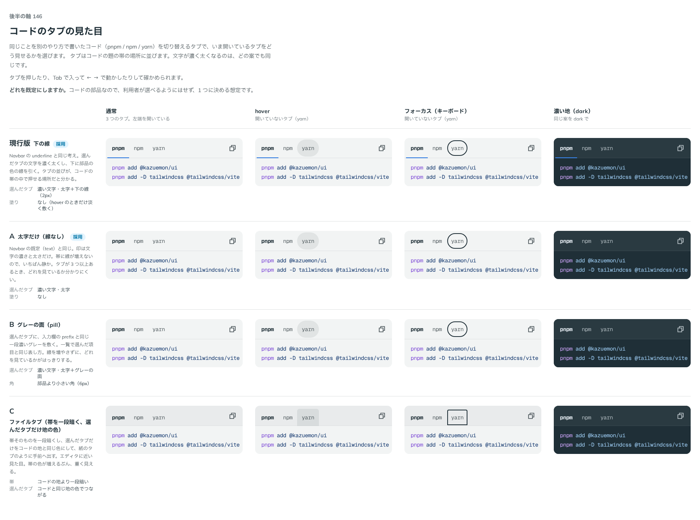

# 0159. コードのタブの見た目

- ステータス: Accepted
- 日付: 2026-09-19
- ラウンド: 後半 軸146

## 背景

同じことを別のやり方で書いたコード（pnpm / npm / yarn、TypeScript / JavaScript）を切り替える CodeGroup で、いま開いているタブをどう見せるかを決めます。タブは CodeBlock の題の帯の場所に並びます（[ADR-0092](./0092-code-block-frame.md)）。

## 候補

| 案     | 内容                                                                   |
| ------ | ---------------------------------------------------------------------- |
| 現行版 | 文字を濃く太くし、下に部品の色の線を引く                               |
| A      | 太字だけ（線なし）                                                     |
| B      | 選んだタブにグレーの面（pill）                                         |
| C      | ファイルタブ（帯を一段暗くし、選んだタブだけコードと同じ地の色にする） |

## 決定

**現行版（下の線）を既定にし、A（太字だけ）も `indicator` で選べるようにします。B・C は採りません。**

| 項目                   | 決定                                                                                                                           |
| ---------------------- | ------------------------------------------------------------------------------------------------------------------------------ |
| 選んだタブ             | 文字を濃く太くする。太字にしても幅が動かないよう、太字の写しで幅を取っておく                                                   |
| 印（`indicator`）      | `line`（既定）は下の線、`text` は文字の濃さと太さだけ                                                                          |
| 線の置き方             | 帯とコードの境目の線（細い線）に、選んだタブの印（2px）を下端をそろえて重ねる。灰色が下に残らない                              |
| 印の動き               | 選んだタブの位置へ滑って移る（Base UI の `Tabs.Indicator`）。動きを減らす設定では動かさない                                    |
| hover の塗り           | 文字の色を淡く敷く。形は pill                                                                                                  |
| 押下                   | 1px 沈む（押しても消えず、画面の一部が切り替わるため）                                                                         |
| フォーカスの線         | タブの内側に引く。外に離すと帯の下の線を越える（Tabs 部品と同じ考え、ADR-0148）                                                |
| タブが入り切らないとき | 帯だけが横にスクロールする。続きは端のぼかしで見せ、つまみは載せたときに出す。スクロールする範囲はコピーのボタンの手前で終わる |

## 理由

ユーザーの返事の原文です。

> 146: デフォルト現行、A も選択可。ホバー領域は pill にして、フォーカスリングは領域ぴったり。現行版の下の線はコードとの境界線と被せる形にしたいです。card-more がやっている Tab がどういう形か聞いてください。

> 146 は揃える形で。Tab をマージしたらお知らせします。

> 灰色の線の上に青い線がある感じなんですが、線ありタブと同じように一直線上に選択下線がある感じにできますか⋯？

> アクティブなときの下線って元から細かったでしたっけ。あとは、スクロールエリアがボタンの下に来るのも戻ってそうですね

- **現行版を既定にした理由**: 返事のとおりです。タブが 3 つ以上あるとき、どれを見ているかがはっきりします
- **A も選べる理由**: 返事のとおりです。帯に線を増やしたくないときに選べます
- **下の線を境目に重ねた理由**: 「一直線上に」の返事です。線を 2 本に見せず、境目の 1 本の上で色が変わる見え方にしました。印の太さは元のまま（2px）で、境目の線（1px）と下端をそろえます
- **フォーカスの線を内側にした理由**: 「揃える形で」の返事です。Tabs 部品と同じ位置（タブの内側）にしました。外に離すと、帯の下の線を越えてはみ出します
- **スクロールする範囲をボタンの手前で終わらせた理由**: 返事のとおりです。余白で空けるだけでは、スクロールしたタブがボタンの下へ潜り込みました

## 却下した案と理由

- **B（グレーの面）**: 選ばれませんでした。コードの面と帯がどちらもグレーなので、面を足すと帯が重くなります
- **C（ファイルタブ）**: 選ばれませんでした。帯の色が増え、コードの枠が重く見えます

## 影響

- `src/components/code-group/CodeGroup.tsx`: `indicator`（`line`・`text`、既定 `line`）。タブは Base UI の Tabs、印は `Tabs.Indicator`、横のスクロールは内部の ScrollArea の見た目
- `design/tokens.css`: `--code-group-*`（帯の中の寸法・印の太さと色と動き・フォーカスの線の内側の量・コピーのボタンの位置）
- Tabs 部品（別の作業）と同じ考えでそろえた項目（pill の hover・内側のフォーカスの線・境目の線に重なる印・太字の写しで幅を取る）は、値が変わったら合わせます。`design/backlog.md` に残しました

## 原則への反映

反映なし。原則 1〜12 の文は変えていません（原則の書き直しは別セッションが受け持ちます）。押しても消えないものは沈む、という切り分けは原則3 の書き直しに渡しました。

## 比較画像

比較のストーリーは決めた時点のコミット `cdff792` にあります。`git checkout cdff792 && pnpm storybook` で開けます。

