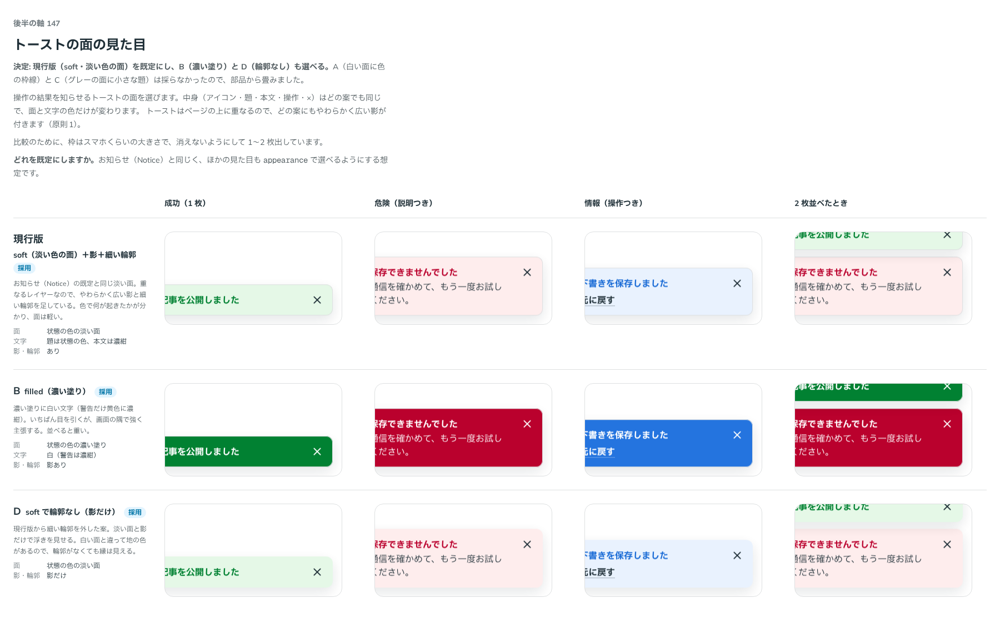

# 0160. トーストの面

- ステータス: Accepted
- 日付: 2026-09-19
- ラウンド: 後半 軸147

## 背景

操作の結果を、画面を止めずに知らせるトーストを作りました。働きはお知らせ（Notice — [ADR-0043](./0043-notice.md)）と同じですが、ページの上に重なって出ます。面をどう見せるかを決めます。

重なるレイヤーなので、面・輪郭・影は浮かぶ面と同じにします（原則1）。角は部品の角です（原則5）。色は状態の色で、読み上げは危険だけが割り込みます（原則6）。

## 候補

| 案     | 内容                                           |
| ------ | ---------------------------------------------- |
| 現行版 | soft（状態の色の淡い面）＋影＋細い輪郭         |
| A      | outline（白い面に状態の色の枠線）              |
| B      | filled（濃い塗りに白文字。警告だけ黄色に濃紺） |
| C      | muted（グレーの面に、状態の色の小さな題）      |
| D      | soft のまま、細い輪郭を外す（影だけ）          |

## 決定

**現行版（soft）を既定にし、B（filled）と D（輪郭なし）も選べるようにします。A・C は採りません。**

| 項目     | 決定                                                         |
| -------- | ------------------------------------------------------------ |
| 面       | `appearance`: `soft`（既定）・`filled`                       |
| 輪郭     | `outline`（既定はあり）。false で影だけになる                |
| 影       | 浮かぶ面と同じ（`--shadow-overlay`）                         |
| 中身     | お知らせと同じ並び（アイコン → 題・本文・操作、× は右上）    |
| 色       | 状態の色（`info`・`success`・`warning`・`danger`）と、グレー |
| 読み上げ | 危険だけが割り込む（Base UI の `priority`。原則6 のまま）    |

面の見た目そのものは、お知らせ（Notice）と Callout が共有している `src/internal/notice-surface` をそのまま使います。働きが同じものは同じ見た目にする、という分け方（[ADR-0084](./0084-callout.md)）に沿います。

## 理由

ユーザーの返事の原文です。

> 147: デフォルト現行、B/D も選択可

- **現行版を既定にした理由**: 返事のとおりです。淡い面は軽く、色で何が起きたかが分かります
- **B・D も選べる理由**: 返事のとおりです。強く知らせたい場面は filled、地の色で縁が分かる場面は輪郭なしを選べます
- **A・C を採らなかった理由**: 返事に挙がりませんでした。部品からも畳んであります（`appearance` は 2 つだけ）

## 却下した案と理由

- **A（白い面に色の枠線）**: 選ばれませんでした
- **C（グレーの面に小さな題）**: 選ばれませんでした。成功と情報の差が伝わりにくい案でした

## 影響

- `src/components/toast/Toast.tsx`: `ToastProvider`（`appearance`・`outline`）と `useToast()`。面は `internal/notice-surface`、影と輪郭は `--toast-shadow`・`--toast-line`
- `design/tokens.css`: `--toast-*`（幅・端からの距離・影・輪郭・残り時間の線）
- お知らせ（Notice）の backlog から「トーストは作っていません」の行を消しました

## 原則への反映

原則の文は変えていません（書き直しは別セッションが受け持ちます）。渡した点は 1 つです。

- **原則1**: ページの上に重なるものの例に、一定時間で消えるお知らせ（トースト）が増えます。面・輪郭・影は浮かぶ面と同じです

## 比較画像

比較のストーリーは決めた時点のコミット `cdff792` にあります。`git checkout cdff792 && pnpm storybook` で開けます。採らなかった A・C は、決めたあとに部品から畳んだので、比較の再現はこの画像とコミットで残します。

