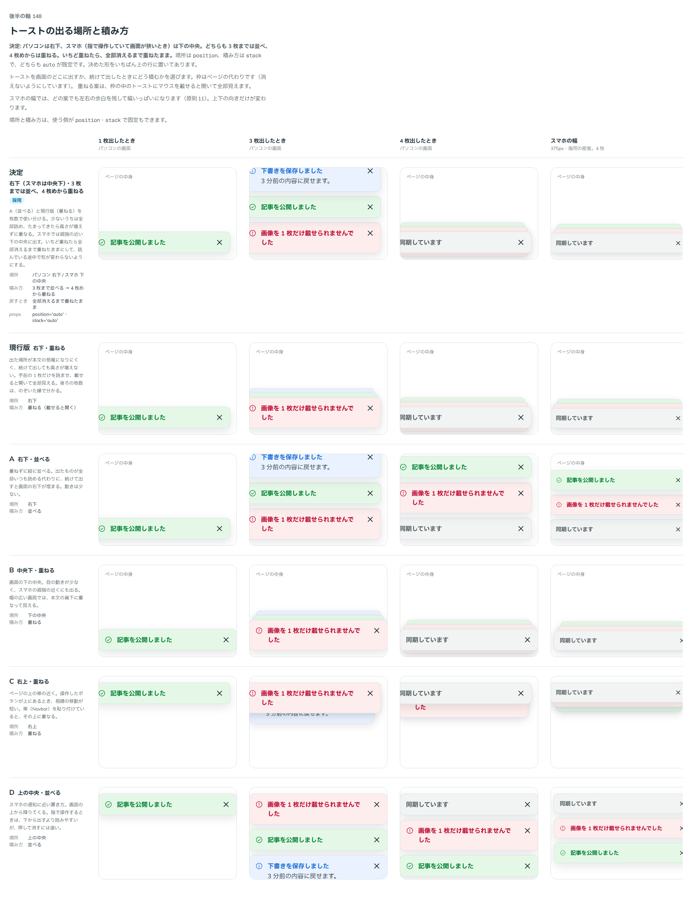

# 0161. トーストの出方（場所・積み方・消えるまで）

- ステータス: Accepted
- 日付: 2026-09-19
- ラウンド: 後半 軸148

## 背景

トーストを画面のどこに出し、続けて出したときにどう積むかを決めます。あわせて、いつ消えるかも決めました。

原則11 は「構造を変えてよいのは浮かぶ UI とページの上の帯だけ」としており、トーストは入っていませんでした。

## 候補

| 案     | 内容                                    |
| ------ | --------------------------------------- |
| 現行版 | 右下・重ねる（手前の 1 枚だけを見せる） |
| A      | 右下・並べる                            |
| B      | 中央下・重ねる                          |
| C      | 右上・重ねる                            |
| D      | 上の中央・並べる                        |

## 決定

**場所は枚数と入力方式で決め、A（並べる）と現行版（重ねる）を使い分けます。**

| 項目             | 決定                                                                                                           |
| ---------------- | -------------------------------------------------------------------------------------------------------------- |
| 場所             | `position="auto"`（既定）。指で操作していて画面が狭いときは下の中央、それ以外は右下。6 つの場所に固定もできる  |
| 積み方           | `stack="auto"`（既定）。3 枚までは縦に並べ、4 枚めから重ねる                                                   |
| 積み方を戻すとき | いちど重ねたら、全部消えるまで重ねたまま。読んでいるあいだ（載せている・キーボードで入っている）は切り替えない |
| 重ねたとき       | 手前の 1 枚だけを見せ、後ろはのぞかせて少し縮める。載せる・触れる・キーボードで入ると開いて全部見える          |
| 消えるまで       | 既定では自動で消えない（`timeout` は 0）。全体でも、トーストごと（`show({ timeout })`）でも決められる          |
| 残り時間の線     | 消えるまでの時間を決めたときだけ、面の下に引く。読んでいるあいだは時間も線も止まる                             |
| 出入りの動き     | 下（または上）から滑り、濃さも動く。並べるときも重ねるときも同じ長さ・同じ緩急                                 |
| はじいて消す     | できる（Base UI の swipeDirection）                                                                            |

## 理由

ユーザーの返事の原文です。

> 148: PC デフォルト右下、3つまでは並べる、4つ以上出ている時は重ねる。スマホデフォルト中央下、スタックルールは同じ。

> 13: 自動で消えないのがデフォルト、内容ごとに表示秒数指定可能
> 14: 表示秒数指定がある場合は表示。プログレスバーは装飾とは違うのでOK

> 4件目以上から順に削除したとき、カーソルを載せている状態で急にアニメーションが変わるので違和感がありますね

- **枚数で使い分ける理由**: 返事のとおりです。少ないうちは全部読め、たまってきても高さが増えません
- **重ねたままにする理由**: 3 つめの返事です。枚数が減るたびに積み方が変わると、読んでいる途中で形が急に変わります。全部消えるまで重ねたままにし、読んでいるあいだは切り替えません
- **自動で消さない理由**: 返事のとおりです。読み落としを避けます。急がない知らせには時間を決められます
- **残り時間の線を出す理由**: 返事のとおりです。「プログレスバーは装飾とは違う」ので、時間を決めたときだけ出します。情報を運ぶ動きなので、動きを減らす設定でも止めません

## 却下した案と理由

- **B（中央下・重ねる）**: パソコンでは本文の真下に重なって見えるので、既定にしませんでした。指で狭いときの置き場所としては採っています
- **C（右上）・D（上の中央）**: 選ばれませんでした。`position` で選べます

## 影響

- `src/components/toast/Toast.tsx`: `position`（`auto` ほか 6 つ）・`stack`（`auto`・`stacked`・`list`）・`timeout`（既定 0）・`limit`（既定 5）。重ね始める枚数はコードの定数（`STACK_FROM = 4`）
- `design/tokens.css`: `--toast-*`（端からの距離・あいだ・のぞかせる高さ・縮める割合・残り時間の線の太さと濃さ）と、`toast-progress` のキーフレーム
- 4 枚を同時に持てるよう、`limit` の既定を 5 にしました（Base UI の既定は 3）

## 原則への反映

原則の文は変えていません（書き直しは別セッションが受け持ちます）。渡した点は 2 つです。

- **構造（原則11 か、新しい原則）**: 重なる面は、形だけでなく**出る場所**も指の動きで変えてよい（指で狭いときは下の中央）
- **動き（原則3 か、新しい原則）**: 情報を運ぶ動き（残り時間の線）は、動きを減らす設定でも止めない。待っていることを伝え続ける考えと同じ

## 比較画像

比較のストーリーは決めた時点のコミット `cdff792` にあります。`git checkout cdff792 && pnpm storybook` で開けます。

