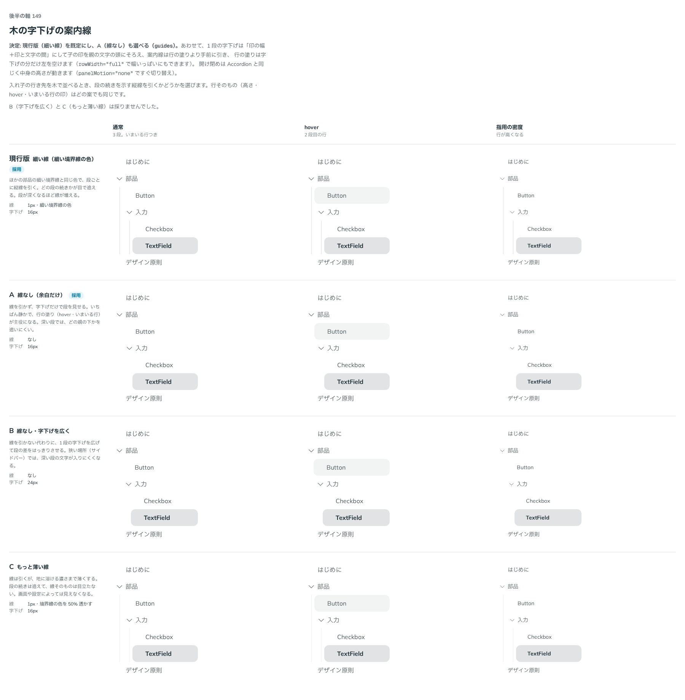

# 0162. 木の字下げと案内線

- ステータス: Accepted
- 日付: 2026-09-19
- ラウンド: 後半 軸149

## 背景

入れ子の行き先を木の形で並べる Tree で、段の続きをどう見せるかを決めます。行そのものは一覧の項目の仲間で、hover は入力欄の塗り、高さは部品の高さです（原則3・原則11）。

## 候補

| 案     | 内容                                    |
| ------ | --------------------------------------- |
| 現行版 | 細い境界線の色で、段ごとに縦線を引く    |
| A      | 線なし（字下げだけ）                    |
| B      | 線なし・字下げを広く（24px）            |
| C      | もっと薄い線（境界線の色を 50% 透かす） |

## 決定

**現行版（細い線）を既定にし、A（線なし）も `guides` で選べるようにします。B・C は採りません。** あわせて、字下げと行の塗りの範囲、開け閉めの動きを決めました。

| 項目           | 決定                                                                                       |
| -------------- | ------------------------------------------------------------------------------------------ |
| 案内線         | 細い境界線の色で、親の行の開閉の印の中心にそろえて引く。`guides={false}` で消せる          |
| 線の重なり     | 行の塗り（hover・いまいる行）より手前に引く。フォーカスの線は、その線より手前に出す        |
| 1 段の字下げ   | 「印の幅＋印と文字の間」。子の行の印が、親の行の文字の頭と同じ位置に来る                   |
| 行の塗りの範囲 | 既定は字下げの分だけ左を空ける（`rowWidth="indent"`）。`"full"` で木の幅いっぱいにも塗れる |
| 開け閉め       | 中身の高さが動く（Accordion と同じ。`panelMotion="none"` ですぐ切り替え）                  |
| 行の文字       | 選べない（続けて押しても文字が選ばれない）。`selectable` で選べるようにできる              |
| 行の高さ       | 部品の高さのまま（44px）                                                                   |

## 理由

ユーザーの返事の原文です。

> 149: デフォルト現行、A も選択可。Accordion の挙動をデフォルトとし、現在のスパッと閉じる動作にも変更可。2段目以降左側矢印は1段目項目の文字開始と同じ位置。細い境界線はホバーの手前側に来る。デフォルトは全幅ではなく1段目以降インデント分左はホバーに入れない。全幅も指定可。

> 15: 今のままで（行の高さは部品の高さ 44px のまま）

> Tree は見出し文字を選択できないのをデフォルトにしたいです（ダブルクリックなどで選択してしまう可能性があるため）選択できるようにするのは props 制御で考えています

> main の tree-focus.png に、フォーカスリングが後ろに行ってしまう症状のスクショをはりました。

- **現行版を既定にした理由**: 返事のとおりです。段が深くなっても、どの親の下かを目で追えます
- **字下げを「印の幅＋間」にした理由**: 返事のとおりです。子の印が親の文字の頭にそろい、段の関係が読めます
- **塗りを字下げの分だけ空ける理由**: 返事のとおりです。押せる範囲が、その段の行の範囲だと分かります
- **高さのある開け閉めにした理由**: 返事のとおりです。Accordion と同じ動きにそろえました
- **文字を選べなくした理由**: 返事のとおりです。開け閉めのために続けて押すと、文字が選ばれてしまいます
- **フォーカスの線を手前に出した理由**: スクリーンショットの指摘です。案内線を塗りより手前に引いたとき、線がフォーカスの線も覆っていました。フォーカスしている行だけを一段手前に出しました。あわせて、開け閉めで中身を切る幅が足りず、入れ子の行の線が上と右で切れていたのも直しました（Chrome は `overflow-clip-margin` に `calc()` を受け取らないので、この値だけは計算せずに書いています）

## 却下した案と理由

- **B（線なし・字下げを広く）**: 選ばれませんでした。狭いサイドバーで、深い段の文字が入りにくくなります
- **C（もっと薄い線）**: 選ばれませんでした。画面や設定によっては見えなくなります

## 影響

- `src/components/tree/Tree.tsx`: `guides`・`rowWidth`・`panelMotion`・`selectable`。開け閉めは Base UI の Collapsible
- `design/tokens.css`: `--tree-*`（行の余白・字下げ・案内線・塗り・切る幅）
- **分かっていること**: 型あたり（文字を打つとその行へ移る）はありません。行の高さが、ドキュメントのサイドバーで高く感じるかは実機で確かめます。どちらも `design/backlog.md` に残しました

## 原則への反映

反映なし。原則 1〜12 の文は変えていません（原則の書き直しは別セッションが受け持ちます）。

## 比較画像

比較のストーリーは決めた時点のコミット `cdff792` にあります。`git checkout cdff792 && pnpm storybook` で開けます。

