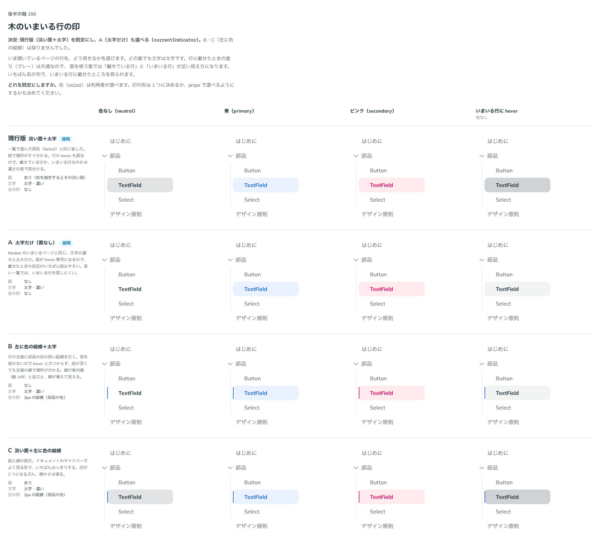

# 0163. 木のいまいる行の印

- ステータス: Accepted
- 日付: 2026-09-19
- ラウンド: 後半 軸150

## 背景

木（Tree）で、いま開いているページの行をどう見せるかを決めます。いまいる場所の印は部品の色に従い、色を指定しないときはグレーです（原則6）。行の hover は一覧の項目と同じグレーの塗りなので、印に面を使うと hover と近い見え方になります。

## 候補

| 案     | 内容                 |
| ------ | -------------------- |
| 現行版 | 淡い面＋太字         |
| A      | 太字だけ（面なし）   |
| B      | 左に色の縦線＋太字   |
| C      | 淡い面＋左に色の縦線 |

## 決定

**現行版（淡い面＋太字）を既定にし、A（太字だけ）も `currentIndicator` で選べるようにします。B・C は採りません。**

| 項目             | 決定                                                                 |
| ---------------- | -------------------------------------------------------------------- |
| 印               | `currentIndicator`: `fill`（既定、淡い面＋太字）・`text`（太字だけ） |
| 色               | `color`（`neutral`（既定）・`primary`・`secondary`）。原則6 のまま   |
| 色を持たないとき | 面は、一覧で選んだ項目と同じグレー                                   |
| hover との差     | いまいる行に載せたときは、面を一段濃くする                           |
| 読み上げ         | `aria-current="page"`                                                |

## 理由

ユーザーの返事の原文です。

> 150: デフォルト現行、A も選択可

- **現行版を既定にした理由**: 返事のとおりです。長い一覧でも、いまいる行がすぐ見つかります
- **A も選べる理由**: 返事のとおりです。行の面を hover 専用にしたいときに選べます
- **B・C を採らなかった理由**: 返事に挙がりませんでした。案内線（[ADR-0162](./0162-tree-guides.md)）と並ぶと線が増えて見えます

## 却下した案と理由

- **B（左に色の縦線）・C（面＋縦線）**: 選ばれませんでした。比較のための切り替えのトークン（`--tree-current-bar`）は、この決定の画像を撮ったあとに畳みます

## 影響

- `src/components/tree/Tree.tsx`: `currentIndicator`（`fill`・`text`、既定 `fill`）
- `design/tokens.css`: `--tree-current-*`（面・文字・hover のときの面）

## 原則への反映

反映なし。原則 1〜12 の文は変えていません（原則の書き直しは別セッションが受け持ちます）。

## 比較画像

比較のストーリーは決めた時点のコミット `cdff792` にあります。`git checkout cdff792 && pnpm storybook` で開けます。

