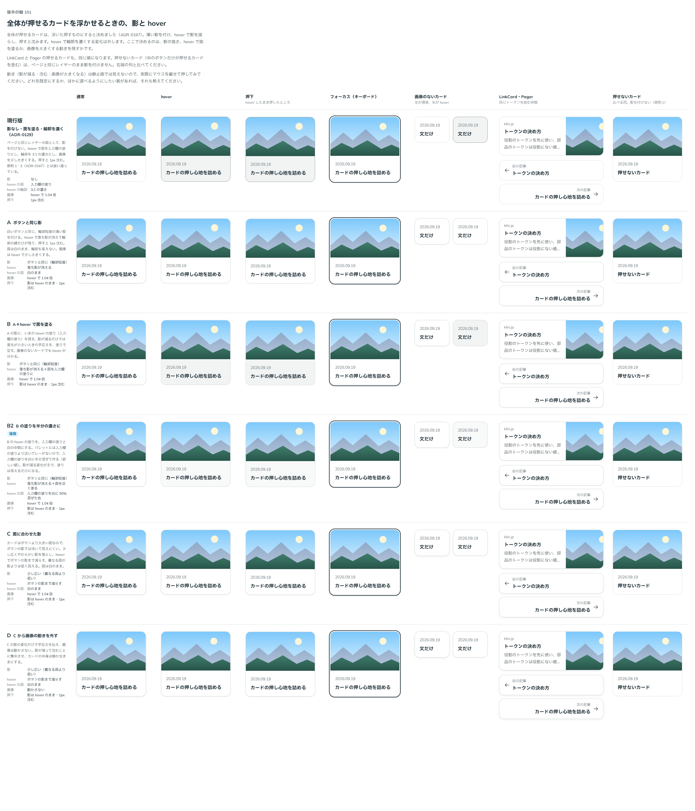

# 0169. 押せるカードの影と hover

- ステータス: Accepted
- 日付: 2026-09-19
- ラウンド: 後半 軸151

## 背景

[ADR-0167](./0167-pressable-card-floats.md) で、全体が押せるカードは浮いた押すものにする（薄い影を付け、hover で影を減らし、押すと沈む。hover で輪郭を濃くする変化は外す）と決めました。それまでの押せるカードは [ADR-0129](./0129-card-press.md) の見た目（影なし、hover で面を入力欄の塗りにし、輪郭を 3:1 の濃さにし、画像を 1.04 倍にする）で、原則 1・3 と食い違っていました。

決めるのは、影の強さ、hover で面を塗るか、画像を大きくする動きを残すかです。Card と LinkCard（同じ見た目）、Pager の押せるカード（[ADR-0158](./0158-pager-look.md) で押せるカードと同じ面にした）が対象です。

候補を作れるよう、先に Card・LinkCard・Pager の輪郭・面・影・沈みをトークンで持つ形に直しました（見た目は変えていません）。

## 候補

| 案     | 内容                                                                                                     |
| ------ | -------------------------------------------------------------------------------------------------------- |
| 現行版 | 影なし。hover で面を入力欄の塗りにし、輪郭を 3:1 の濃さにし、画像を 1.04 倍。押すと 1px 沈む（ADR-0129） |
| A      | 白いボタンと同じ影（`--shadow-raised`）。hover で落ち影が消える。面は白のまま。画像は 1.04 倍            |
| B      | A に、hover で面を入力欄の塗りにする変化を足す                                                           |
| B2     | B の hover の塗りを、入力欄の塗りを白に 50% 混ぜた色にする（新しい値）                                   |
| C      | 大きな面に合わせた少し広い影。hover でボタンの影まで減らす。面は白のまま                                 |
| D      | C から画像の動きを外す                                                                                   |

状態は、通常・hover・押下・キーボードのフォーカス・画像のないカード・LinkCard と Pager・押せないカード（比べる用）の 7 列で比べました。B2 は、B の塗りが濃いという返事を受けてラウンドの途中で足した案です。文字の色（濃紺）を 3% 敷く案も作りましたが、白との差が B2 とほぼ同じ（1.055:1 と 1.046:1）で見分けられなかったので、並べませんでした。

## 決定

**B2 を採用し、画像の拡大は既定でオフにします。** `imageZoom` を渡すと、hover で画像を 1.04 倍にします。

- 影: ボタンと同じ（`--shadow-raised`）。hover で落ち影が消えて輪郭程度の線だけが残り（`--shadow-raised-hover`）、押しても hover のまま（`--shadow-raised-press`）
- hover の面: 入力欄の塗りを白に 50% 混ぜた色（`--card-fill-hover`。白地との差 1.05:1）
- 輪郭: 白いボタンと同じ細い線（`--color-surface-line`）のまま、hover でも変えない
- 押下: ボタンと同じ深さ（`--press-depth`）で沈む
- Pager の押せるカードも同じ値にします（`--pager-card-fill-hover`・`--pager-card-fill-press` は `--card-fill-hover` を指す）
- 押せないカード（`href` のないカード）は、いままでどおり影を付けません

## 理由

ユーザーの返事の原文です。

> 151 の B ですが、ホバーの色って薄くする選択肢ありますか？ちょっと濃いなと思ったんですが、デザイントークンに他の選択肢があるかなーと。

> 151 については、B2 で画像の拡大をデフォルトでオフにしてほしいです。オンにもできるようにしたいです。

- **B2**: 影が減る変化だけでは大きな面の手応えが小さいので、塗りを添えます。ただし B の塗り（入力欄の塗り）は濃く見えたので、影の変化を補う程度の淡さにしました。パレットには入力欄の塗りより淡いグレーがないため、入力欄の塗りを白に混ぜて作っています。基準の言葉では「軽い」に近い案です
- **画像の拡大を既定でオフ**: 返事のとおりです。影と塗りだけで手応えは足りており、画像の動きは使う側が足すものにしました

## 却下した案と理由

- **現行版**: 影がなく、原則 1・3（ADR-0167）と食い違います
- **A**: 影が減る変化だけでは、大きな面の hover が分かりにくい
- **B**: hover の塗りが濃い（返事のとおり）
- **C・D**: 選ばれませんでした。ボタンと違う影を持つと、浮いた押すものの影が 2 種類になります

## 影響

- `src/components/card/Card.tsx`・`src/components/link-card/LinkCard.tsx`: 押せるカードに `shadow-raised` と hover・押下の影を付け、hover の輪郭の変化を外しました。沈む深さは `--press-depth` にしました。`imageZoom`（既定 `false`）を足し、渡したときだけ hover で画像を大きくします（`data-image-zoom`）
- `src/components/pager/Pager.tsx`: 押せるカード（`appearance="card"`）に同じ影を付け、hover の輪郭の変化を外しました。`--pager-press-depth` は `--press-depth` にしました
- `design/tokens.css`: `--card-fill-hover` を足しました。軸で比べるためだけに置いた `--card-line`・`--card-line-hover`・`--card-shadow`・`--card-shadow-hover`・`--card-shadow-press`・`--card-press-depth`・`--pager-card-shadow*` は、決まった値へ部品に畳んで消しました。`--pager-card-line-hover` も消しました
- Card・LinkCard・Pager の見た目の基準画像を撮り直しました。ストーリーの Docs の説明を新しい見た目に合わせ、Card と LinkCard に `imageZoom` の Controls を足しました
- [ADR-0129](./0129-card-press.md) を Superseded にしました

## 原則への反映

原則 3 の押せるカードの行を書き換えました（輪郭を濃くする・画像を大きくする変化をやめ、影が減る変化に淡い塗りを添える形にした）。原則 1 の「全体が押せるカードは浮いた押すもの」は ADR-0167 のまま変えていません。

## 比較画像

比較のストーリーは決めた時点のコミット `98dd68a` にあります。`git checkout 98dd68a && pnpm storybook` で開けます。

