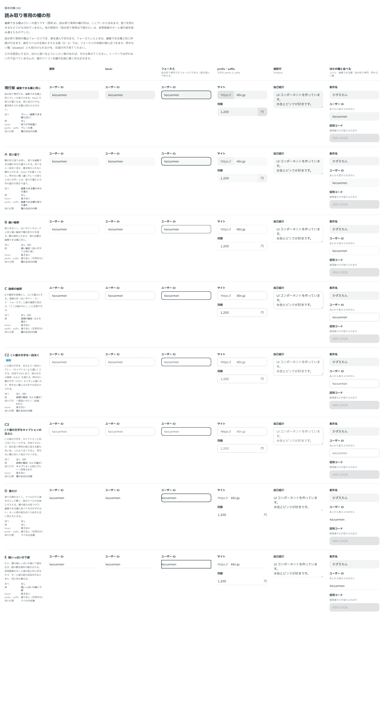

# 0170. 読み取り専用の欄の形

- ステータス: Accepted
- 日付: 2026-09-19
- ラウンド: 後半 軸152

## 背景

読み取り専用（`readOnly`）の TextField と Textarea は、編集できる欄と同じ見た目で、見ただけでは書き換えられる欄と見分けられませんでした（[ADR-0072](./0072-disabled-over-error.md) の backlog）。

前の原則には「読み取り専用の欄は下線だけ」とありましたが、これは参照画像（`site-profile-mobile.webp`）のキーと値の組を、読み取り専用の入力欄と読み違えたものでした（[ADR-0164](./0164-principles-reorganization.md) の D11）。形は一から比べ直しました。

読み取り専用は、押せない欄（disabled）とは意味が違います。値を見せて写させるための欄で、Tab で止まり、フォームで送られ、読み上げでは「読み取り専用」と読まれます。値の文字は読むための文字なので、押せない欄のように薄くはできません（文字の基準 4.5:1 の対象です）。

候補を作れるよう、先に読み取り専用の見た目をトークン（`--field-readonly-*`）で持つ形に直しました。いまの値は編集できる欄と同じにしました。

## 候補

| 案     | 内容                                                         |
| ------ | ------------------------------------------------------------ |
| 現行版 | 編集できる欄と同じグレーの塗り                               |
| A      | 欄の形と塗りは残し、塗りを編集できる欄の半分の濃さにする     |
| B      | 塗りをなくし、白いボタンと同じ細い輪郭で欄の形だけを残す     |
| C      | B の輪郭を、3:1 の濃さの破線にする                           |
| C2     | C の値の文字を、本文より一段淡いグレーにする（白地 6.9:1）   |
| C3     | C の値の文字を、キャプションと同じグレーにする（白地 4.5:1） |
| D      | 塗りも線もなし。値はラベルの左端にそろえる                   |
| E      | D に、欄の幅いっぱいの細い下線を足す                         |

状態は、通常・hover・フォーカス・prefix と suffix・複数行（Textarea）・ほかの欄と並べたところ（上から編集できる欄・読み取り専用・押せない欄）の 6 列で比べました。はじめは A〜C（いまの B・C・D にあたる 3 案）だけを並べましたが、読み違いが分かって一から比べ直し、候補を増やしました。C2・C3 は、C の文字を薄くした場合を見たいという返事を受けて足した案です。

## 決定

**C2 を採用します。**

- 塗り: なし。hover でも変えない。prefix・suffix も塗りを持たせない（文字だけ）
- 輪郭: 3:1 の濃さ（`--color-line-strong`）の、細い破線を欄の内側に引く
- 値の文字: 本文より一段淡いグレー（`--color-fg-muted`。白地 6.9:1）
- フォーカス: 破線の代わりに、編集できる欄と同じ枠線を付ける（エラーのときは、赤い枠線と離した線）
- 角・大きさ・値の位置は、編集できる欄と同じ

## 理由

ユーザーの返事の原文です。

> 読み取り専用が下線である、というのはちょっと違うかもしれません。参照画像にあったのは、読み取り専用のフォームではなく、キーと値のペアを示すコンポーネントです。私も見逃していました。読み取り専用の入力欄の見た目は、改めて軸として考え直したいです。他にもバリエーションを考えてもらえますか

> 152 C で、文字を薄くした場合を見てみたいです。

> C2 でよさそう。逆にプレースホルダテキストが出ている場合の見た目も再検討したいです。

- **塗りなしと破線**: 編集できる欄はグレーの塗りなので、塗りのないことが「書き換えられない」の手がかりになります。実線の枠（白いボタン・カード・フォーカス）と線の種類で見分けられ、押せない欄（濃いグレーの塗りと淡い文字）とも形で分かれます
- **値の文字を一段淡く**: 値が編集中の文字ではないことを添えます。一段淡いグレーは基準を大きく満たし、押せない欄の文字（2.5:1）とも濃さではっきり分かれます
- **C3 を選ばない**: キャプションと同じグレーは、プレースホルダーと同じ色になり、空の欄に見えるおそれがありました

## 却下した案と理由

- **現行版**: 書き換えられる欄と見分けられません
- **A**: 塗りが残り、押せない欄（塗りのある欄）と塗りで見分けることになります
- **B・C**: 選ばれませんでした（C の文字を淡くした C2 を採用）
- **C3**: プレースホルダーと同じ色で、値がないように見えます
- **D・E**: 値をラベルの左端にそろえると、フォーカスの枠線が値に近づきます。E はキーと値の組を示す部品（backlog）と見た目が重なります

## 影響

- `src/internal/field/field-styles.ts`（controlBox）: `data-field-readonly` のときの見た目を足しました。TextField と Textarea が `readOnly` のときに本体へ `data-field-readonly` を置きます。Base UI の Select は、止めているあいだ本体に自分で `data-readonly` を付けるので、名前を分けています
- 破線は `:not(:focus-within)` で書かず、いつも引いてフォーカス中だけ戻しています。否定で書くと、Storybook の状態の固定（pseudo-states）が否定を書き換え、フォーカスの列で破線が残ったためです
- 値を確かめているあいだ（`loadingBehavior="blocking"`）とフォームの送信中は、中で `readOnly` を使っていますが、見た目は押せない欄のままです（`readOnly` の props を渡したときだけこの見た目になる）
- `design/tokens.css`: 軸で比べるためだけに置いた `--field-readonly-*`（塗り・hover の塗り・prefix と suffix の塗り・角・線の色・下線と輪郭の太さ・線の種類・文字の色・左端にそろえる切り替え）は、決まった値へ部品に畳んで消しました。左端にそろえるために TextField・Textarea・FieldAddon に足した仕組みも外しました
- TextField と Textarea の「状態」のストーリーに、読み取り専用の行を足し、基準画像を撮り直しました
- backlog に足した未決事項: 読み取り専用の Textarea に高さを変えるつまみを残すか、選ぶ部品（Select・Checkbox・Switch など。Base UI には readOnly がある）の読み取り専用の形

## 原則への反映

原則 8 の文を書き換えました（読み取り専用の欄は塗りを持たせず、破線の輪郭で形だけを残す。値の文字は一段淡く、フォーカスでは編集できる欄と同じ枠線）。原則 12 に「読むための文字は、淡くするときも基準を満たす淡さで止め、それより強く見分けたいときは線の種類や書き方で分ける」を足しました。

## 比較画像

比較のストーリーは決めた時点のコミット `98dd68a` にあります。`git checkout 98dd68a && pnpm storybook` で開けます。

