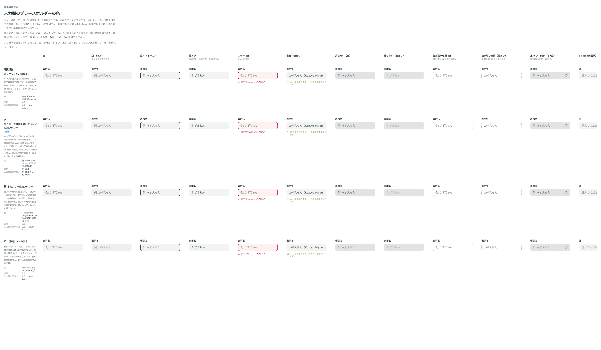

# 0171. プレースホルダーの色と書き方

- ステータス: Accepted
- 日付: 2026-09-19
- ラウンド: 後半 軸153

## 背景

プレースホルダー（TextField・Textarea の `placeholder`、Select の未選択の文字）は、キャプションと同じ淡いグレー（`--color-fg-subtle`）でした。白地では 4.52:1 で文字の基準（4.5:1）を満たしますが、入力欄のグレーの塗りの上では 4.09:1、hover の塗りの上では 3.95:1 に下がり、基準に届いていませんでした。

また、読み取り専用の値を一段淡いグレーにした（[ADR-0170](./0170-readonly-field.md)）ので、プレースホルダーが値に見えないかも見直しました。

候補を作れるよう、先にプレースホルダーの色をトークン（`--field-placeholder`）1 つで持つ形に直しました（いまの値は変えていません）。

## 候補

| 案     | 内容                                                                                             |
| ------ | ------------------------------------------------------------------------------------------------ |
| 現行版 | キャプションと同じグレー（fg-subtle）。白地 4.5:1、塗りの上 4.1:1、hover 3.95:1                  |
| A      | 塗りの上でも 4.5:1 を満たす、いちばん淡いグレー。fg-subtle に fg-muted を 45% 混ぜる（新しい値） |
| B      | 本文より一段淡いグレー（fg-muted。読み取り専用の値と同じ）。塗りの上 6.2:1                       |
| C      | （参考）3:1 の輪郭と同じ淡さ。塗りの上 2.7:1 で、基準を満たさない                                |

列は TextField の「状態」と同じ並び（空・値あり・エラー・警告・押せない）に、読み取り専用（空・値あり）、止めているあいだ、Select の未選択、Textarea の空を足した 13 列です。空の欄は hover とフォーカスも並べました。

## 決定

**A を採用します。** `--field-placeholder` を `color-mix(in oklab, var(--color-fg-muted) 45%, var(--color-fg-subtle))` にします。ブラウザで描いた色で、白地 5.46:1、入力欄の塗りの上 4.95:1、hover の塗りの上 4.77:1、エラーの塗りの上 4.99:1 です。

あわせて、プレースホルダーの書き方を決まりにします。値と見分けられるよう、「例: かずえもん」のように見本だと分かる書き方にします。Select の未選択の文字は「選んでください」のように、まだ選んでいないと分かる書き方にします。

## 理由

ユーザーの返事の原文です。

> 可能であれば、TextField story の 状態 のように、入力欄の他のステータスを並びで見れる形になっていると嬉しいです（読み取り専用含む）

> A で行きましょう。同時に、ガイドラインとしてプレースホルダテキストはプレースホルダであることが分かるような表現を使ってもらう（「例:」をつけるなど）ことを明記してください。

- **A**: 基準を満たしつつ、いまの見た目からの変化がいちばん小さい案です。読み取り専用の値（一段淡いグレー）よりは淡いままです
- **書き方の決まり**: プレースホルダーは文字なので、色は基準を満たす淡さまでしか淡くできません。値との見分けを色だけに頼らず、書き方でも付けます

## 却下した案と理由

- **現行版**: 入力欄の塗りの上で基準を満たしません
- **B**: 読み取り専用の値と同じ色になり、値が入っているように見えやすい
- **C**: 基準を満たしません（比べるための参考）

## 影響

- `design/tokens.css`: `--field-placeholder` を A の値にしました
- `src/components/text-field/TextField.tsx`・`src/components/textarea/Textarea.tsx`・`src/components/select/Select.tsx`: プレースホルダーの色を `--field-placeholder` で持ち、`placeholder` の JSDoc に書き方の決まりを書きました。3 部品の Docs の説明にも同じことを足しました
- TextField のストーリーの例のプレースホルダーを「例: かずえもん」「例: example.com」にし、基準画像を撮り直しました。Textarea の「ご用件をお書きください」と Select の「選んでください」は、そのままで見本だと分かるので変えていません
- 押せない欄のプレースホルダーは、押せない値の文字（2.5:1）より濃いままです。原則 13 の「押せない欄では、文を出しているところは薄い文字、値はさらに薄い文字」のとおりです
- 読み取り専用で値が空の欄には、いまはプレースホルダーを出しています。「なし」などの文字で示すかは決めていません（backlog）

## 原則への反映

原則 8 にプレースホルダーの行を足しました（値より淡くするが、文字の基準を満たす淡さで止める。値との見分けは書き方でも付ける）。原則 12 に、読むための文字を淡くする限りと、それより強く見分けたいときは線の種類や書き方で分けることを足しました（ADR-0170 と同じ行）。

## 比較画像

比較のストーリーは決めた時点のコミット `98dd68a` にあります。`git checkout 98dd68a && pnpm storybook` で開けます。

