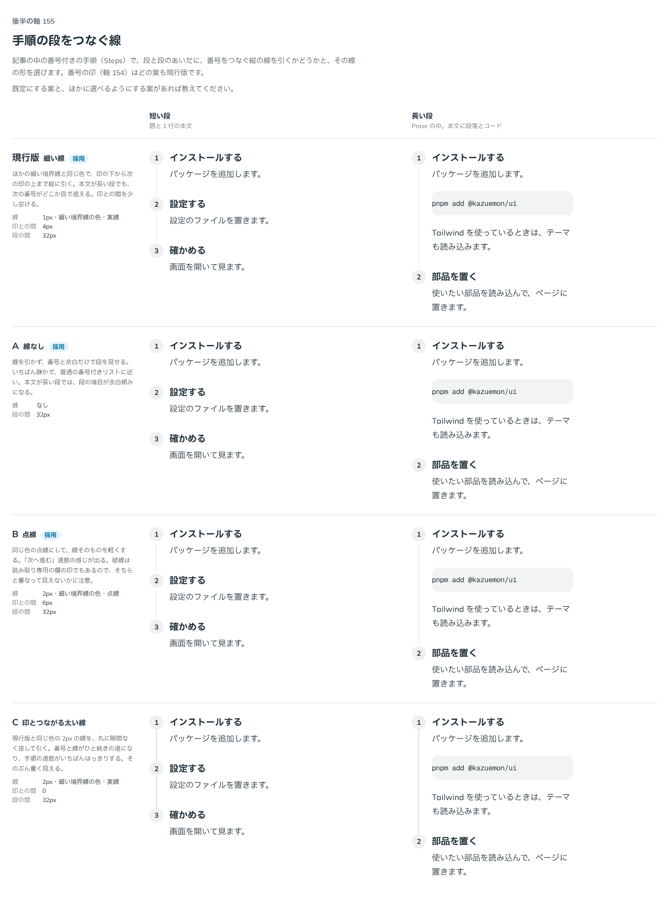

# 0172. 手順の段をつなぐ線

- ステータス: Accepted
- 日付: 2026-09-19
- ラウンド: 後半 軸155

## 背景

Steps（記事の中の番号付きの手順）を作りました。段と段のあいだに、番号をつなぐ縦の線を引くかどうかと、その線の形を決めます。番号の印（軸 154）は、この軸ではどの案も現行版のグレーの丸のまま比べました。

## 候補

| 案     | 内容                                                   |
| ------ | ------------------------------------------------------ |
| 現行版 | 細い実線。印の下から次の印の上まで、少し間を空けて引く |
| A      | 線なし。番号と余白だけで段を見せる                     |
| B      | 点線。同じ色で、線そのものを軽くする                   |
| C      | 印とつながる太い線。丸に隙間なく接する 2px の実線      |

短い段（題と 1 行の本文）と、長い段（Prose の中、本文に段落とコード）の 2 列で比べました。

## 決定

**現行版（細い実線）を既定とし、A（線なし）と B（点線）も選べるようにします。** `line` で選びます。

- solid（既定）: `--border-width-thin` の細い実線
- none: 線を引かない
- dotted: 点線（太さ・印との間は点線用の値に差し替え）

C（印とつながる太い線）は選べる形にしません。

## 理由

ユーザーの返事の原文です。

> 155: デフォルト現行、A/Bも選択可

- **現行版を既定に**: 細い実線が、段の道筋を静かに見せます
- **A・B も選べるように**: 線なしはいちばん静かな見た目、点線は線を軽くした見た目として、どちらも使う場面がありそうです
- **C を選ばない**: 番号と線がひと続きになって重く見え、返事にも挙がりませんでした

## 却下した案と理由

- C: 印とつながる太い線は、重く見えるため選ばれませんでした

## 影響

- `src/components/steps/Steps.tsx`: `line` props（`solid`（既定）・`dotted`・`none`）を足しました
- `design/tokens.css`: `--steps-line-width`・`--steps-line-gap`・`--color-steps-line`・`--steps-line-dotted-width`・`--steps-line-dotted-gap` を Steps の区画に持ちます。軸で比べるためだけに置いた値は、決まった値へ部品に畳んで消しました
- Steps の「状態」のストーリーに `line` の一覧を足しました

## 原則への反映

反映なし。原則には数値やトークン名を書かないため、原則 5（角丸）・19（読みもの）の範囲内の決定です。

## 比較画像

比較のストーリーは決めた時点のコミット `17e1d06` にあります。`git checkout 17e1d06 && pnpm storybook` で開けます。

