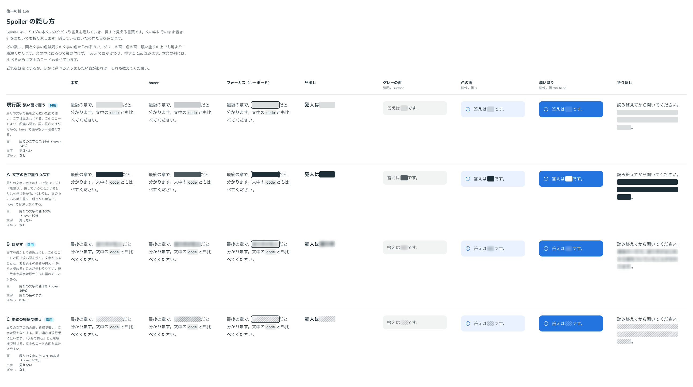

# 0173. Spoiler の隠し方

- ステータス: Accepted
- 日付: 2026-09-19
- ラウンド: 後半 軸156

## 背景

Spoiler（文中で隠しておき、押すと見える言葉）を作りました。隠しているあいだの見た目を決めます。面と文字の色は、どの案も周りの文字の色（currentColor）から作り、白地・グレーの面・色の面・濃い塗りのどこでも地より一段濃い面になるようにしました（文中のコードと同じ考え方）。

## 候補

| 案     | 内容                                                                |
| ------ | ------------------------------------------------------------------- |
| 現行版 | 淡い面で覆う。周りの文字の色を 16%（hover 24%）敷き、文字は見えない |
| A      | 文字の色で塗りつぶす（黒塗り）。100%（hover 80%）で、文字は見えない |
| B      | ぼかす。8%（hover 16%）の淡い面に、文字はぼかして残す（0.3em）      |
| C      | 斜線の模様で覆う。28%（hover 40%）の細い斜線。文字は見えない        |

本文・hover・フォーカス・見出し・グレーの面（引用の surface）・色の面（Callout）・濃い塗り（Callout の filled）・折り返しの 8 列で比べました。

## 決定

**C（斜線の模様）を既定とし、現行版（淡い面）と B（ぼかし）も選べるようにします。** `appearance` で選びます。

- hatched（既定）: 斜線の模様で覆う
- soft: 淡い面で覆う
- blur: 文字をぼかす。ぼかし半径は 0.3em

A（文字の色で塗りつぶす）は選べる形にしません。

## 理由

ユーザーの返事の原文です。

> 156: デフォルトC、現行/Bも選択可

- **C を既定に**: 面の濃さは現行版に近いまま、「伏せてある」ことが模様で伝わり、文中のコードの面とも見分けやすくなります
- **現行版・B も選べるように**: 淡い面はいちばん静かな見た目、ぼかしは「押すと読める」ことが伝わりやすい見た目として、どちらも残します
- **A を選ばない**: 文の中でいちばん重く、軽さの基準から遠いため選ばれませんでした

## 却下した案と理由

- A: 黒塗りは軽さの基準から離れ、返事にも挙がりませんでした

## 影響

- `src/components/spoiler/Spoiler.tsx`: `appearance` props（`hatched`（既定）・`soft`・`blur`）を足しました
- `design/tokens.css`: `--spoiler-hatched-fill`・`--spoiler-soft-fill`・`--spoiler-blur-fill`（と各 hover）・`--spoiler-blur-radius` を Spoiler の区画に持ちます
- Spoiler の「状態」のストーリーに `appearance` の一覧を足しました

## 原則への反映

反映なし。原則には数値やトークン名を書かないため、原則 6（色は役割で持つ）・19（読みもの）の範囲内の決定です。

## 比較画像

比較のストーリーは決めた時点のコミット `17e1d06` にあります。`git checkout 17e1d06 && pnpm storybook` で開けます。

