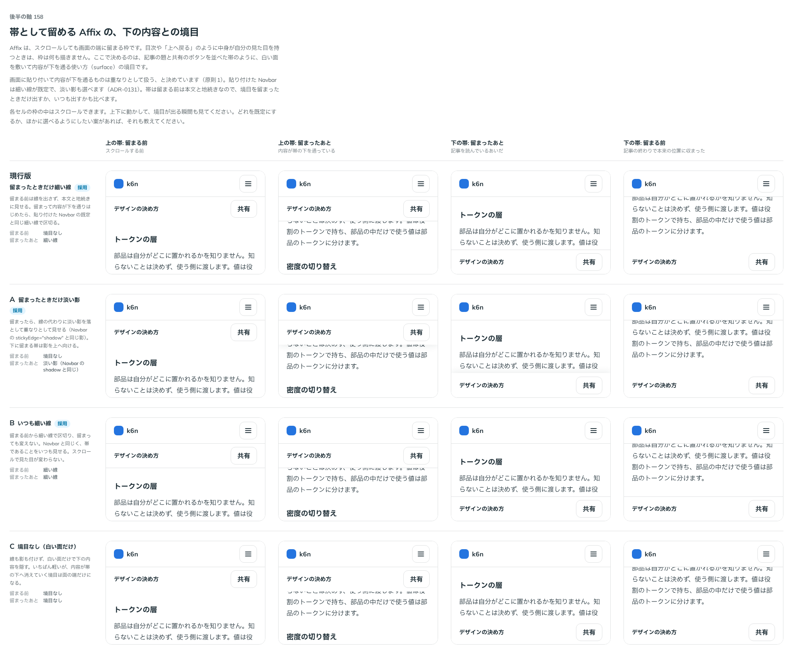

# 0175. 帯として留める Affix の、下の内容との境目

- ステータス: Accepted
- 日付: 2026-09-19
- ラウンド: 後半 軸158

## 背景

Affix（スクロールしても画面の端に留まる枠）を作りました。目次や「上へ戻る」のように中身が自分の見た目を持つときは、枠は何も描きません。ここで決めるのは、記事の題と共有のボタンを並べた帯のように、白い面を敷いて内容が下を通る使い方（`surface`）の境目です。

画面に貼り付いて内容が下を通るものは重なりとして扱うと決めています（原則1）。貼り付けた Navbar は細い線が既定で、淡い影も選べます（[ADR-0131](./0131-navbar-sticky.md)）。Affix の帯は、留まる前は本文と地続きなので、境目を留まったときだけ出すか、いつも出すかも比べました。

## 候補

| 案     | 内容                                                               |
| ------ | ------------------------------------------------------------------ |
| 現行版 | 留まったときだけ細い線。留まる前は境目なし                         |
| A      | 留まったときだけ淡い影（Navbar の `stickyEdge="shadow"` と同じ影） |
| B      | いつも細い線。留まる前から区切り、留まっても変えない               |
| C      | 境目なし（白い面だけ）                                             |

上の帯（留まる前・留まったあと）と、下の帯（留まったあと・留まる前）の 4 列で比べました。

## 決定

**現行版（留まったときだけ細い線）を既定とし、A（留まったときだけ淡い影）と B（いつも細い線）も選べるようにします。** `surfaceEdge` で選びます。

- line（既定）: 留まったときだけ細い線
- shadow: 留まったときだけ淡い影（上に留まる帯は下へ、下に留まる帯は上へ向ける）
- always-line: 留まる前からいつも細い線

C（境目なし）は選べる形にしません。

## 理由

ユーザーの返事の原文です。

> 158: デフォルト現行、A/Bも選択可

- **現行版を既定に**: 留まる前は本文と地続きに見せ、留まって重なりになったときだけ境目を出すのが、原則1の「重なりとして扱う」に自然に沿います
- **A・B も選べるように**: 淡い影は Navbar と同じ選択肢をそろえ、いつも細い線は帯であることをスクロールによらず見せたい場面に応えます
- **C を選ばない**: 境目が面の端だけになり、内容が帯の下へ消えていく境目が読み取りにくいため、選べる形にしません

## 却下した案と理由

- C: 境目が弱く、下の内容との切り分けが面の端だけに頼ることになります

## 影響

- `src/components/affix/Affix.tsx`: `surfaceEdge` props（`line`（既定）・`shadow`・`always-line`）を足しました。`surface` を付けないときは効きません
- `design/tokens.css`: `--affix-shadow-top`・`--affix-shadow-bottom` を Affix の区画に持ちます。軸で比べるためだけに置いた `--affix-line`・`--affix-line-stuck`・`--affix-shadow-*-stuck` は、決まった値へ部品に畳んで消しました
- Affix のストーリーに `surfaceEdge` の一覧を足しました

## 原則への反映

反映なし。原則 1 の「画面に貼り付いて、スクロールした内容が下を通るようになったら、重なりとして扱う」の範囲内の決定です。

## 比較画像

比較のストーリーは決めた時点のコミット `17e1d06` にあります。`git checkout 17e1d06 && pnpm storybook` で開けます。

