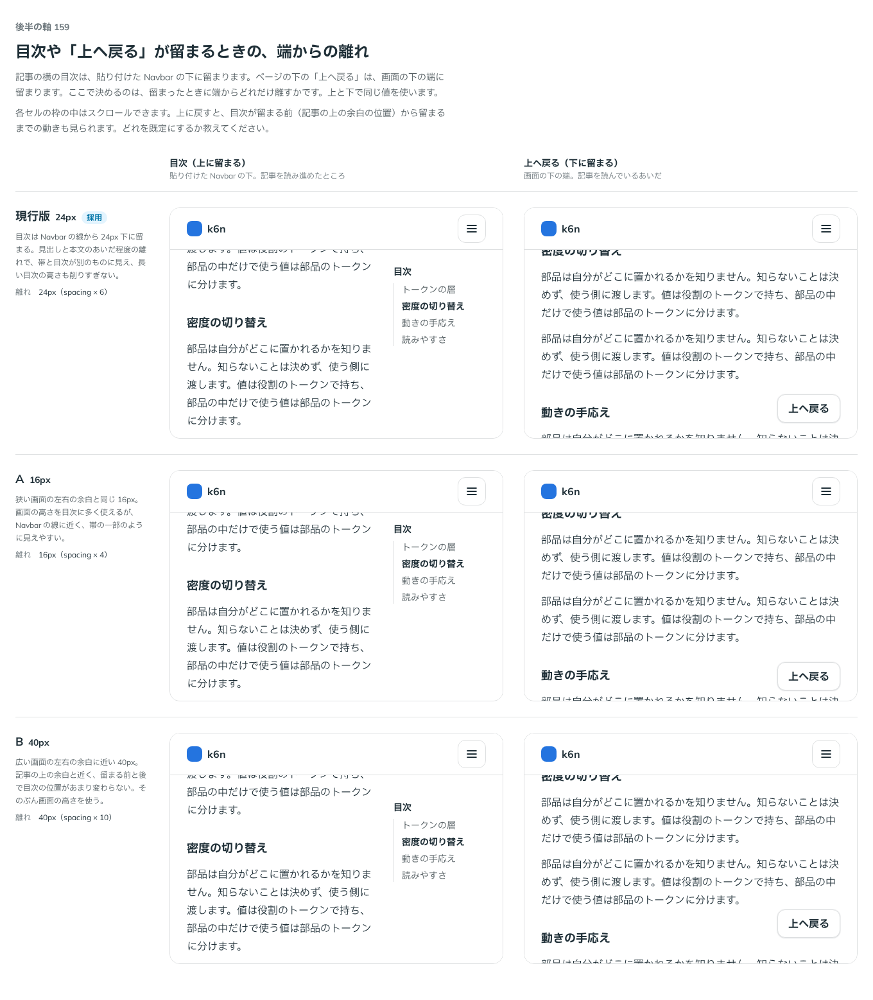

# 0176. Affix が留まるときの端からの離れ

- ステータス: Accepted
- 日付: 2026-09-19
- ラウンド: 後半 軸159

## 背景

面を持たない Affix（記事の横の目次、下に留まる「上へ戻る」）が留まるとき、端からどれだけ離すかを決めます。上に留まる目次は貼り付けた Navbar の下の線から、下に留まる「上へ戻る」は画面の下の端から、同じ値（`--affix-gap`）で離します。帯（`surface`）は端に付けて留めるので、この軸には関わりません。

## 候補

| 案     | 内容                               |
| ------ | ---------------------------------- |
| 現行版 | 24px（`--spacing` × 6）            |
| A      | 16px（狭い画面の左右の余白と同じ） |
| B      | 40px（広い画面の左右の余白に近い） |

目次（上に留まる。貼り付けた Navbar の下）と、「上へ戻る」（下に留まる。画面の下の端）の 2 列で、スクロールして留まる前後の動きも見て比べました。

## 決定

**現行版（24px）を既定にします。** 選べる形（props）は作りません。ページのレイアウトに合わせて使う側が `--affix-gap` を上書きします。

## 理由

ユーザーの返事の原文です。

> そもそもページのレイアウトによりますね。デフォルトは現行にしておきます。

- **現行版を既定に**: 見出しと本文のあいだ程度の離れで、帯や画面の端と目次・ボタンが別のものに見えます
- **選べる形は作らない**: 適切な離れはページのレイアウト次第なので、部品の props ではなく、置く側の CSS 変数の上書きに任せます（原則20: 部品は知らないことを決めない）

## 却下した案と理由

なし。A・B は候補として作りましたが、レイアウト次第という返事により、props としては採用しませんでした。

## 影響

- `design/tokens.css`: `--affix-gap: calc(var(--spacing) * 6)`（24px）を Affix の区画に持ちます。使う側は `className="[--affix-gap:--spacing(4)]"` のように上書きするか、CSS で `--affix-gap` を定めます
- `src/components/affix/Affix.tsx` の JSDoc に、上書きの仕方を書きました

## 原則への反映

反映なし。原則 20（部品は知らないことを決めない）の「置く場所を知らないことは使う側に渡す」に沿う決定で、文の書き換えはありません。

## 比較画像

比較のストーリーは決めた時点のコミット `17e1d06` にあります。`git checkout 17e1d06 && pnpm storybook` で開けます。

