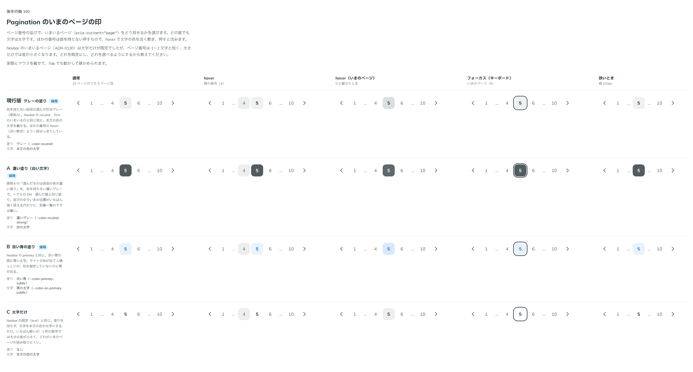

# 0177. Pagination のいまのページの印

- ステータス: Accepted
- 日付: 2026-09-19
- ラウンド: 後半 軸160

## 背景

Pagination（ページ番号のナビ）を作りました。いまいるページ（`aria-current="page"`）をどう見せるかを決めます。どの案も文字は太字で、ほかの番号は面を持たない押すもの（hover で文字の色を淡く敷き、押すと沈む）です。近い前例として、Navbar のいまいるページ（[ADR-0130](./0130-navbar-current.md)）は太字だけが既定で、グレー・淡い青の pill も選べます。ただしページ番号は 1〜2 文字と短く、太さだけでは差が小さくなります。

## 候補

| 案     | 内容                                                   |
| ------ | ------------------------------------------------------ |
| 現行版 | グレーの塗り（`--color-neutral`）に本文の色の太字      |
| A      | 濃いグレーの塗り（`--color-neutral-strong`）に白の太字 |
| B      | 淡い青の塗り（`--color-primary-subtle`）に青の太字     |
| C      | 太字だけ（塗りなし）                                   |

通常・hover（隣の番号）・hover（いまのページ）・フォーカス（キーボード）・狭いとき（幅 320px）の 5 列で比べました。

## 決定

**現行版（グレーの塗り）を既定とし、A（濃いグレー）と B（淡い青）も選べるようにします。** `currentIndicator` で選びます。

- neutral（既定）: グレーの塗りに本文の色（色を持たない部品の選んだ印はグレー — 原則6）
- neutral-strong: 濃いグレーの塗りに白い文字（トグルの ON と同じ）
- primary: 淡い青の塗りに青い文字（Navbar の primary と同じ）

C（太字だけ）は選べる形にしません。

## 理由

ユーザーの返事の原文です。

> 160: デフォルト現行、A/Bも選択可

- **現行版を既定に**: 色を持たない部品の選んだ印はグレーという決まりに沿い、ほかの番号の hover（淡い敷き）よりはっきり見えます
- **A・B も選べるように**: neutral-strong はいまの位置をいちばん強く見せたいとき、primary はサイトの色を出したいときに使えます
- **C を選ばない**: ページ番号は 1〜2 文字と短く、太さだけの差ではいまのページが読み取りにくくなります

## 却下した案と理由

- C: 太さの差だけでは、短い数字でいまのページが分かりにくいため選ばれませんでした

## 影響

- `src/components/pagination/Pagination.tsx`: `currentIndicator` props（`neutral`（既定）・`neutral-strong`・`primary`）を足しました
- `design/tokens.css`: 決まった 3 色の値は部品の `currentIndicator` の variants に畳み、Pagination の区画には持ちません
- Pagination のストーリーに `currentIndicator` の一覧を足しました

## 原則への反映

反映なし。原則 6（色は役割で持つ）の「色を指定しないとき、色を持つ部品はすべてグレー」の範囲内の決定です。

## 比較画像

比較のストーリーは決めた時点のコミット `17e1d06` にあります。`git checkout 17e1d06 && pnpm storybook` で開けます。

