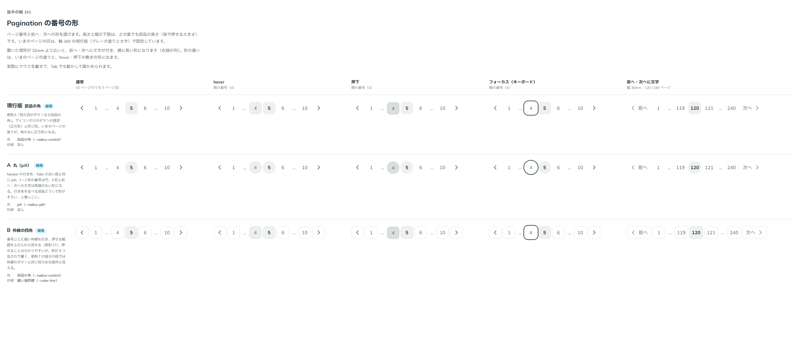

# 0178. Pagination の番号の形

- ステータス: Accepted
- 日付: 2026-09-19
- ラウンド: 後半 軸161

## 背景

Pagination の番号と前へ・次への形を決めます。高さと幅の下限は、どの案も部品の高さ（指で押せる大きさ）です。いまのページの印は、この軸ではどの案も軸 160 の現行版（グレーの塗りと太字。[ADR-0177](./0177-pagination-current.md)）で固定して比べました。

## 候補

| 案     | 内容                                                                              |
| ------ | --------------------------------------------------------------------------------- |
| 現行版 | 部品の角（原則5「見た目がボタンなら部品の角」）。枠線なし                         |
| A      | 丸（pill）。Navbar の行き先・Tabs の淡い面と同じ。枠線なし                        |
| B      | 部品の角のまま、番号ごとに細い枠線を引く（押せる範囲をふだんから見せる — 原則17） |

通常・hover・押下・フォーカス（キーボード）・前へ・次へに文字（幅 36rem・120 / 240 ページ）の 5 列で比べました。

## 決定

**現行版（部品の角）を既定とし、A（丸・pill）も選べるようにします。** `shape` で選びます。加えて、B の枠線は `shape` とは別の `outline` の真偽値にします。

- shape: square（既定。部品の角）／round（pill）
- outline: 番号と前へ・次へに細い枠線を引くか（既定 false）

`shape` と `outline` は組み合わせて使えます（丸に枠線も付けられます）。

## 理由

ユーザーの返事の原文です。

> 161: デフォルト現行、A/Bも選択可
>
> 3: outline にわけるでよいです。

- **現行版を既定に**: アイコンだけのボタンの既定（正方形）と同じ形で、部品どうしの形がそろいます
- **A も選べるように**: Navbar の行き先・Tabs と形をそろえたいときに使えます
- **B を `outline` に分ける**: 枠線は角の形（square・round）とは別の軸で、どちらの形にも重ねられる性質だと分かったため、`shape` の 3 つ目の値にはせず、独立した真偽値にしました

## 却下した案と理由

なし。B は形の候補としては採らず、独立した `outline` props として採用しました。

## 影響

- `src/components/pagination/Pagination.tsx`: `shape` props（`square`（既定）・`round`）と `outline` props（既定 `false`）を足しました
- `design/tokens.css`: Pagination の区画には、決まった `shape`・`outline` の値は部品の variants に畳んであり、比較用のトークンは残っていません
- Pagination のストーリーに `shape`・`outline` の一覧を足しました

## 原則への反映

反映なし。原則 5（角丸は部品と包むもので分ける）・17（押せる範囲は見た目の範囲）の範囲内の決定です。

## 比較画像

比較のストーリーは決めた時点のコミット `17e1d06` にあります（`shape` と `outline` を分けた決定は `10e858a` の時点です）。`git checkout 17e1d06 && pnpm storybook` で開けます。

