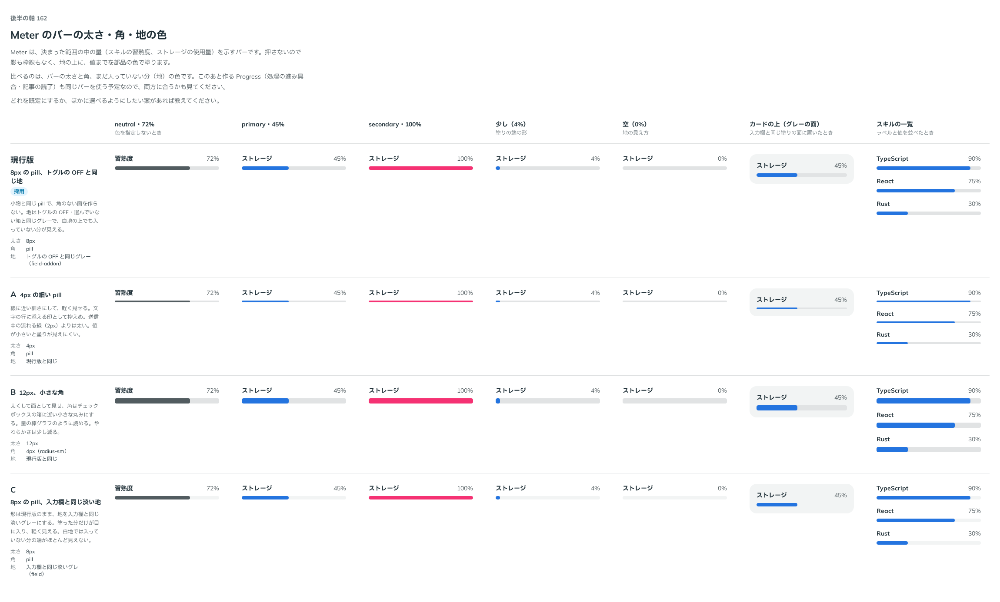

# 0179. Meter のバーの太さ・角・地の色

- ステータス: Accepted
- 日付: 2026-09-19
- ラウンド: 後半 軸162

## 背景

Meter（決まった範囲の中の量を示すバー）を作りました。押さないので影も枠線もなく、地の上に値までを部品の色で塗ります。バーの太さ・角・まだ入っていない分（地）の色を決めます。このあと作る Progress（処理の進み具合・記事の読了）も同じバーの形を使う予定なので、両方に合うかも見ました。

## 候補

| 案     | 内容                                                                     |
| ------ | ------------------------------------------------------------------------ |
| 現行版 | 8px の pill。地はトグルの OFF・選んでいない箱と同じグレー（field-addon） |
| A      | 4px の細い pill。地は現行版と同じ                                        |
| B      | 12px、小さな角（`--radius-sm`）。地は現行版と同じ                        |
| C      | 8px の pill。地は入力欄と同じ淡いグレー（field）                         |

neutral・72%／primary・45%／secondary・100%／少し（4%）／空（0%）／カードの上（グレーの面）／スキルの一覧の 7 列で比べました。

## 決定

**現行版（8px の pill、トグルの OFF と同じ地）を既定とし、太さを選べるようにします。** `size` で選びます。

- sm（4px）: 一覧に多く並べるとき
- md（8px。既定）: 標準
- lg（12px）: 1 つだけ大きく見せるとき

どの太さでも角は pill のままです（B の小さな角は採りません）。地の色は現行版のまま、色を選べる形は作りません。

## 理由

ユーザーの返事の原文です。

> 162: デフォルト現行、太さ変更可能

- **現行版を既定に**: 小物と同じ pill で角のない面を作らず、地はトグルの OFF と同じグレーで、白地の上でも入っていない分が見えます
- **太さを選べるように**: A（細い）・B（太い）は、一覧に多く並べる場面と、1 つだけ大きく見せる場面のどちらもありそうです
- **角は pill のまま**: B の小さな角は候補どまりで、返事は太さの変更だけを求めました（原則5: 角は何であるかで決め、高さに比例させない）
- **地の色は現行版のまま**: C（入力欄と同じ淡いグレー）は、白地では入っていない分の端がほとんど見えなくなるため、返事にも挙がりませんでした

## 却下した案と理由

- B: 角を小さくする変更は求められませんでした（太さだけを lg として採用）
- C: 地が淡すぎて、入っていない分の端が見えにくくなります

## 影響

- `src/components/meter/Meter.tsx`: `size` props（`sm`・`md`（既定）・`lg`）を足しました
- `design/tokens.css`: `--meter-height-sm`・`--meter-height-md`・`--meter-height-lg` を Meter の区画に持ちます
- Meter のストーリーに `size` の一覧を足しました

## 原則への反映

反映なし。原則 5（角丸は部品と包むもので分ける）・11（文字の大きさは入力方式で切り替える。バーの太さは入力方式で変えない）の範囲内の決定です。

## 比較画像

比較のストーリーは決めた時点のコミット `17e1d06` にあります。`git checkout 17e1d06 && pnpm storybook` で開けます。

