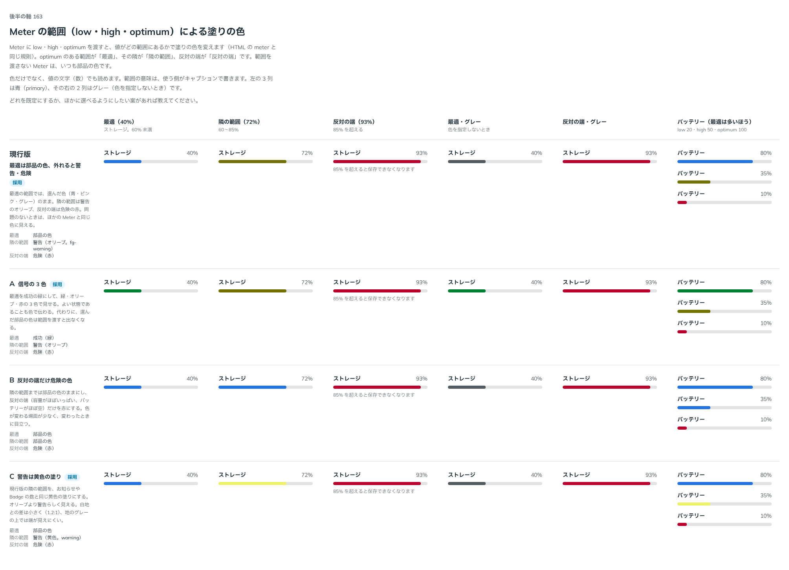
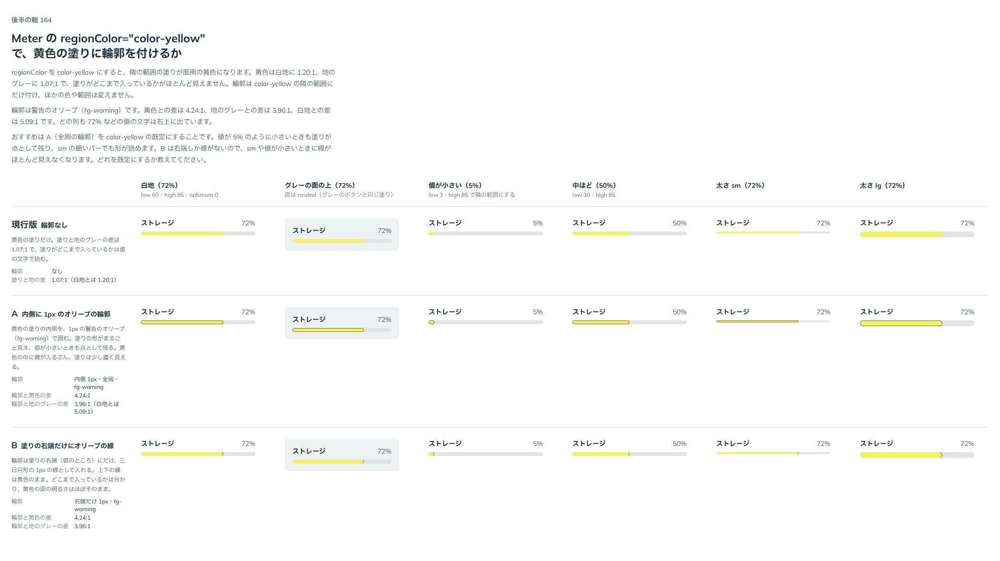

# 0180. Meter の範囲による塗りの色

- ステータス: Accepted
- 日付: 2026-09-19
- ラウンド: 後半 軸163・164

## 背景

Meter に `low`・`high`・`optimum` を渡すと、値がどの範囲にあるかで塗りの色を変えます（HTML の `meter` と同じ規則）。`optimum` のある範囲を「最適」、その隣を「隣の範囲」、反対の端を「反対の端」として、それぞれの塗りの色を決めます（軸 163）。色だけでなく、値の文字（数）でも読めるようにし、範囲の意味は使う側がキャプションに書く前提です。

軸 163 でいったん候補に挙げた「隣の範囲を黄色の塗りにする案」は、黄色（`--color-warning`）が白地に 1.20:1、地のグレーに 1.07:1 しかなく、塗りの端が見えにくいことが分かりました。そこで、黄色の塗りに輪郭を付けるかを軸 164 として別に比べました。

## 候補

軸 163（最適・隣の範囲・反対の端の色）

| 案     | 内容                                                               |
| ------ | ------------------------------------------------------------------ |
| 現行版 | 最適は部品の色のまま。隣の範囲は警告のオリーブ、反対の端は危険の赤 |
| A      | 信号の 3 色。最適は成功の緑、隣の範囲はオリーブ、反対の端は赤      |
| B      | 反対の端だけ危険の赤。最適・隣の範囲は部品の色のまま               |
| C      | 現行版の隣の範囲を、面用の黄色の塗りにする                         |

最適（40%）・隣の範囲（72%）・反対の端（93%）・最適（グレー）・反対の端（グレー）・バッテリー（最適は多いほう）の 6 列で比べました。

軸 164（C の黄色の塗りに輪郭を付けるか）

| 案     | 内容                                                        |
| ------ | ----------------------------------------------------------- |
| 現行版 | 輪郭なし。黄色の塗りだけ                                    |
| A      | 内側に 1px のオリーブ（fg-warning）の輪郭を全周に付ける     |
| B      | 塗りの右端（値のところ）だけに、三日月形の 1px の線を入れる |

白地・グレーの面の上・値が小さい（5%）・中ほど（50%）・太さ sm・太さ lg の 6 列で比べました。

## 決定

**A（信号の 3 色）を既定とし、現行版（最適は部品の色のまま）も選べるようにします。** `regionColor` で選びます。

- status（既定）: 最適は成功の緑、隣の範囲は警告のオリーブ、反対の端は危険の赤
- color: 最適は部品の色のまま。隣の範囲・反対の端は status と同じ

C（隣の範囲を黄色の塗りにする案）は、軸 164 で輪郭を付けた見た目まで見たうえで、**採りません**。B（反対の端だけ赤）も選べる形にしません。

## 理由

ユーザーの返事の原文です（軸 163）。

> 163: デフォルトA、現行/Cも選択可

> 4: 付けた見た目を見たいです

軸 164 を見たあとの返事です。

> 164: うーん、この色自体はナシでいいかもですね

- **A を既定に**: 最適の状態であることも色で伝わり、隣の範囲・反対の端との差もはっきりします
- **現行版も選べるように**: 選んだ部品の色をそのまま保ちたい場面（サイトの色を優先したいとき）に応えます
- **B を選ばない**: 反対の端だけ赤にする案は、返事の対象になりませんでした
- **C を採らない**: 輪郭を付けても、黄色は白地・グレーの地との差が小さいままで、値が小さいときや細いバーでは判別しづらいことが分かりました。色そのものを見送り、`regionColor` の値としては用意しません

## 却下した案と理由

- B: 反対の端だけ赤にする案は選ばれませんでした
- C（と、その輪郭付きの A・B）: 黄色は地との差が小さく、輪郭を付けても十分に見分けやすくならないため、`regionColor` の値として採りません

## 影響

- `src/components/meter/Meter.tsx`: `regionColor` props（`status`（既定）・`color`）を持ちます。軸 164 で試した `color-yellow` は、値としては足しません
- `design/tokens.css`: `--color-meter-optimum` などの範囲の色は部品の `regionColor` の variants に畳んであります。軸 164 で比べるためだけに置いた `--meter-yellow-outline-x`・`--meter-yellow-outline-spread`・`--color-meter-yellow-outline` は消しました
- Meter のストーリーに `regionColor` の一覧を足しました

## 原則への反映

反映なし。原則 6（色は役割で持つ）の「状態の色は、知らせるための色」「色だけでなく、形でも見分ける」の範囲内の決定です。

## 比較画像

比較のストーリーは、軸 163 は決めた時点のコミット `17e1d06`、軸 164 は `c9dffec` にあります。`git checkout <sha> && pnpm storybook` で開けます。

