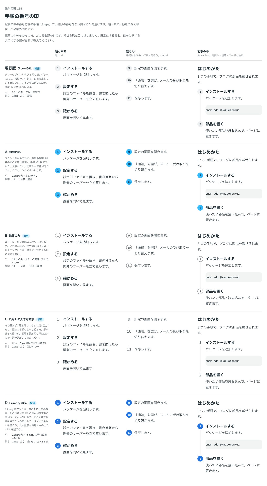

# 0181. 手順の番号の印

- ステータス: Accepted
- 日付: 2026-09-19
- ラウンド: 後半 軸154（第 2 ラウンド）

## 背景

Steps の各段の番号をどう見せるかを決めます。題・本文・段をつなぐ線（[ADR-0172](./0172-steps-line.md)）は、どの案も同じにして比べました。記事の中のものなので、どの案も影を付けず、押せる見た目にはしません。

はじめのラウンドで現行版（グレーの丸）・A（水色の丸）・B（輪郭の丸）・C（丸なしの大きな数字）を比べたところ、A は水色の面に濃紺の数字を載せる案でしたが、白地との差が図形として 3:1 に届かないと分かりました。ユーザーからボタンの色合いを使う案の提案があり、D（Primary の丸）を足して第 2 ラウンドで比べ直しました。

## 候補

| 案     | 内容                                                                            |
| ------ | ------------------------------------------------------------------------------- |
| 現行版 | グレーの丸（28px）に濃紺の太い数字                                              |
| A      | 水色の丸に濃紺の数字。白地との差が図形として 2.21:1 で、3:1 に届かない          |
| B      | 輪郭だけの丸（1.5px・3:1 のグレー）に、一段淡い濃紺の数字                       |
| C      | 丸を置かず、題と同じ大きさの淡い数字だけ                                        |
| D      | Primary ボタンと同じ青の丸に、白の数字。丸も数字も白地・丸の上で 4.5:1 を越える |

題と本文・題なし（本文の 1 行目に番号をそろえる）・記事の中（Prose、見出し・段落・コードと並ぶ）の 3 列で比べました。

## 決定

**現行版（グレーの丸）を既定とし、B（輪郭の丸）・C（丸なしの数字）・D（Primary の丸）も選べるようにします。** `marker` で選びます。

- neutral（既定）: グレーの丸に本文の色の太い数字
- outline: 輪郭だけの丸に一段淡い数字
- number: 丸を置かない大きな数字
- primary: Primary の丸に白い数字

A（水色の丸）は選べる形にしません。

## 理由

ユーザーの返事の原文です。

> 154 の A って、白だとコントラスト NG ですか？ボタンと同じ色合いでもよいです

> お願いします。154 はパターンを足してもらえますか？

第 2 ラウンドの返事です。

> 154: デフォルト現行、B/C/D 選択可

- **現行版を既定に**: 色を指定しないときはグレーという決まりに沿い、静かで題が主役になります
- **B・C・D も選べるように**: 輪郭だけの軽い見た目、丸を置かない雑誌風の組み方、色で手順を目立たせたい見た目のどれも使う場面がありそうです
- **A を選ばない**: 水色の丸に濃紺の数字は、丸の形そのものが白地との差 2.21:1 しかなく、図形の基準（3:1）に届きません。ユーザーの指摘どおり、色で目立たせたいときはボタンと同じ色合い（D）を使います

## 却下した案と理由

- A: 白地との差が図形の基準（3:1）に届かないため、選べる形にしません（D に置き換え）

## 影響

- `src/components/steps/Steps.tsx`: `marker` props（`neutral`（既定）・`outline`・`number`・`primary`）を足しました
- `design/tokens.css`: `--steps-marker-size`・`--steps-marker-gap`・`--steps-marker-text`・`--steps-marker-number-text` を Steps の区画に持ちます。決まった塗り・輪郭・数字の色は部品の `marker` の variants に畳んであります
- Steps のストーリーに `marker` の一覧を足しました

## 原則への反映

反映なし。原則 6（色は役割で持つ）・12（色は面用と前景用の 2 段で持つ。図形の基準）の範囲内の決定です。

## 比較画像

比較のストーリーは決めた時点のコミット `10e858a` にあります（画像は pick `current,B,C,D`）。`git checkout 10e858a && pnpm storybook` で開けます。

