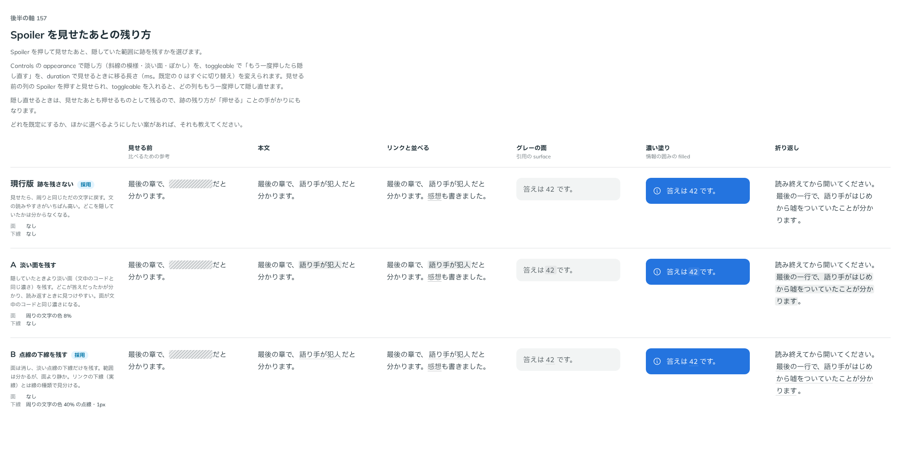

# 0182. Spoiler を見せたあとの残り方

- ステータス: Accepted
- 日付: 2026-09-19
- ラウンド: 後半 軸157（第 2 ラウンド）

## 背景

Spoiler を押して見せたあと、隠していた範囲に跡を残すかを決めます。あわせて、もう一度押したら隠し直すか（`toggleable`）も決めます。隠し方（[ADR-0173](./0173-spoiler-conceal.md)）・移る長さ（[ADR-0174](./0174-spoiler-motion.md)）は Controls で切り替えながら見ました。

## 候補

| 案     | 内容                                                      |
| ------ | --------------------------------------------------------- |
| 現行版 | 跡を残さない。見せたら周りと同じただの文字に戻す          |
| A      | 淡い面を残す（周りの文字の色 8%。文中のコードと同じ濃さ） |
| B      | 点線の下線を残す（周りの文字の色 40% の点線・1px）        |

見せる前（参考）・本文・リンクと並べる・グレーの面（引用の surface）・濃い塗り（Callout の filled）・折り返しの 6 列で比べました。

## 決定

**`toggleable` が false（既定）のときは現行版（跡を残さない）、true のときは B（点線の下線）を自動で選びます。** 使う側が選ぶ props ではなく、`toggleable` から部品が自動で決めます。A（淡い面）は採りません。

## 理由

ユーザーの返事の原文です。

> 156 のパターンを切り替えて見れるようにしたいです。あと、再度クリックしたら戻すかどうかも制御したいです

第 2 ラウンドの返事です。

> 157: おすすめいいですね。

- **toggleable が false なら跡を残さない**: 一度見せたらもう押せないので、文の読みやすさをいちばん高くします
- **toggleable が true なら B を自動で**: 見せたあとも押せるものとして残るので、点線の下線が「押せる」ことの手がかりになります。リンクの下線（実線）とは線の種類で見分けます
- **A を採らない**: 淡い面は文中のコードと同じ濃さになり、答えがコードと紛らわしく見えます。返事にも挙がりませんでした

## 却下した案と理由

- A: 淡い面は文中のコードと見分けにくく、選ばれませんでした

## 影響

- `src/components/spoiler/Spoiler.tsx`: `toggleable` props（既定 `false`）を足しました。見た目は使う側が選ぶのではなく、`toggleable` の値から部品が自動で決めます（`revealed` と `toggleable` の組み合わせ）
- `design/tokens.css`: Spoiler の区画には、見せたあとの残り方の値は部品の compoundVariants に畳んであり、比較用のトークンは残っていません
- Spoiler のストーリーに `toggleable` の一覧を足しました

## 原則への反映

反映なし。原則 3（hover は手応え、押すと沈む。押せることを示す手がかり）・18（働きで部品を選び、見た目は別に選ぶ）の範囲内の決定です。

## 比較画像

比較のストーリーは決めた時点のコミット `10e858a` にあります（画像は pick `current,B`）。`git checkout 10e858a && pnpm storybook` で開けます。

