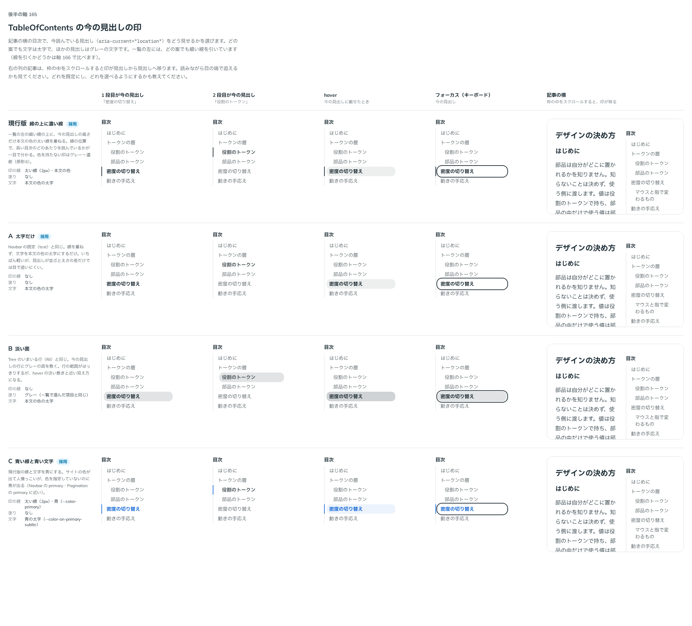

# 0183. 目次のいまの見出しの印

- ステータス: Accepted
- 日付: 2026-09-20
- ラウンド: 後半 軸165

## 背景

TableOfContents（記事の横に並ぶ目次）で、今読んでいる見出し（`aria-current="location"`）をどう見せるかを決めます。近い前例は 3 つあります。Navbar のいまいるページ（[ADR-0130](./0130-navbar-current.md)、既定は太字だけ）、Tree のいまいる行（[ADR-0163](./0163-tree-current.md)、既定は淡い面＋太字で `currentIndicator`・`color` を持つ）、Pagination のいまのページ（[ADR-0177](./0177-pagination-current.md)、既定はグレーの塗り）です。どの案も、ほかの見出しはグレーの文字で、hover で文字の色を淡く敷きます。

## 候補

| 案     | 内容                                                              |
| ------ | ----------------------------------------------------------------- |
| 現行版 | 一覧の左の細い線に重ねて、今の見出しの高さだけ太い線を引く＋太字  |
| A      | 太字だけ（線なし）                                                |
| B      | 今の見出しの行に淡い面を敷く＋太字（Tree の `fill` と同じ考え方） |
| C      | 現行版の線と文字を青にする                                        |

1 段目・2 段目が今の見出し・hover・フォーカス（キーボード）・記事の横（スクロールに合わせて印が移る）の 5 列で比べました。

## 決定

**現行版（線に重ねる濃い線＋太字）を既定とし、A（太字だけ）・色の指定も選べるようにします。** `currentIndicator`・`color` で選びます。Tree と同じ分け方です。

- `currentIndicator`: `line`（既定、一覧の左の線に重ねる濃い線＋太字）・`text`（太字だけ）
- `color`: `neutral`（既定、本文の色）・`primary`（青い線＋青い文字）・`secondary`（ピンクの線＋ピンクの文字）

B（淡い面）は選べる形にしません。

## 理由

ユーザーの返事の原文です。

> 165: Tree と同じ感覚で、現行デフォルト、A/C選択可

`color` に `secondary` を残すかは、軸 167 の返事と同じやり取りの中で確かめました（「color は secondary もありで」）。

> 167: しましまのDを選べるようにしたいです。Eはなしよりですが、一応選択肢として。角なしのみで。color は secondary もありで。

- **現行版を既定に**: 長い目次でも、線の位置で今どのあたりを読んでいるかが一目で分かります
- **A（太字だけ）も選べるように**: Navbar の既定と同じ軽さで使いたい場面に応えます
- **色（`color`）も選べるように**: Tree・Pagination と同じ「色を指定しないときはグレー」の決まりに沿いつつ、サイトの色を出したい場面に応えます。`secondary` も、Tree の `color` にそろえて残します
- **B（淡い面）を選ばない**: 返事に挙がりませんでした。行に面を敷くと、隣の見出しの hover（淡い敷き）と近い見え方になります

## 却下した案と理由

- B: 返事に挙がらず、選ばれませんでした。行の面が hover の淡い敷きと紛れて見えます

## 影響

- `src/components/table-of-contents/TableOfContents.tsx`: `currentIndicator`（`line`（既定）・`text`）・`color`（`neutral`（既定）・`primary`・`secondary`）
- `design/tokens.css`: `--toc-current-fg`・`--toc-current-bar-width`・`--toc-current-bar-color` を TableOfContents の区画に持ちます。決まった色は部品の `color` の variants に畳んであります

## 原則への反映

反映なし。原則 6（色は役割で持つ。色を指定しないときはグレー）の範囲内の決定です。

## 比較画像

比較のストーリーは決めた時点のコミット `f4d5aef` にあります（`color` に `secondary` を残す判断は `3ffbb98` の時点）。`git checkout f4d5aef && pnpm storybook` で開けます。

