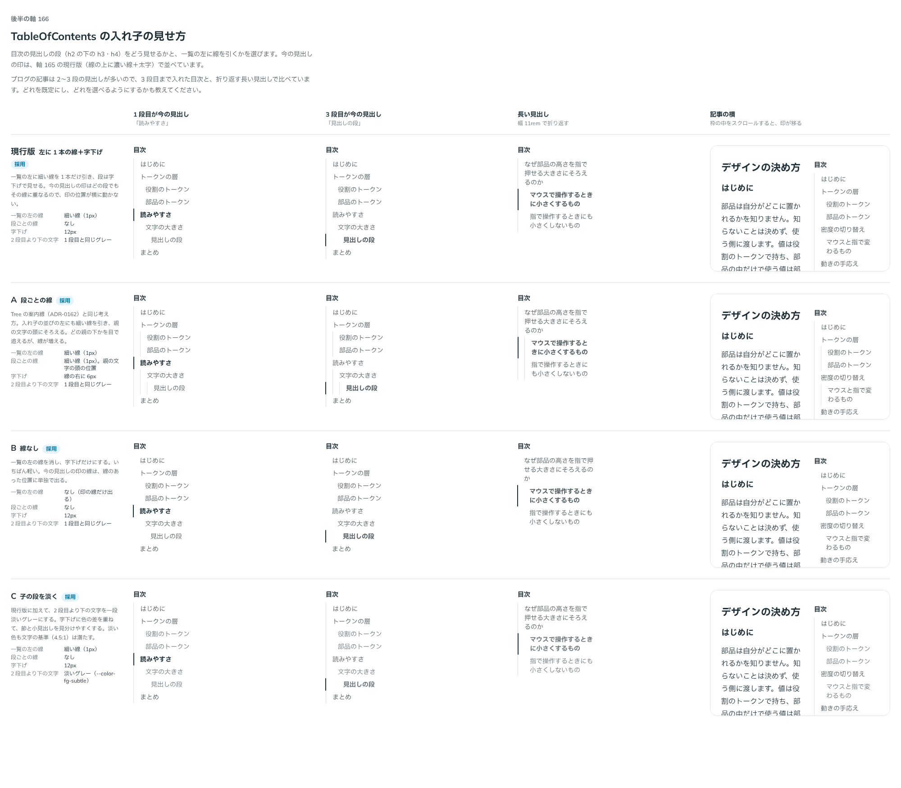

# 0184. 目次の入れ子の見せ方と行の高さ

- ステータス: Accepted
- 日付: 2026-09-20
- ラウンド: 後半 軸166

## 背景

TableOfContents で、見出しの段（h2 の下の h3・h4）をどう見せるかと、一覧の左に線を引くかを決めます。今の見出しの印は [ADR-0183](./0183-toc-current.md) の現行版（線に重ねる濃い線＋太字）で並べました。近い前例は Tree の字下げと案内線（[ADR-0162](./0162-tree-guides.md)、既定は段ごとの細い線）です。あわせて、目次の行の高さも確かめました。

## 候補

| 案     | 内容                                                                    |
| ------ | ----------------------------------------------------------------------- |
| 現行版 | 一覧の左に細い線を 1 本だけ引き、段は字下げで見せる                     |
| A      | 入れ子の並びの左にも、段ごとに細い線を引く（Tree の案内線と同じ考え方） |
| B      | 一覧の左の線を消し、字下げだけにする                                    |
| C      | 現行版に加えて、2 段目より下の文字を一段淡いグレーにする                |

1 段目・3 段目が今の見出し・長い見出し（幅 11rem で折り返す）・記事の横の 4 列で比べました。

## 決定

**現行版（左の線 1 本＋字下げ）を既定とし、A・B・C も選べるようにします。組み合わせて使えます。** `guides`（段ごとの線）・`track`（一覧の左の線）・`subtleNested`（2 段目より下を淡く）で選びます。

- `guides`: `false`（既定、A は `true`）
- `track`: `true`（既定、B は `track={false}`）
- `subtleNested`: `false`（既定、C は `true`）

あわせて、目次の行の高さ（本文の大きさ＋行の余白で決まる 28px）は、比べたうえでそのままとしました。

## 理由

ユーザーの返事の原文です。

> 166: デフォルト現行、A/B/C 選択可

> 2: 28pxでよさそう

- **現行版を既定に**: どの段でも今の見出しの印の線が同じ位置に重なり、印の位置が横に動きません
- **A（段ごとの線）・B（線なし）・C（子の段を淡く）も選べるように**: 案内線を増やしたい場面、いちばん軽くしたい場面、字下げに色の差を重ねたい場面のどれも使う場面があります。3 つは独立した見た目なので組み合わせられます
- **行の高さ（28px）**: 返事のとおり、今の実装のままでよいと確かめました

## 却下した案と理由

なし。現行版・A・B・C のすべてを選べる形にしました。

## 影響

- `src/components/table-of-contents/TableOfContents.tsx`: `guides`（既定 `false`）・`track`（既定 `true`）・`subtleNested`（既定 `false`）
- `design/tokens.css`: `--toc-indent`・`--toc-guide-width`・`--toc-track-width`・`--toc-track-gap` を TableOfContents の区画に持ちます
- 行の高さは、既存の `--toc-item-py`・本文の大きさ（`--text-label`・`--leading-label`）で決まる 28px のままで、新しいトークンは足しません

## 原則への反映

反映なし。原則 5（角丸は部品と包むもので分ける）・原則 6（色は役割で持つ）の範囲内の決定です。

## 比較画像

比較のストーリーは決めた時点のコミット `f4d5aef` にあります。`git checkout f4d5aef && pnpm storybook` で開けます。

